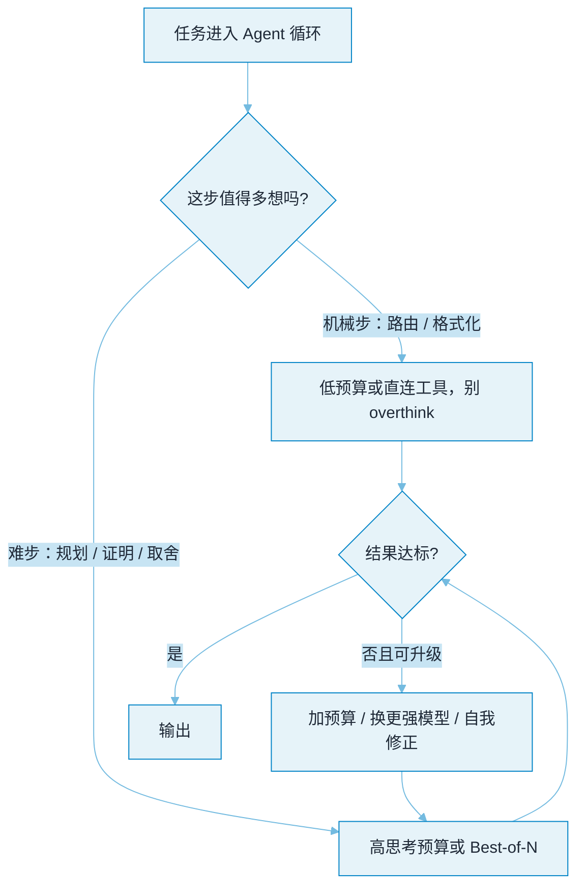

# 推理预算与测试期计算


**一句话**：2026 的关键转变，是把「**模型该想多久**」从玄学变成一个**可调的算力旋钮**——测试期计算（test-time compute）越多通常越准，但更慢、更贵。Agent 的核心功课不是「一律多想」，而是**按任务难度分配思考预算**，并认清推理模型与工具调用之间的张力。


## 问题动机

过去算力主要花在**训练期**（train-time）：把模型练得更强，推理时固定跑一次。而推理模型（o 系列、DeepSeek-R1、带扩展思考的 Claude/Gemini）把重心移到了**测试期**：同一个模型，允许它「想」得越久，越能在数学、规划、多步推理上突破上限。[思维链](chain-of-thought.md) 里那句「思考长度可按预算调节」，说的就是这个旋钮。

对 Agent 尤其要紧：Agent 是**在循环里逐步调用模型**的，每一步多花的一千个思考 token，都会**乘以步数**变成端到端延迟与账单。所以「要不要多想、想多少」不是模型的事，而是**编排层要显式决策的资源分配**。它与[记忆固化与睡眠时计算](../06-memory-rag/sleep-time-memory-consolidation.md) 是一对镜像：那页把算力挪到**查询前的空闲期**，这页管**查询当口值不值得现场多想**。

## 三种「多花算力换准确率」的形态

它们本质相同——用更多测试期计算换更高成功率——只是拧的旋钮不同：

- **内化思考链**：推理模型用 RL 把 CoT 练进权重，输出前先「想」一段隐藏 token；旋钮是**思考预算 / effort 档位**。
- **重复采样**：同一题独立采样 N 次再投票或选优（self-consistency、Best-of-N、[思维树](tree-of-thoughts.md) 的分支搜索）。旋钮是**样本数 N**；「采样越多、覆盖越广」的定量关系就是 pass@k 的无偏估计，其数学见 [Agent 评估指标](../10-evaluation-safety/evaluation-metrics.md)。
- **迭代自我修正**：生成→检查→改，跑多轮（Reflexion / Self-Refine）。旋钮是**修正轮数**。

「Large Language Monkeys」的核心发现很反直觉：**光是反复采样**（不引入任何更聪明的搜索），很多题的覆盖率就会随 N 稳步上升——算力本身就是有效资源。而 s1 证明：只需在结尾**强制续写「Wait, let me reconsider」**，不训练也能把思考「拉长」换准确率——即 **budget forcing**。

## 怎么拧这个旋钮

| 旋钮 | 典型形态 | 适用 |
|---|---|---|
| effort 档位 | minimal / low / medium / high | 已知任务难度分层时 |
| 思考 token 预算 | 给「想」设上限（如几百到几万） | 要卡延迟/成本硬约束 |
| 采样数 N | Best-of-N、多数投票 | 可验证答案、能并行 |
| 修正轮数 | Reflexion 式多轮 | 有可靠反馈信号 |
| 升级式路由 | 便宜模型先答，失败再升 | 多数请求简单、少数难 |

务实做法是**默认轻量、按需升级**：先用低预算或直连工具，命中失败判据（校验不过、置信低、工具报错）才加预算或换更强模型——把高配留给真正难的步骤。

## 对 Agent 的特殊含义

- **别在机械步骤上 overthink**：路由、格式化、简单抽取这类步骤，多想只会拖慢循环、还可能把模型带偏；这些步该给最低预算。
- **推理模型未必擅长工具调用**：部分思考型模型在**严格结构化输出、并行工具调用**上反而退化——「想太久」会打乱它按 schema 出手的节奏。工具密集的场景要实测，别默认「会推理=会调工具」。
- **把预算当成本旋钮逐环设**：规划/取舍/证明这类关键节点给高预算，其余给低；整条轨迹的思考 token 设总上限，防止循环里层层叠加失控。
- **测你自己的「算力—准确率」曲线**：s1/R1 的增益有拐点，越过之后多花 token 不再涨点；找到你任务分布上的拐点，比无脑拉满更省。

## 思考预算怎么分配

*《图：默认轻量、按需升级——机械步直接出手，难步才展开思考；「结果不达标且可升级」就回到更高预算，把昂贵的测试期计算花在真正难的节点上》*

## 概念速查

| 概念 | 一句话 | 关键权衡 |
|---|---|---|
| 测试期计算 | 推理阶段多花算力换准确率 | 更准，但更慢更贵 |
| 思考预算 / effort | 给模型「想多久」设档位或上限 | 拉满未必最优，有拐点 |
| 重复采样 | 独立采样 N 次投票/选优 | 简单有效，成本随 N 线性 |
| 迭代修正 | 生成-检查-改多轮 | 依赖可靠的反馈信号 |
| 升级式路由 | 便宜先答、失败再升 | 省多数、不误少数 |
| Budget forcing | 强制续写「再想想」拉长思考 | 免训练即得部分增益 |

## 直觉解释

像**考试的时间分配**：1 分的选择题和 50 分的大题，不该花一样的时间。思考预算就是让模型「**按分值分配思考时长**」——机械步骤一眼带过，关键大题才打满草稿。而「反复采样再投票」相当于**同一道大题多写几版取最优**：不是更聪明，而是用更多遍数把「碰对」的概率堆上去。真正的高手编排，是**知道哪一步值得多想**，而不是每步都磨。

## 常见误区

- ❌ 以为「多想总比少想好」：机械步上过度思考只会拖慢循环、抬高成本，甚至带偏
- ❌ 假设会推理就会调工具：思考型模型常在严格 JSON、并行工具调用上退化，须实测
- ❌ 把思考预算拉到最高当默认：越过增益拐点纯属烧 token 与加延迟
- ❌ 只在单次调用层设预算：忘了 Agent 是多步循环，成本会逐步相乘失控
- ❌ 重复采样不看可验证性：没有判据时，采 N 次也只是把随机错误平均掉

## 源码案例

- **s1: Simple test-time scaling**（[论文](https://arxiv.org/abs/2501.19393)）：以 budget forcing 强制「再想想」，不训练即可用思考长度换准确率
- **Large Language Monkeys**（[论文](https://arxiv.org/abs/2407.21787)）：仅靠重复采样，覆盖率随样本数稳步上升，证明测试期算力本身是有效资源
- **DeepSeek-R1**（[论文](https://arxiv.org/abs/2501.12948)）：用强化学习激发模型自发的长链推理，是「内化思考链」的代表

## 参考资料

- [s1: Simple test-time scaling](https://arxiv.org/abs/2501.19393)（Mu et al., 2025）
- [Large Language Monkeys: Scaling Inference Compute with Repeated Sampling](https://arxiv.org/abs/2407.21787)（Brown et al., 2024）
- [DeepSeek-R1: Incentivizing Reasoning Capability in LLMs via Reinforcement Learning](https://arxiv.org/abs/2501.12948)（Guo et al., 2025）

## 相关知识点

- [思维链 CoT](chain-of-thought.md)
- [思维树 ToT](tree-of-thoughts.md)
- [自我修正 Self-Refine](self-refine.md)
- [记忆固化与睡眠时计算](../06-memory-rag/sleep-time-memory-consolidation.md)
