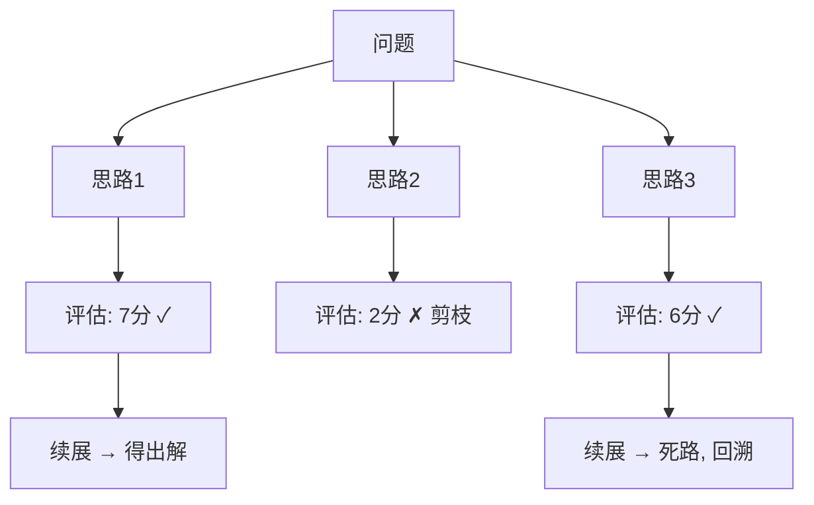

# 💬 Tree of Thoughts

> **一句话**：ToT 把思考组织成树：每步生成多个候选思路，用评估函数打分后择优继续、失败回溯——像下棋的搜索树，而不是一条道走到黑。
> **难度**：⭐️⭐️⭐️ 高级
> **标签**：`#prompt`

## 📌 先看结论

- 三要素：候选生成（每步 N 个想法）+ 状态评估（打分/投票）+ 搜索策略（BFS/DFS）
- 本质是「推理时计算扩展」（test-time compute）：花更多推理换更高成功率
- CoT 是 ToT 的退化特例（每步只有 1 个候选、不回溯）
- 成本高：token 消耗成倍增长，适合高价值难题，不适合常规管线

## 🖼️ 图示



## 🧩 与 CoT 对比

| 维度 | CoT | ToT |
|---|---|---|
| 结构 | 单链 | 树 |
| 错误处理 | 错了就一路错下去 | 评估发现差 → 回溯换路 |
| token 成本 | 1× | 5–20× |
| 实现复杂度 | 一段 prompt | 需要调度程序 + 评估器 |

## 💻 最小实现思路

```python
def tot_solve(problem, depth=3, breadth=3):
    states = [problem]
    for _ in range(depth):
        candidates = [llm(f"{s}\n提出下一步并评估可行性(1-10)")
                      for s in states for _ in range(breadth)]
        scored = sorted(candidates, key=score, reverse=True)
        states = [s for s in scored[:2] if score(s) > 4] or backtrack()
    return best(states)
```

## 📦 源码案例

- **LangGraph 的分支-汇聚原语**（[langgraph](https://github.com/langchain-ai/langgraph)）：节点可扇出到多个分支并行生成，再汇聚打分选优——ToT 用图编排原语即可搭建，不必手写搜索循环
- **DeepSeek-R1 的「内化 ToT」**（[论文](https://arxiv.org/abs/2501.12948)）：推理模型的思考链里频繁出现「等一下，换个思路」（Aha moments）——RL 训练让模型在**一条序列内**完成尝试-评估-换路，效果接近显式 ToT 而成本远低。这是「买推理模型还是自己搭 ToT」的现实答案：多数场景前者更划算
- **研究级参考实现**：论文作者的 [princeton-nlp/tree-of-thought-llm](https://github.com/princeton-nlp/tree-of-thought-llm) 开源了 24 点游戏等任务的完整代码

## ⚠️ 常见误区

- ❌ ToT 适合一切任务：事实问答、抽取类任务毫无收益，只在「搜索空间大 + 可分步评估」的问题上发力
- ❌ 让模型自己打分就客观：自评存在系统性偏差（偏好自己的思路），必要时用独立模型评估或外部验证器（跑测试、对答案）
- ❌ 回溯无限次：必须限制搜索宽度/深度/预算，否则成本爆炸

## 🧪 小练习

把「写营销文案」用 ToT 组织：分支维度是什么（受众/卖点/语气）？评估标准是什么？在哪一步剪枝？

## 🔗 相关资源

- [Tree of Thoughts 论文](https://arxiv.org/abs/2305.10601)

## 📚 相关知识点

- [Chain of Thought](chain-of-thought.md)
- [Graph of Thoughts](graph-of-thoughts.md)
