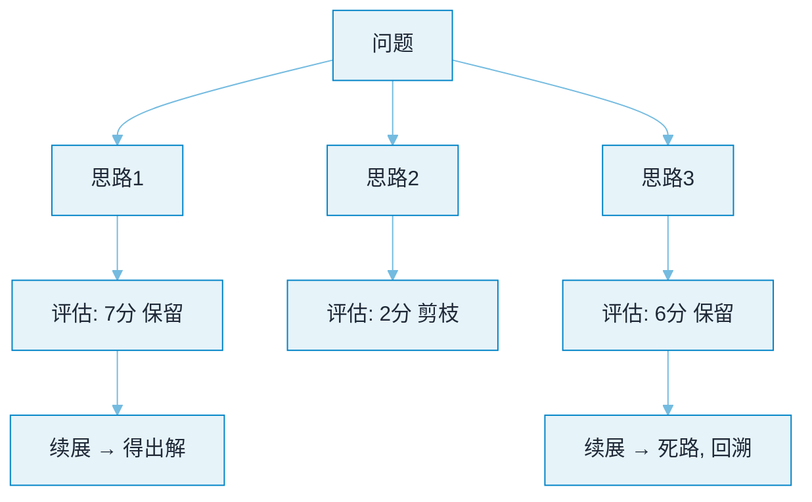

# Tree of Thoughts


**一句话**：ToT 把思考组织成树：每步生成多个候选思路，用评估函数打分后择优继续、失败回溯——像下棋的搜索树，而不是一条道走到黑。


## 问题动机

Chain of Thought 是单链的：一旦某一步想错，错误会沿着链条一路传播，且没有机制回头。对需要「搜索」的问题（24 点游戏、规划、谜题），人类会试着走几步、觉得不对就退回换一条路——ToT 把这种「分支 + 评估 + 回溯」形式化成对思维状态的搜索。

## 核心机制

ToT 把推理建模为在「思维状态」上的启发式搜索，四个组件：

**1. 思维分解**：把问题拆成中间状态 $$s$$，每一步是一个「想法」（thought），可解释、可评估。

**2. 想法生成器** $$G$$：从一个状态生成 $$k$$ 个候选：

$$
\{s^{(1)},\dots,s^{(k)}\}\sim G(p_\theta,\,s)
$$

采样（temperature > 0）产生多样性，或用「提出 3 个不同思路」的 prompt 让模型一次给出多个。

**3. 状态评估器** $$V$$：给候选状态打分：

$$
v_i=V(p_\theta,\,s^{(i)})\in[0,1]\quad\text{或}\quad v_i=\frac{\#\{\text{投"sure"的票}\}}{k}
$$

论文里用「值打分」（sure/likely/impossible）或「投票」两种方式；**评估质量是 ToT 的成败关键**——评估器不准则搜索被带偏。

**4. 搜索策略**：BFS 或 DFS，按分数剪枝：

$$
S_{t+1}=\operatorname*{Top\text{-}b}_{s\in\{G(p_\theta,s')\,:\,s'\in S_t\}} V(p_\theta,s)
$$

以宽度 $$b$$、深度 $$d$$ 的 BFS 为例，需要评估的节点数是 $$O(b^d)$$；而 CoT 是 $$b=1$$ 的退化情形（每步只走一个候选、不回溯）。这就是 ToT 用更多推理时计算（test-time compute）换更高成功率的本质。

$$
\underbrace{b=1}_{\text{CoT}}\;\longrightarrow\;\underbrace{b>1,\ \text{可回溯}}_{\text{ToT}}
$$

## 与 CoT 对比

| 维度 | CoT | ToT |
|---|---|---|
| 结构 | 单链 | 树（搜索空间） |
| 错误处理 | 错了就一路错下去 | 评估发现差 → 回溯换路 |
| 需要评估器 | 否 | 是（成败关键） |
| token 成本 | $$1\times$$ | 随 $$b^d$$ 增长（常见 5–20×） |
| 实现复杂度 | 一段 prompt | 需要调度程序 + 评估器 |

## 图示



*《图：问题一次叉出三条思路各配评估分——2 分当场剪掉，7 分、6 分保留续展，但 6 分那条仍会走到死路再回溯，说明打分只是提前砍掉明显没救的支》*

## 核心实现

```python
def tot_solve(problem, depth=3, breadth=3, beam=2, threshold=0.4):
    states = [problem]
    for _ in range(depth):
        # 生成：每个状态扩展出 breadth 个候选
        candidates = [llm(f"{s}\n提出一个下一步，并给出可行性评分(0-1)")
                      for s in states for _ in range(breadth)]
        scored = sorted(candidates, key=lambda c: c.score, reverse=True)
        # 剪枝：只保留分数达标的 beam 个
        states = [c.text for c in scored[:beam] if c.score >= threshold]
        if not states:
            break
    return best(states)
```


**注意**：必须限制宽度 $$b$$、深度 $$d$$ 与总预算，否则成本随 $$b^d$$ 爆炸。


## 这笔搜索预算花得值不值

ToT 的合理性与否是一道不等式，不是信仰问题。设单条 CoT 的成本为 $$c$$、成功率为 $$p_1$$；ToT 成本约 $$c\cdot b\cdot d$$、成功率为 $$p_T$$：

$$
p_T - p_1 \;>\; \lambda\, c\,(b d - 1)
$$

$$\lambda$$ 是把 token 成本折成「任务失败损失」的换算系数。三条实用判据：

| 判据 | 满足才值得搜 | 不满足时 |
|---|---|---|
| 可分步评估 | 有能提前判断「这步靠谱吗」的信号 | 只能到终点才知道，搜索近似随机漫步 |
| 有外部验证器 | 跑测试、算答案、查约束 | 只能自评，噪声会剪掉好路 |
| 失败很贵 | 重试成本远高于 $$b d$$ 倍 token | 直接 $$n$$ 次独立采样取最优（self-consistency）更省 |

第三行最常被忽略：**「多跑几次挑最好」往往已经吃到 ToT 的大部分收益**。差别在于 ToT 会在中途剪枝、复用前缀，适合深度大、每步昂贵的任务。

## 源码案例

- **LangGraph 的分支-汇聚原语**（[langgraph](https://github.com/langchain-ai/langgraph)）：节点可扇出到多个分支并行生成，再汇聚打分选优——ToT 用图编排原语即可搭建，不必手写搜索循环
- **DeepSeek-R1 的「内化 ToT」**（[论文](https://arxiv.org/abs/2501.12948)）：推理模型的思考链里频繁出现「等一下，换个思路」（Aha moments）——RL 训练让模型在**一条序列内**完成尝试-评估-换路，效果接近显式 ToT 而成本远低。这是「买推理模型还是自己搭 ToT」的现实答案：多数场景前者更划算
- **论文官方实现**：[princeton-nlp/tree-of-thought-llm](https://github.com/princeton-nlp/tree-of-thought-llm) 开源了 24 点游戏等任务的完整搜索代码

## 常见误区

- ❌ ToT 适合一切任务：事实问答、抽取类任务毫无收益，只在「搜索空间大 + 可分步评估」的问题上发力
- ❌ 让模型自己打分就客观：自评存在系统性偏差（偏好自己的思路），必要时用独立模型评估或外部验证器（跑测试、对答案）
- ❌ 回溯无限次：必须限制 $$b$$、$$d$$ 与预算，否则成本爆炸
- ❌ 评估器随便写：评估器噪声大时，搜索反而比单链更差——它会把好路径剪掉

## 小练习

拿一个你手边真实的多步任务（例如「把这张表里金额对不上的行找出来」），先只写评估器：给定一个中间状态，你能不能用一段代码而不是模型判断「这步有希望」？写不出来，就别上 ToT——改用一次 CoT 加人工复核。

## 参考资料

- [Tree of Thoughts: Deliberate Problem Solving with Large Language Models](https://arxiv.org/abs/2305.10601)（Yao et al., 2023）
- [Chain-of-Thought Prompting Elicits Reasoning in Large Language Models](https://arxiv.org/abs/2201.11903)（Wei et al., 2022）
- [ToT 官方实现（princeton-nlp）](https://github.com/princeton-nlp/tree-of-thought-llm)

## 相关知识点

- [Chain of Thought](chain-of-thought.md)
- [Graph of Thoughts](graph-of-thoughts.md)
- [推理预算与测试期计算](test-time-compute-reasoning-budget.md)

