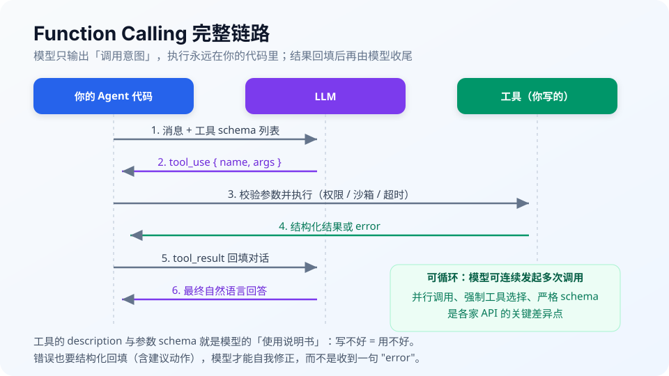
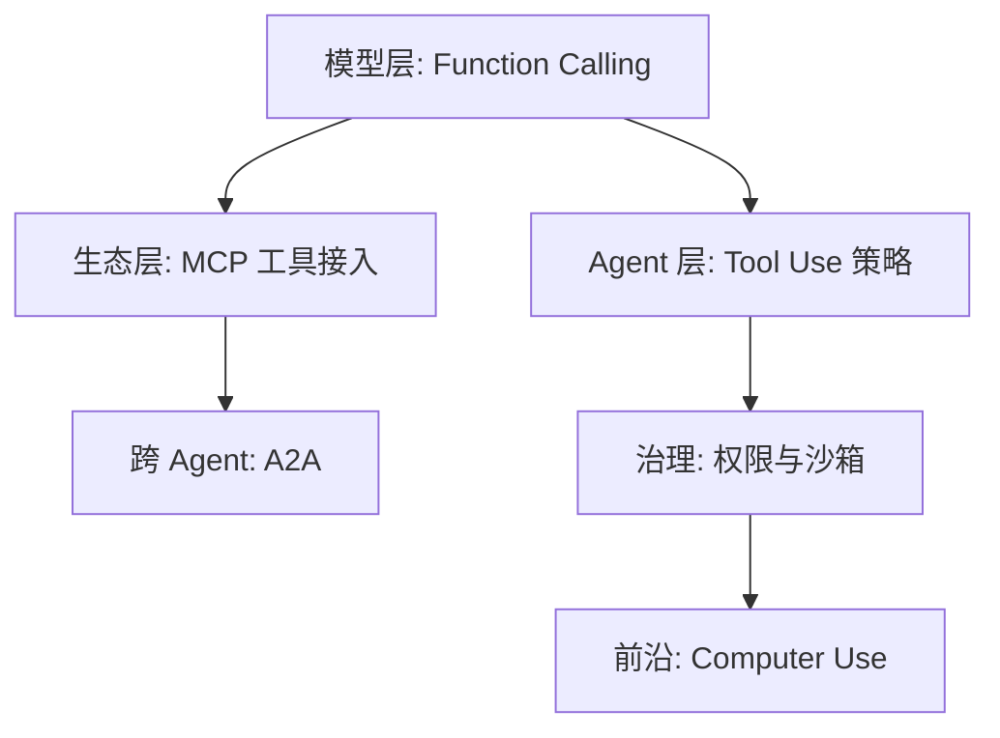

# 05 工具调用与协议

> **一句话**：工具是 Agent 的手脚，协议是手脚的接法。本章从 Function Calling 原理讲到 MCP/A2A 两大协议，再到权限、沙箱与 Computer Use。

## 你将学到

- Function Calling 的完整链路：schema 注册 → 模型决策 → 参数解析 → 执行回填
- MCP 为什么被称为「AI 的 USB-C」，以及 Server/Client 架构
- A2A：跨 Agent 的协作协议，与 MCP 如何互补
- 权限模型与沙箱：DeepSeek Harness 的执行流水线、Claude Code 的审批层
- Computer Use：截图 → 定位 → 操作的 GUI 自动化循环

## 全章地图

## 本站页面

- [Function Calling](function-calling.md)
- [Tool Use](tool-use.md)
- [MCP：Model Context Protocol](mcp.md)
- [A2A：Agent-to-Agent](a2a.md)
- [工具权限与沙箱](tool-permission-sandbox.md)
- [浏览器、代码、文件系统工具](browser-code-filesystem-tools.md)
- [Computer Use / Browser Use](computer-use-browser-use.md)
