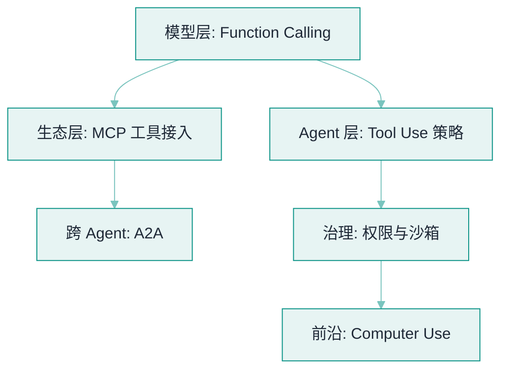

# 05 工具调用与协议


**一句话**：工具是 Agent 的手脚，协议是手脚的接法。本章从 Function Calling 原理讲到 MCP/A2A 两大协议，再到权限、沙箱与 Computer Use。


## 你将学到

- Function Calling 的完整链路：schema 注册 → 模型决策 → 参数解析 → 执行回填
- MCP 为什么被称为「AI 的 USB-C」，以及 Server/Client 架构
- A2A：跨 Agent 的协作协议，与 MCP 如何互补
- 权限模型与沙箱：DeepSeek Harness 的执行流水线、Claude Code 的审批层
- Computer Use：截图 → 定位 → 操作的 GUI 自动化循环
- **2026 协议栈补全**：AG-UI、agents.md / Skills 与 MCP/A2A 的分层，见 [2026 协议栈](../18-frontier-2026/protocol-stack-2026.md)

## 全章地图

## 本站页面

- [Function Calling](function-calling.md)
- [Tool Use](tool-use.md)
- [MCP：Model Context Protocol](mcp.md)
- [A2A：Agent-to-Agent](a2a.md)
- [工具权限与沙箱](tool-permission-sandbox.md)
- [浏览器、代码、文件系统工具](browser-code-filesystem-tools.md)
- [Computer Use / Browser Use](computer-use-browser-use.md)

## 读完能做到

- [ ] 画出 Function Calling 的四步往返（给 schema→模型出调用→你执行→回填），并说清「模型不真的执行函数，只出调用意图」
- [ ] 按原子性/无歧义/幂等友好/返回可消化四原则，把一个「15 操作挤在一个大 JSON 参数」的工具拆成原子工具集，标出哪些非幂等
- [ ] 说清 MCP 如何把 M×N 集成降成 M+N，以及 Tools / Resources / Prompts 三原语各管什么
- [ ] 区分 MCP 与 A2A 的分工（工具变手脚 vs Agent 变同事），点出 Agent Card / Task / Message 三构件的用武之地
- [ ] 为「分析上传的 CSV 并生成图表」定执行环境：代码放哪一层沙箱、网络策略是什么、哪些动作要人审

## 章末自测

1. **回忆**：为什么工具 schema 会「每一轮」都占用上下文？这对工具数量和选型意味着什么？（提示：见 function-calling.md、tool-use.md）
2. **应用**：「每月登录网银下载账单并记账」怎么拆成 API + GUI + HITL 的混合方案？哪些步骤必须走 GUI？（提示：见 computer-use-browser-use.md）
3. **判断**：「给 Agent 尽量多塞工具以增强能力」——用工具面治理（选择准确率随工具数下降）评价这个主张。（提示：见 tool-use.md、tool-permission-sandbox.md）

