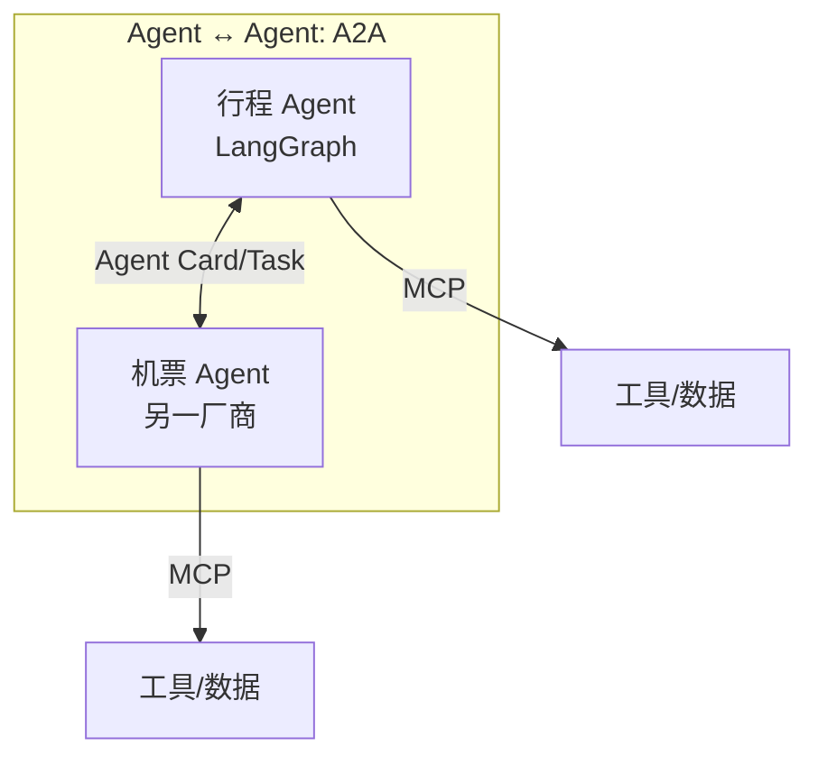

# A2A：Agent-to-Agent

> **一句话**：A2A 是 Google 发起（2025 年 4 月，现由 Linux 基金会治理）的开放协议，让不同厂商、不同框架的 Agent 互相发现、对话、委派任务——MCP 管「Agent 连工具」，A2A 管「Agent 连 Agent」。
> **难度**：进阶
> **标签**：`#multi-agent` `#tooling`

## 先看结论

- MCP 与 A2A 互补不竞争：MCP 把工具变成 Agent 的手脚，A2A 把 Agent 变成彼此的同事
- 核心概念：Agent Card（能力名片，JSON 发现文档）+ Task（有生命周期的协作单位）
- 设计原则：不透明（互相只看能力卡片，不暴露内部思考/记忆/工具）、基于 HTTP 等标准、支持长任务与流式
- 现实进度：协议在演进，生态落地仍在早期——企业跨团队 Agent 互联是最可能的首批场景

## MCP vs A2A



## 核心机制

| 机制 | 作用 | 类比 |
|---|---|---|
| Agent Card | 声明身份、能力、端点、认证方式 | 名片 + 服务目录 |
| Task | 协作任务对象：submitted → working → completed/failed | 工单系统 |
| 消息/Artifact | 任务中的沟通与产出物 | 会议纪要与交付物 |
| 长任务支持 | 流式更新、通知、轮询 | 外卖订单状态推送 |

## Agent Card 示例（简化）

```json
{
  "name": "报销审批 Agent",
  "description": "审核报销单合规性并给出结论",
  "skills": [{"id": "audit", "description": "发票合规审查"}],
  "url": "https://agents.example.com/a2a",
  "capabilities": {"streaming": true}
}
```

## 源码案例

- **DeepSeek Harness 的多 Agent 面**（[仓库](https://github.com/deepseek-ai/deepseek-harness)）：其编排采用 Supervisor–Worker 层级模式，子 Agent 调度走内部事件流（同一进程内）；对外的协议化互联正是 A2A 这类标准要解决的问题——读它的 `core/agent` 实时注册表设计，可以理解「进程内 Agent 互调」与「跨进程 A2A」的边界
- **Pi 的克制**：Pi 明确不做重型多 Agent 框架，把「多 Agent」视为「多个 Agent 进程 + 简单 IPC」——从反面印证了 A2A 的价值：当 Agent 分属不同信任域和代码库时，才需要协议级互联
- **官方仓库**：[google/A2A](https://github.com/google/A2A)（含 Python/JS SDK 与样例 Agent）；样例里的「货币转换 Agent」几百行代码即可被任意 A2A 客户端发现和调用

## 常见误区

- ❌ A2A 取代 MCP：两者层级不同，生产系统往往同时使用
- ❌ Agent 互聊 = 多 Agent 智能自动涌现：协议只提供通信能力，协作质量仍取决于编排设计（→ [多 Agent 编排](../08-multi-agent/multi-agent-orchestration.md)）
- ❌ 忽略信任问题：接到陌生 Agent Card 的 Agent 就像点了陌生链接——能力声明可伪造，认证与沙箱隔离必须先行

## 小练习

设计「旅行规划」的双 Agent A2A 协作：行程 Agent 和机票 Agent 各自的 Agent Card 需要声明哪些 skill？任务失败（航班售罄）时 Task 状态如何流转？

## 相关资源

- [A2A 官方仓库](https://github.com/google/A2A)

## 相关知识点

- [MCP](mcp.md)
- [通信协议](../08-multi-agent/communication-protocol.md)
