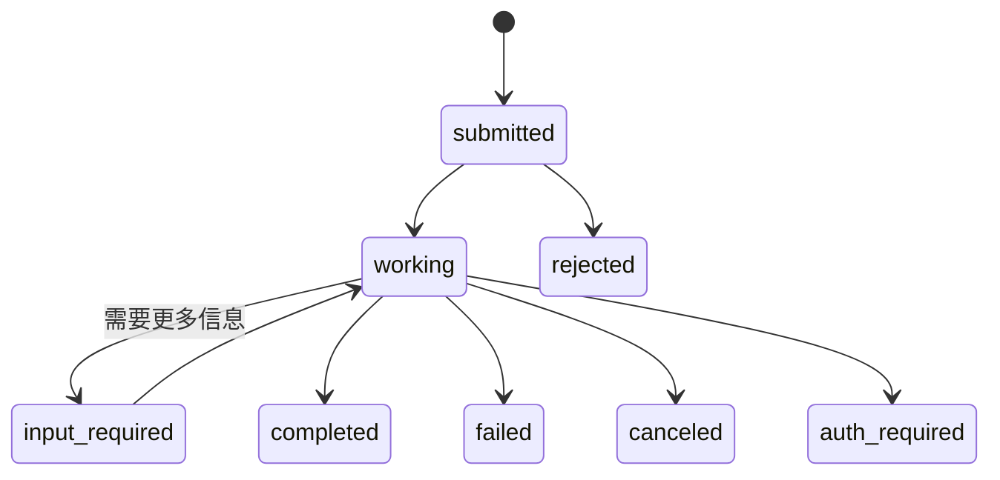
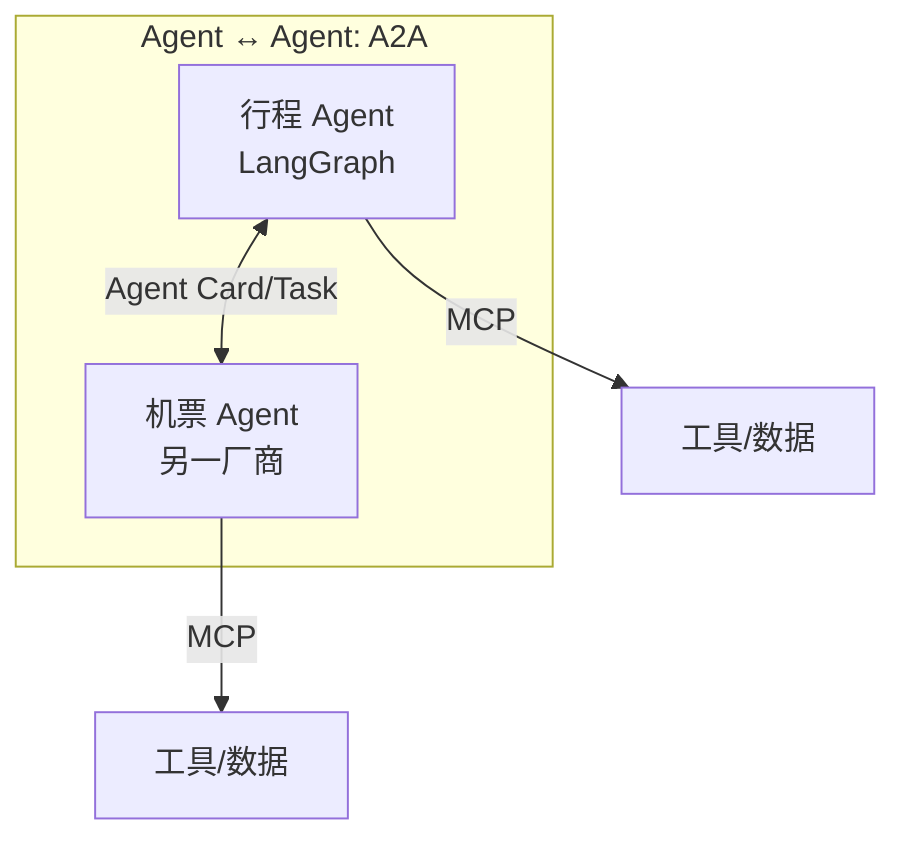

# A2A：Agent-to-Agent

> **一句话**：A2A 是 Google 发起（2025 年 4 月，同年捐给 Linux 基金会治理）的开放协议，让不同厂商、不同框架的 Agent 互相发现、对话、委派任务——MCP 管「Agent 连工具」，A2A 管「Agent 连 Agent」。

## 先看结论

- MCP 与 A2A 互补不竞争：MCP 把工具变成 Agent 的手脚，A2A 把 Agent 变成彼此的同事
- 三大构件：**Agent Card**（能力名片，发现用）、**Task**（有生命周期的协作单位）、**Message/Artifact**（沟通与产出）
- 设计原则：不透明（只看能力卡片，不暴露内部思考/记忆/工具）、基于 HTTP 等标准、支持长任务与流式
- 协议在演进，生态落地仍在早期——企业跨团队 Agent 互联是最可能的首批场景

## 核心机制

### 1. 为什么需要它：跨越信任域

进程内的多 Agent（同一个 harness 里的 Supervisor–Worker）靠共享状态或事件流协作就够了。但当协作的两方**分属不同公司、不同框架、不同信任域**时，需要的是标准化契约：

$$
\text{进程内协作}\;\to\;\text{共享内存/事件流}
\qquad\text{跨组织协作}\;\to\;\text{协议 + 认证}
$$

A2A 定义的正是后者：一个 Agent 通过 HTTP 暴露自己，另一个 Agent 通过标准消息与它协作。

### 2. Agent Card：先发现，再调用

客户端首先获取对方的 **Agent Card**（约定放在 `/.well-known/agent-card.json`），从中得知：身份与描述、支持的技能（skills）、服务端点、认证方式、是否支持流式。这相当于「服务目录 + 名片」，让调用方在**不读对方源码**的前提下知道能委托什么。

### 3. Task：有生命周期的协作单位

A2A 把一次协作建模为 `Task`，有明确状态机——这是它区别于「一问一答」的关键：



- `input-required`：Agent 主动要求补充信息（长任务中很常见）
- `auth-required`：需要额外授权才能继续
- `completed / failed / canceled / rejected`：终态

**长任务支持**：客户端可通过流式（SSE）接收进度，或配置推送通知端点，任务完成时被动收到回调——对应「外卖订单状态推送」的体验。

### 4. 不透明原则与信任边界

A2A 强调 Agent 之间**互相不可见内部实现**：一方只声明「我能做什么」，不暴露内部提示词、记忆与工具。这既是安全设计（不泄露商业实现），也是解耦设计（内部可以随意更换框架）。但由此也带来信任问题：

| 风险 | 说明 | 对策 |
|---|---|---|
| 能力伪造 | Agent Card 声称的能力与实际不符 | 认证 + 白名单 + 先小规模试用 |
| 恶意委托 | 收到诱导性任务内容 | 把外部任务内容当**数据**，与指令隔离（同 [提示注入](../10-evaluation-safety/prompt-injection.md)） |
| 权限蔓延 | 被委托的 Agent 拥有过大权限 | 最小权限 + 人工审批高危动作 |
| 数据出域 | 协作过程中传输敏感数据 | 明确数据边界与脱敏策略 |

## MCP vs A2A



| 维度 | MCP | A2A |
|---|---|---|
| 连接对象 | Agent ↔ 工具/数据源 | Agent ↔ Agent |
| 类比 | USB-C（接外设） | 同事间的工单系统 |
| 核心构件 | Tools / Resources / Prompts | Agent Card / Task / Message |
| 谁决定调用 | 模型（Tools） | 调用方 Agent（委派任务） |
| 典型场景 | 接入文件、数据库、SaaS | 跨团队、跨厂商的任务委派 |

**生产系统往往同时使用**：自己的 Agent 用 MCP 接工具，同时用 A2A 把部分任务委派给外部 Agent。

## Agent Card 示例（简化）

```json
{
  "name": "报销审批 Agent",
  "description": "审核报销单合规性并给出结论",
  "skills": [{"id": "audit", "description": "发票合规审查"}],
  "url": "https://agents.example.com/a2a",
  "capabilities": {"streaming": true}
}
```

## 源码案例

- **DeepSeek Harness 的多 Agent 面**（[仓库](https://github.com/deepseek-ai/deepseek-harness)）：其编排采用 Supervisor–Worker 层级模式，子 Agent 调度走**同一进程内**的事件流；对外的协议化互联正是 A2A 这类标准要解决的问题——对照两者能看清「进程内 Agent 互调」与「跨进程 A2A」的边界
- **Pi 的克制**（[仓库](https://github.com/earendil-works/pi)）：不做重型多 Agent 框架，倾向于把「多 Agent」视为「多个 Agent 进程 + 简单 IPC」——从反面印证 A2A 的价值：**当 Agent 分属不同信任域和代码库时，才需要协议级互联**
- **官方仓库与规范**：[a2aproject/A2A](https://github.com/a2aproject/A2A)（含 Python/JS SDK 与样例 Agent）、[A2A 规范](https://a2a-protocol.org/latest/specification/)

## 工程含义

- **先问「是否需要跨域」**：同一进程内的协作不要上 A2A，事件流/直接调用更简单。协议的价值在跨越组织与框架边界。
- **把对方当不可信服务**：认证、限流、超时、审计一个都不能少——跨域调用的失败模式与外部 API 调用相同。
- **任务边界要清晰**：委派的是「一个可交付的任务」，不是「一段模糊的诉求」。任务描述质量决定协作质量。
- **结果要可验证**：跨域协作无法审查对方过程，只能验收产出——所以要约定明确的交付物与验收标准。

## 常见误区

- ❌ A2A 取代 MCP：两者层级不同，生产系统往往同时使用
- ❌ Agent 互聊 = 多 Agent 智能自动涌现：协议只提供通信能力，协作质量仍取决于编排设计（→ [多 Agent 编排](../08-multi-agent/multi-agent-orchestration.md)）
- ❌ 忽略信任问题：接到陌生 Agent Card 的 Agent 就像点了陌生链接——能力声明可伪造，认证与沙箱隔离必须先行
- ❌ 用 A2A 做进程内协作：那是过度设计，事件流/函数调用更合适

## 小练习

设计「旅行规划」的双 Agent A2A 协作：行程 Agent 和机票 Agent 各自的 Agent Card 需要声明哪些 skill？任务失败（航班售罄）时 Task 状态如何流转？再指出这条链路上最需要认证与隔离的一步。

## 参考资料

- [A2A 规范](https://a2a-protocol.org/latest/specification/)
- [a2aproject/A2A（官方仓库）](https://github.com/a2aproject/A2A)
- [Linux Foundation 宣布 A2A 项目](https://www.linuxfoundation.org/press/linux-foundation-launches-the-agent2agent-protocol-project-to-enable-secure-intelligent-communication-between-ai-agents)
- [MCP 官方文档](https://modelcontextprotocol.io/docs/learn/architecture)

## 相关知识点

- [MCP](mcp.md)
- [通信协议](../08-multi-agent/communication-protocol.md)
- [多 Agent 编排](../08-multi-agent/multi-agent-orchestration.md)
