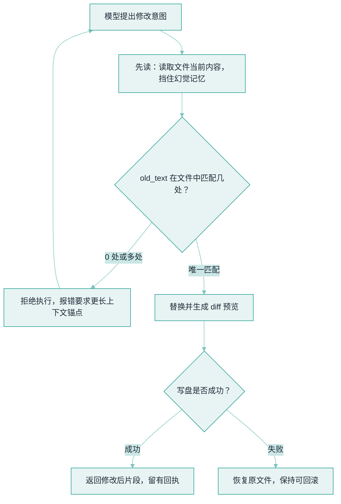

# 浏览器、代码、文件系统工具


**一句话**：这三类工具覆盖 Agent 90% 的实际工作面——读网页、跑代码、动文件；各自的安全与设计要点完全不同。
  **难度**：进阶


## 先看结论

- 文件系统工具：最小集是 read / write / edit / glob / grep——Pi 证明四个原子工具就够干活
- 代码执行工具：能力最强、风险最高，必须沙箱化；结果回填要截断
- 浏览器工具：分「API 型」（fetch/search）与「GUI 型」（Playwright 操作页面），成本与适用场景不同

## 三类工具设计要点

| 工具类 | 关键设计 | 主要风险 | 必配防线 |
|---|---|---|---|
| 文件系统 | edit 用「旧文匹配→替换」防覆盖；路径校验 | 误删、越权读写 | 工作目录白名单、只读区 |
| 代码执行 | 超时、内存上限、无网络默认 | 任意代码执行、资源耗尽 | 沙箱（容器/microVM）、egress 白名单 |
| 浏览器 | 等待策略、DOM 精简提取 | 网页内容注入恶意指令 | 内容当数据不当指令、域名白名单 |


**回填的永远是摘要不是全量**：这三类工具共享同一条铁律——输出可控。编码 Agent 类工具把 stdout 截断阈值硬编码在工具层（常见 30000 字符上限），Playwright MCP 用结构化 DOM 快照而非截图能省 10 倍以上 token。网页抓取动辄几十万 token，先提取正文/相关片段再回填，否则一轮就把上下文吃光。


## 文件编辑的安全模式

`edit_file(path, old_text, new_text)` 对外只吃三个字段，回包却分两种形状——改没改成，全看 `old_text` 在文件里匹配几处。下面是模型视角看到的一次调用与它的两种收场。

**模型发起的一次 edit 调用**：`path` 走工作目录白名单校验，`old_text` 是锚点，`new_text` 是替换后的内容。

```json
{
  "name": "edit_file",
  "input": {
    "path": "src/weather.py",
    "old_text": "temp = 30",
    "new_text": "temp = 31"
  }
}
```

**回包 A：匹配数不是 1 → 拒绝，一个字都不写**（`matched_count` 为 0 或 >1 都走这条）

```json
{
  "status": "rejected",
  "matched_count": 0,
  "message": "错误：匹配 0 或多处，请提供更长的上下文片段",
  "hint": "先 read 该文件，再带上唯一锚点重试"
}
```

**回包 B：唯一匹配 → 替换、落盘、回预览**

```json
{
  "status": "modified",
  "matched_count": 1,
  "message": "已修改，修改后片段预览：",
  "preview": "temp = 31"
}
```




#### 第 1 步：模型只出「改哪儿的旧文 → 换成什么」

调用里给的是 `path` + `old_text` + `new_text` 三个字段。凭记忆直接改文件是幻觉覆盖的高发区（它「以为」文件里有某段代码），所以这个工具从设计上就不接受「整文件覆盖」，只接受精确锚点替换。




#### 第 2 步：先过路径白名单，越界连读都不读

执行 `read` 之前先验 `path`：必须落在工作目录白名单内、目标不在只读区。不在范围内直接拒，回一条拒绝原因——越权读写比改错内容更危险。




#### 第 3 步：先 `read` 当前内容，挡住幻觉记忆

`content = read(path)` 把「模型以为的文件」拉回磁盘上的真实文件。这一步是「先读后写」硬规则的技术实现，也是主流编码 Agent 系统提示里反复强调的一条。




#### 第 4 步：数 `old_text` 命中几处，必须恰好 1 处

`content.count(old_text) != 1` 就回 `status:"rejected"`。命中 0 处说明锚点没对上（模型记错了），命中多处说明锚点太短会误伤别处——两种都拒绝，绝不猜。




#### 第 5 步：唯一匹配才替换并生成预览

`content.replace(old_text, new_text)`，把改动做成 diff/预览。只回预览或摘要、不回整文件，既省上下文也让人一眼能审这处变更。




#### 第 6 步：写盘成功回预览，失败恢复原文件保持可回滚

`write` 成功就返回 `status:"modified"` + `preview`；写盘失败（权限、磁盘）要恢复原文件，让这次 edit 保持可回滚。「先 diff 后写 + 可回滚」是文件系统工具区别于其它两类的地方。



## 四种匹配结局（点标签切换）



模型凭记忆写的 `old_text` 文件里根本没有 → `matched_count:0`，`status:"rejected"`。正确处理是让它先 `read` 再带着真实锚点重试，而不是你替它模糊匹配。这多半意味着模型对文件状态的认知已经过期。



`old_text` 太短（比如就一个 `}` 或 `return`），命中好几处 → `matched_count>1`，同样 `rejected`。这一支防的是**误伤**：替换会把别处也改掉。要求「更长的上下文片段」就是逼模型把锚点扩到唯一。



`matched_count:1`，替换落盘，回 `status:"modified"` + `message:"已修改，修改后片段预览："` + `preview:"temp = 31"`。回执里保留改后片段，用户无需重开文件就能确认，且这次改动仍可回滚。



`path` 不在工作目录白名单、或目标处于只读区 → 第 2 步就拒，`read` 都不执行。回一条越权/只读的拒绝原因，让模型换合法路径或改提别的方案，而不是硬写。



「旧文匹配替换」是 Claude Code Edit 工具与 Pi edit 工具的共同设计：强迫模型先读后改、精确锚定，杜绝「幻觉覆盖」。

## 安全写的完整流程

把「先读后写 + diff 审阅 + 可回滚」三条防线画成一次 edit 的实际路径：



## 源码案例

- **Pi 的四工具极简主义**（[earendil-works/pi](https://github.com/earendil-works/pi)）：read/write/edit/bash 覆盖全部文件与执行需求——grep 藏在 bash 里（`rg`）、glob 也是。启示：工具集大小与能力无关，与模型选择难度有关
- **Claude Code 的代码执行权衡**（逆向分析）：Codex/Claude Code 类产品把 Bash 当「万能逃生舱」，但系统提示词明确优先专用工具（安全审计、权限粒度都更细）；输出截断规则（如 30000 字符）硬编码在工具层
- **DeepSeek Harness 的沙箱执行**（[仓库](https://github.com/deepseek-ai/deepseek-harness)）：代码执行默认进 landlock-run 沙箱，网络与文件访问按 profile 配置——「执行类工具默认危险」是架构级共识
- **浏览器工具生态**：[Playwright MCP](https://github.com/microsoft/playwright-mcp)（微软官方，结构化 DOM 快照而非截图，token 省 10 倍+）、[browser-use](https://github.com/browser-use/browser-use)（视觉+DOM 混合，开源 GUI 自动化标配）

## 核心机制：三类工具的共性约束

浏览器、代码执行、文件系统看起来差异很大，但它们共享同一组设计约束，因为它们都是**「有副作用、结果不可完全预测」的工具**：

| 约束 | 浏览器 | 代码执行 | 文件系统 |
|---|---|---|---|
| 幂等/可回滚 | 关键提交前截图与断言 | 沙箱内可丢弃 | **先 diff 后写**，可回滚 |
| 最小权限 | 限定域名与登录态范围 | 默认无网络、限定目录 | 路径白名单 |
| 输出可控 | 只回结构化元素/摘要 | 截断 stdout | 只回 diff 或摘要 |

核心公式可以概括为：

$$
\text{安全写}=\underbrace{\text{先读后写}}_{\text{了解现状}}+\underbrace{\text{diff 审阅}}_{\text{可验证变更}}+\underbrace{\text{可回滚}}_{\text{失败可撤}}
$$

**为什么强调「先读后写」**：模型凭记忆改文件是幻觉的高发区（它「以为」文件里有某段代码）。强制读取后再改，把幻觉挡在落盘之前——这也是主流编码 Agent 系统提示里的硬性规则。

对代码执行工具而言，还多一条约束：**执行结果必须可解释**。相同输入重复执行应得到相同结果（确定性），否则调试与复现都无从谈起；依赖网络或外部状态的操作应显式标注，让调用方知道它不可重放。

## 常见误区

- ❌ 浏览器工具 = Playwright 全家桶搬进来：GUI 操作贵且脆，能用 API/fetch 解决的别点鼠标
- ❌ 代码执行沙箱只限文件：Python 可以读环境变量、发网络请求——秘钥泄漏路径主要在这
- ❌ 工具结果全量回填：网页抓取动辄几十万 token，先提取正文/相关片段再回填

## 小练习

设计「竞品价格监控」Agent：用 API 型还是 GUI 型浏览器工具？价格页结构变化时如何兜底？每天跑批的沙箱预算怎么定？

## 参考资料

- [Playwright（浏览器自动化的底层库，MCP 只是它外面的一层壳）](https://github.com/microsoft/playwright)
- [Playwright MCP（把浏览器操作暴露成工具协议的官方实现）](https://github.com/microsoft/playwright-mcp)
- [browser-use（ DOM 优先的网页操作 Agent）](https://github.com/browser-use/browser-use)
- [earendil-works/pi（文件 / 命令 / 浏览器三件套的组合方式参考）](https://github.com/earendil-works/pi)

## 相关知识点

- [工具权限与沙箱](tool-permission-sandbox.md)
- [Computer Use / Browser Use](computer-use-browser-use.md)

