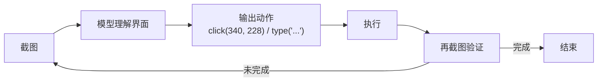

# Computer Use / Browser Use

> **一句话**：让模型看截图、动鼠标键盘来操作图形界面——Agent 能力图谱的最后一块拼图，也是当前最脆弱的一块。
> **难度**：高级
> **标签**：`#tooling`

## 先看结论

- 两条技术路线：**DOM 路线**（读页面结构树，快而省）与**视觉路线**（看截图输出坐标，通用但脆）
- 核心循环：截图 → 理解界面 → 输出动作（点击/输入/滚动）→ 再截图验证
- 失败率高企的主因：小字识别、动态元素、遮挡弹窗、坐标偏移——工程兜底比模型能力更关键
- 适用原则：能用 API/MCP 就不用 GUI；GUI 是「没有 API 时」的兜底能力

## 循环图

## 两条路线对比

| 维度 | DOM 路线（Playwright MCP 等） | 视觉路线（Claude Computer Use 等） |
|---|---|---|
| 输入 | accessibility tree / DOM 快照 | 截图 |
| token 成本 | 低（结构化文本） | 高（每屏数百–数千 token） |
| 可靠性 | 高（元素有唯一引用） | 中（坐标漂移、识别错） |
| 适用面 | 浏览器内 | 一切 GUI（桌面软件、遗留系统） |

## 源码案例

- **Playwright MCP**（[microsoft/playwright-mcp](https://github.com/microsoft/playwright-mcp)）：微软官方实现，把页面转成结构化快照，模型用 `ref` 引用元素操作而非坐标——token 省一个数量级、可靠性大增，浏览器自动化的首选底座
- **browser-use**（[GitHub](https://github.com/browser-use/browser-use)）：开源 GUI 自动化框架，DOM + 视觉混合定位，自带失败重试与元素等待策略，是目前 Star 最高的 browser-use 实现，源码是学习「GUI Agent 工程兜底」的活教材
- **Claude 的 Computer Use API**（[文档](https://docs.anthropic.com/en/docs/agents-and-tools/computer-use)）：模型输出 `screenshot / click / type / key` 等动作原语，官方参考实现（agent loop + Docker 沙箱）开源在 anthropic-quickstarts 仓库——虚拟机隔离 + 每日快照重置的安全模型值得细读
- **DeepSeek Harness 与 Pi 的选择**：两者都未把 Computer Use 做成核心内置，而是通过工具/MCP 扩展接入——GUI 自动化的成熟度尚不足以成为 harness 的一等公民

## 最佳实践

- 每次动作后强制截图验证「预期效果是否发生」，不盲信坐标
- 关键操作（提交、支付、删除）前设 HITL 确认点
- 截图裁剪与缩放：只给模型相关区域，省 token 且提升识别率
- 长流程做检查点：失败从最近稳定状态重放，不从头再来

## 核心机制：成本与鲁棒性的两个约束

### 1. 截图循环的成本随分辨率平方增长

视觉路线的每一步都要把整屏截图送进模型，而图像 token 数由切块数量决定：

$$
N_{\text{tokens}}=\frac{H}{P}\times\frac{W}{P}
$$

分辨率翻倍 → token 数变 4 倍。因此 GUI Agent 的成本几乎完全由**截图频率 × 分辨率**决定，而不是由任务步数单独决定。三条降本手段：

- **降采样**：够用即可，别默认全高清
- **只截变化区域**：比较连续帧，只把差异区域送进模型
- **先定位再高清读**：低分辨率找到目标区域，再对该区域放大重读

### 2. 坐标不稳定是固有属性

模型输出的点击坐标会漂移，原因有三：视觉编码的量化误差、页面重排导致元素位移、以及模型对「同一点击目标」的表达不唯一。因此**纯像素坐标是脆弱接口**：

$$
\text{可靠动作}=\text{语义定位}\big(\text{accessibility 角色/文本/属性}\big)\;\gg\;\text{像素坐标}
$$

工程结论：**能拿到结构化元素信息就不要用坐标**——这也正是 DOM 路线比纯视觉路线更稳、更便宜的根本原因。

$$
\text{cost}_{\text{DOM}}\ll\text{cost}_{\text{vision}},\qquad
\text{robustness}_{\text{DOM}}>\text{robustness}_{\text{vision}}
$$

视觉路线的正当用途是**兜底**：当页面无法通过 DOM/accessibility 访问（canvas、远程桌面、非浏览器 GUI）时，它是唯一选择。

### 3. 循环收敛需要显式停止条件

GUI 任务的「完成」很难自动判定，容易陷入反复点击。因此循环必须带显式停止条件：

$$
\text{stop}\iff
\underbrace{\text{断言达成}}_{\text{目标状态可见}}\;\vee\;
\underbrace{\text{step}>N_{\max}}_{\text{轮次熔断}}\;\vee\;
\underbrace{\text{连续无状态变化}}_{\text{无进展检测}}
$$

其中「无进展检测」最实用：比较相邻截图/元素树，若连续若干步没有任何变化，就说明操作没有生效（点错位置、被弹窗遮挡），应换路或上报人工，而不是继续点。把「页面状态是否变化」当作观测信号，是 GUI Agent 区别于普通对话 Agent 的关键工程点。

## 常见误区

- ❌ 视觉路线是未来所以放弃 DOM：在浏览器里 DOM 路线的确定性无可替代，两条路线会长期共存
- ❌ Demo 效果 = 生产效果：录制演示的任务成功率与无监督跑批的成功率可能差 30%+，务必用自己场景评估（→ [持续评估](../11-engineering/continuous-evaluation.md)）
- ❌ 忽略法律与风控：操作真实账户受服务条款限制，密码与支付流程严禁交给无审计的自动化

## 小练习

把「每月登录网银下载账单并记账」拆成混合方案：哪些步骤用 API/文件导入？哪些必须 GUI？HITL 检查点放哪？

## 相关知识点

- [浏览器、代码、文件系统工具](browser-code-filesystem-tools.md)
- [多模态模型](../03-llm/multimodal.md)
- [工具权限与沙箱](tool-permission-sandbox.md)
