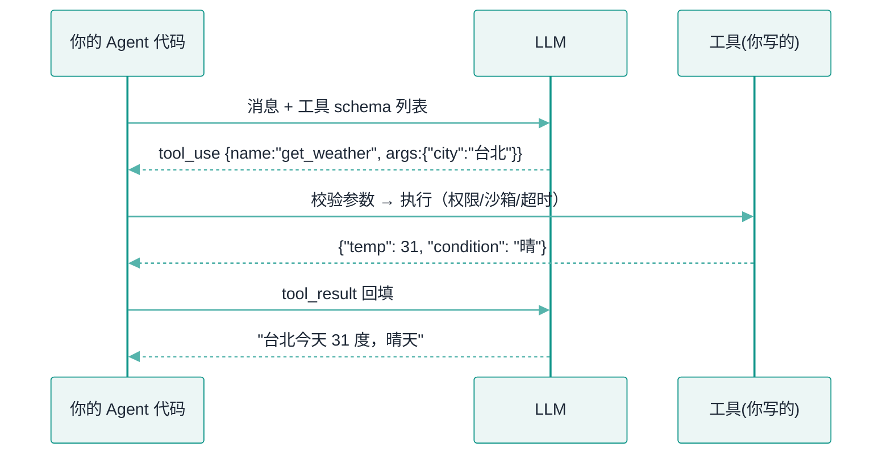
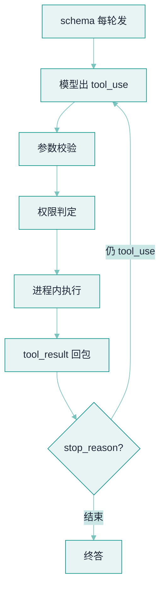

# Function Calling


**一句话**：Function Calling 是让模型输出「调用哪个函数 + JSON 参数」的训练能力；模型只出主意，执行永远在你的代码里。


## 先看结论

- 模型不真的执行函数：它输出结构化调用意图，你的代码执行后把结果回填对话
- 一次完整交互是**四步往返**：给 schema → 模型出调用 → 你执行 → 回填结果
- 工具的 `description` 与参数 schema 就是模型的「使用说明书」——写不好 = 用不好
- 这是训练出来的能力：不同模型可靠性差异巨大，选型时必须实测
- Schema 会占用**每一轮**的上下文预算，工具越多越贵

## 核心机制

### 1. 四步往返协议

Function Calling 不是一次调用，而是一个约定好的往返：

$$
\underbrace{\text{schema}}_{\text{你}\to\text{模型}}
\;\to\;
\underbrace{\text{tool\_call}}_{\text{模型}\to\text{你}}
\;\to\;
\underbrace{\text{执行}}_{\text{你的代码}}
\;\to\;
\underbrace{\text{tool\_result}}_{\text{你}\to\text{模型}}
$$

关键约束：**模型只产出第一步和第二步**。函数真正执行发生在你的进程里，这意味着三件事你能完全控制——权限校验、参数校验、错误处理。这也是「模型说删库，代码可以不执行」的安全基础。

### 2. 工具描述与 schema 是一份「说明书」

模型凭什么选对工具、填对参数？靠 description 与 schema。它们承担三个信息：

| schema 元素 | 传达什么 | 写不好会怎样 |
|---|---|---|
| 工具名 | 这是什么能力 | 名字含糊 → 选错工具 |
| description | 何时用我、**何时别用我** | 只写功能 → 与相近工具混用 |
| 参数类型/必填/enum | 合法取值范围 | 缺约束 → 模型编造取值 |
| 参数字段描述 | 每个参数的语义与示例 | 缺示例 → 值语义错（如日期格式） |

经验法则：**description 要写「边界」，不只写「功能」**。例如搜索工具应写明「已知文件路径时请改用 Read，不要用我」——把选择规则直接告诉模型，比让它猜要可靠得多。

### 3. 四种典型失效与对策

$$
\text{成功率}=1-P(\text{选错工具})-P(\text{参数非法})-P(\text{参数语义错})-P(\text{执行失败})
$$

| 失效模式 | 表现 | 对策 |
|---|---|---|
| 幻觉工具名 | 调用不存在的函数 | 严格 schema + 拒绝重试 |
| 参数非法 | 漏必填、类型错、枚举外取值 | 执行前用 JSON Schema 校验，把错误原文回填 |
| 参数语义错 | 工具对、值错（格式/口径） | 字段描述给示例，关键值从工具结果取而非生成 |
| 选错工具 | 在相近工具间摇摆 | 精简工具面、分组、延迟加载 |

**注意第三项**：参数值错是最隐蔽的失效。做法是让「确定性来源」负责取值——时间、ID、金额应从工具返回或程序计算，而不是让模型生成（见 [幻觉问题](../10-evaluation-safety/hallucination.md)）。

### 4. Schema 的上下文成本

每个工具的 schema 会在**每一轮**请求里重复发送，成本近似：

$$
\text{schema tokens}\approx N\times \overline{\text{schema size}}
$$

$$N$$ 是工具数。这就是「工具越多越贵、也越容易选错」的双重惩罚，也是延迟加载（先只给工具名，选中后再取完整 schema）的动机。

## 完整链路



*《图：整张图里 LLM 与工具之间没有任何直连箭头，校验参数、权限、沙箱、超时全压在 Agent 代码进出工具的那两根箭头上》*

## 最小示例

工具从注册到跑完一次，模型侧与 Agent 侧之间流动的只有三份 JSON：**注册时发给模型的 schema**、**模型回给你的 `tool_use` 调用**、**你回填给模型的 `tool_result`**。下面这三段契约就是那条 while 循环的全部——把循环体拆开看，每一步都在搬运这三份报文之一。

**① 工具 schema（你 → 模型，每一轮都重复发）**

```json
{
  "name": "get_weather",
  "description": "查询指定城市的实时天气。已知不需要实时数据时不要调用我。",
  "input_schema": {
    "type": "object",
    "properties": {
      "city": { "type": "string", "description": "城市名，如 '台北'" },
      "unit": { "type": "string", "enum": ["celsius", "fahrenheit"], "default": "celsius" }
    },
    "required": ["city"]
  }
}
```

**② `tool_use` 调用（模型 → 你）**：当返回的 `stop_reason == "tool_use"`，`content` 里就带出这次调用。`id` 用来跟回包对账，`name` 是工具名，`input` 是模型填好的参数。

```json
{
  "role": "assistant",
  "stop_reason": "tool_use",
  "content": [
    {
      "type": "tool_use",
      "id": "toolu_01A",
      "name": "get_weather",
      "input": { "city": "台北", "unit": "celsius" }
    }
  ]
}
```

**③ `tool_result` 回包（你 → 模型，装进一条 `role:"user"` 消息）**：正常回包把执行结果 `json.dumps(..., ensure_ascii=False)` 成字符串塞进 `content`；出错的回包多带一个 `is_error: true`，并把异常类型与原因原文写进 `content`——模型靠这行字自我修正。

```json
{
  "role": "user",
  "content": [
    {
      "type": "tool_result",
      "tool_use_id": "toolu_01A",
      "content": "{\"temp\": 31, \"condition\": \"晴\"}"
    },
    {
      "type": "tool_result",
      "tool_use_id": "toolu_01B",
      "is_error": true,
      "content": "ValidationError: 'city' is a required property"
    }
  ]
}
```

循环的停止条件只有一句：`stop_reason != "tool_use"` 就 `break`；否则把这条 assistant 消息与刚拼出的 `tool_result` 一路 `append` 回 `messages`，再发下一轮。整条链路没有别的魔法，全部状态都在这三份报文之间传递。

## 分步演示：一次 `get_weather` 从出调用到续跑



*《图：模型只负责出 call，校验、权限、执行、回包全在你这侧；回包后再问一次，直到 `stop_reason` 不再是 tool_use》*




#### 第 1 步：模型只出「调谁 + 填什么」

Agent 带着 `messages` 与 `tools` 发一轮请求，模型返回 `stop_reason="tool_use"`，`content` 里给出 `toolu_01A` / `get_weather` / `{"city":"台北","unit":"celsius"}`。到这一步为止，**没有任何函数被执行**，模型只是把意图写成了 JSON。




#### 第 2 步：执行前先拿 schema 校验参数

用契约①里的 `input_schema` 过一遍：`required` 里的 `city` 在不在、`unit` 是否落在 `enum ["celsius","fahrenheit"]`、类型对不对。不合 schema 的调用根本不进执行——宁可回填错误让模型改，也不要拿脏参数往下跑。




#### 第 3 步：权限判定，安全策略的落点

`get_weather` 是只读低风险，直接放行；换成写类工具，这一步查「谁能调、要不要审批」（见 [工具注册中心](../11-engineering/tool-registry.md)）。正因为校验与权限都在你的进程里做，「模型说删库、代码可以不执行」才成立。




#### 第 4 步：在你自己的函数里执行，LLM 不参与

真正调 `get_weather("台北")`，外面包上超时、沙箱、资源上限。它返回 `{"temp": 31, "condition": "晴"}`。这一整步模型完全不知情——它既看不到你查了哪个 API，也无法干预执行过程。




#### 第 5 步：把结果 `json.dumps` 成 `tool_result` 回填

执行结果序列化成字符串（`ensure_ascii=False` 保住中文），配上 `tool_use_id: "toolu_01A"`，包成契约③那种 `type:"tool_result"` 项，放进一条 `role:"user"` 消息。出错走另一条：`is_error:true` + 异常类型与原因。




#### 第 6 步：带回包再发一轮，直到 `stop_reason` 收敛

把回包 append 回 `messages` 再发一次，模型看到 `temp:31, condition:晴`，产出终答「台北今天 31 度，晴天」，此时 `stop_reason` 不再等于 `tool_use`，循环 `break`。回填的是原料不是答案——别把工具结果当最终回复直接给用户。



## 四种结局，四条分支（点标签切换）

同一次调用，卡在哪一步就回哪一包的错。四个标签对应四种典型收场。



模型漏填了 `city`（或把 `unit` 写成 `"度"`）。你在第 2 步拦下，不执行，回填一条 `is_error:true`、`content:"ValidationError: 'city' is a required property"`。模型下一轮补齐 `city` 再调。**别替它填默认值**——你猜的默认常常正是它漏掉的那个关键参数。



参数合法，但天气 API 超时或抛了异常。你在第 4 步的 `except` 里捕获，回包写 `is_error:true` + `f"{type(e).__name__}: {e}"`（例如 `TimeoutError: connect timeout after 10s`）。有具体原因，模型才会换城市、换参数或改走别的路；只回一个光秃秃 `"error"` 等于没告诉它怎么修。



换成 `risk="high"` 的工具（如退款），第 3 步权限判定不放行，循环在此挂起：把这次调用的 `name` 与 `input` 摊给人看，批准才继续执行、驳回就回填一条 `is_error:true` 的拒绝原因。**审批是数据分支不是异常**，模型收到拒绝能改提别方案。



走完整六步：`temp:31` 回填、`stop_reason` 收敛为结束、模型出终答。唯一容易忘的点——把工具结果当作「又喂回模型的原料」而非最终答案；直接原样抛给用户，就丢掉了模型基于结果再推理那一层价值。




**上下文成本要算在选型前面**：契约①那份 schema 每轮都重发。一个约 120 token 的工具挂满 30 个、跑 10 轮，光 schema 就 ~36000 token 打底，还没算正文。工具面越宽越贵、也越容易选错——这是「延迟加载（先只给名字，选中再取完整 schema）」的全部动机。


## 高级特性

- **并行工具调用**：一轮里模型可返回多个 tool_use（彼此无依赖），你的代码可并发执行后再一起回填——显著减少轮次与成本
- **强制工具选择**：约束模型必须调用某个工具（而非自由文本），用于「必须走流程」的场景
- **严格 schema**：部分 API 支持服务端强制参数符合 schema（见 [结构化输出](../04-prompt-reasoning/structured-output.md)）

## 源码案例

- **Claude Code 的工具设计**（逆向全集：[Piebald-AI/claude-code-system-prompts](https://github.com/Piebald-AI/claude-code-system-prompts)）：内置工具全部带精细 description——包括「何时用我、何时别用我」（如搜索工具写明「已知路径时用 Read」）；工具面用「先列名字、按需加载 schema」控制上下文成本
- **DeepSeek Harness 的工具流水线**（[仓库](https://github.com/deepseek-ai/deepseek-harness)）：模型吐出的 tool-call 不直接执行，而是进 `packages/core/tools` 的执行管道：Hook 拦截 → 审批 → 权限检查 → 沙箱 → 超时控制 → 结果改写 → 事件记录。Function Calling 的「执行侧」被做成了一条可插拔的流水线
- **Pi 的工具封装**（[仓库](https://github.com/earendil-works/pi)）：工具以 name + schema + execute 的形式注册，`pi-ai` 把不同厂商的工具调用格式统一到一层——适配层抹平 API 差异

## 常见误区

- ❌ 工具越多越好：工具面膨胀稀释选择准确率，几十个以上要考虑分组或延迟加载
- ❌ schema 写得越复杂越智能：嵌套太深模型容易漏填、错填，扁平 + 必填字段少为妙
- ❌ 工具报错返回 "error"：把具体错误信息（含建议动作）回填给模型，它才能自我修正
- ❌ 模型会执行函数：它只输出意图；真正执行由你控制，这正是安全策略的落点
- ❌ 忽略 schema 的 token 成本：它在每一轮都重复计费

## 小练习

给「发邮件」设计工具 schema：哪些字段必填？哪些加枚举约束？description 里要写哪些「何时不该用我」的提示？再写出参数校验失败时你会回填给模型的错误内容。

## 参考资料

- [Toolformer: Language Models Can Teach Themselves to Use Tools](https://arxiv.org/abs/2302.04761)（Schick et al., 2023）
- [Gorilla: Large Language Model Connected with Massive APIs](https://arxiv.org/abs/2305.15334)（Patil et al., 2023）
- [Anthropic: Writing effective tools for agents](https://www.anthropic.com/engineering/writing-tools-for-agents)
- [Berkeley Function Calling Leaderboard](https://gorilla.cs.berkeley.edu/leaderboard)（工具调用能力的横评）
- [Piebald-AI/claude-code-system-prompts](https://github.com/Piebald-AI/claude-code-system-prompts)

## 相关知识点

- [Tool Use](tool-use.md)
- [结构化输出](../04-prompt-reasoning/structured-output.md)
- [MCP](mcp.md)

