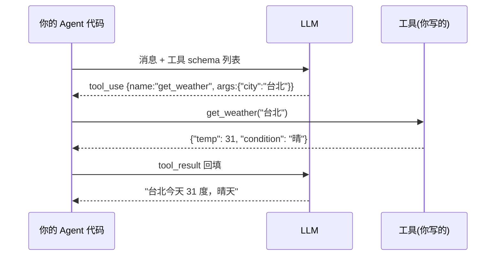

# Function Calling

> **一句话**：Function Calling 是让模型输出「调用哪个函数 + JSON 参数」的训练能力；模型只出主意，执行永远在你的代码里。
> **难度**：进阶
> **标签**：`#tooling`

## 先看结论

- 模型不真的执行函数：它输出结构化调用意图，你的代码执行后把结果回填对话
- 工具的 `description` 和参数 schema 就是模型的「工具使用说明书」——写不好 = 用不好
- 这是训练出来的能力：不同模型可靠性差异巨大，选型时必须实测
- 并行工具调用、强制工具选择、严格 schema 是各家 API 的关键差异点

## 完整链路



## 最小示例

```python
tools = [{
  "name": "get_weather",
  "description": "查询指定城市的实时天气。气温单位摄氏度。",
  "input_schema": {
    "type": "object",
    "properties": {"city": {"type": "string", "description": "城市名，如'台北'"}},
    "required": ["city"]
  }
}]
```

## 源码案例

- **Claude Code 的工具设计**（逆向全集：[Piebald-AI/claude-code-system-prompts](https://github.com/Piebald-AI/claude-code-system-prompts)）：27 个内置工具全部带精细 description——包括「何时用我、何时别用我」（如 Grep 工具描述里写明「已知路径时用 Read 别用我」）；描述里的行为约束就是 prompt engineering
- **DeepSeek Harness 的工具流水线**（[仓库](https://github.com/deepseek-ai/deepseek-harness)）：模型吐出的 tool-call 不直接执行，而是进 `core/tools` 的执行管道：Hook 拦截 → 审批 → 权限检查 → 沙箱 → 超时控制 → 结果改写 → 事件记录。Function Calling 的「执行侧」被做成了一条可插拔的流水线
- **Pi 的工具三件套**（[earendil-works/pi](https://github.com/earendil-works/pi)）：每个工具 = name + schema + execute 函数，注册即用；其 `pi-ai` 统一了 OpenAI/Anthropic/Google 三家不同的工具调用格式——适配层抹平差异

## 常见误区

- ❌ 工具越多越好：工具面膨胀稀释选择准确率，几十个以上要考虑分组或延迟加载（Claude Code 的 ToolSearch 先列名字再加载 schema）
- ❌ schema 写得越复杂越智能：嵌套太深模型容易漏填、错填，扁平 + 必填字段少为妙
- ❌ 工具报错返回 "error"：把具体错误信息（含建议动作）回填给模型，它才能自我修正

## 小练习

给「发邮件」设计工具 schema：哪些字段必填？哪些加枚举约束？description 里要写哪些「何时不该用我」的提示？

## 相关知识点

- [Tool Use](tool-use.md)
- [结构化输出](../04-prompt-reasoning/structured-output.md)
- [MCP](mcp.md)
