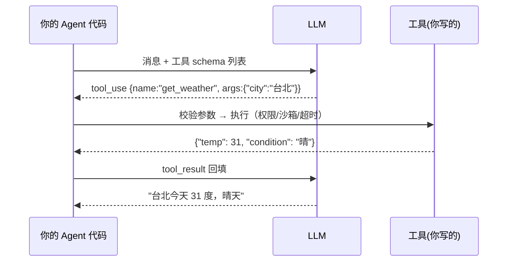

# Function Calling

> **一句话**：Function Calling 是让模型输出「调用哪个函数 + JSON 参数」的训练能力；模型只出主意，执行永远在你的代码里。

## 先看结论

- 模型不真的执行函数：它输出结构化调用意图，你的代码执行后把结果回填对话
- 一次完整交互是**四步往返**：给 schema → 模型出调用 → 你执行 → 回填结果
- 工具的 `description` 与参数 schema 就是模型的「使用说明书」——写不好 = 用不好
- 这是训练出来的能力：不同模型可靠性差异巨大，选型时必须实测
- Schema 会占用**每一轮**的上下文预算，工具越多越贵

## 核心机制

### 1. 四步往返协议

Function Calling 不是一次调用，而是一个约定好的往返：

$$
\underbrace{\text{schema}}_{\text{你}\to\text{模型}}
\;\to\;
\underbrace{\text{tool\_call}}_{\text{模型}\to\text{你}}
\;\to\;
\underbrace{\text{执行}}_{\text{你的代码}}
\;\to\;
\underbrace{\text{tool\_result}}_{\text{你}\to\text{模型}}
$$

关键约束：**模型只产出第一步和第二步**。函数真正执行发生在你的进程里，这意味着三件事你能完全控制——权限校验、参数校验、错误处理。这也是「模型说删库，代码可以不执行」的安全基础。

### 2. 工具描述与 schema 是一份「说明书」

模型凭什么选对工具、填对参数？靠 description 与 schema。它们承担三个信息：

| schema 元素 | 传达什么 | 写不好会怎样 |
|---|---|---|
| 工具名 | 这是什么能力 | 名字含糊 → 选错工具 |
| description | 何时用我、**何时别用我** | 只写功能 → 与相近工具混用 |
| 参数类型/必填/enum | 合法取值范围 | 缺约束 → 模型编造取值 |
| 参数字段描述 | 每个参数的语义与示例 | 缺示例 → 值语义错（如日期格式） |

经验法则：**description 要写「边界」，不只写「功能」**。例如搜索工具应写明「已知文件路径时请改用 Read，不要用我」——把选择规则直接告诉模型，比让它猜要可靠得多。

### 3. 四种典型失效与对策

$$
\text{成功率}=1-P(\text{选错工具})-P(\text{参数非法})-P(\text{参数语义错})-P(\text{执行失败})
$$

| 失效模式 | 表现 | 对策 |
|---|---|---|
| 幻觉工具名 | 调用不存在的函数 | 严格 schema + 拒绝重试 |
| 参数非法 | 漏必填、类型错、枚举外取值 | 执行前用 JSON Schema 校验，把错误原文回填 |
| 参数语义错 | 工具对、值错（格式/口径） | 字段描述给示例，关键值从工具结果取而非生成 |
| 选错工具 | 在相近工具间摇摆 | 精简工具面、分组、延迟加载 |

**注意第三项**：参数值错是最隐蔽的失效。做法是让「确定性来源」负责取值——时间、ID、金额应从工具返回或程序计算，而不是让模型生成（见 [幻觉问题](../10-evaluation-safety/hallucination.md)）。

### 4. Schema 的上下文成本

每个工具的 schema 会在**每一轮**请求里重复发送，成本近似：

$$
\text{schema tokens}\approx N\times \overline{\text{schema size}}
$$

$$N$$ 是工具数。这就是「工具越多越贵、也越容易选错」的双重惩罚，也是延迟加载（先只给工具名，选中后再取完整 schema）的动机。

## 完整链路



## 最小示例

```python
# 1) 注册工具 schema（发给模型）
tools = [{
  "name": "get_weather",
  "description": "查询指定城市的实时天气。已知不需要实时数据时不要调用我。",
  "input_schema": {
    "type": "object",
    "properties": {
      "city": {"type": "string", "description": "城市名，如 '台北'"},
      "unit": {"type": "string", "enum": ["celsius", "fahrenheit"], "default": "celsius"}
    },
    "required": ["city"]
  }
}]

# 2) 往返循环：模型出调用 → 你执行 → 回填
messages = [{"role": "user", "content": "台北现在多少度？"}]
while True:
    resp = client.messages.create(model=MODEL, messages=messages, tools=tools)
    if resp.stop_reason != "tool_use":
        break
    messages.append({"role": "assistant", "content": resp.content})
    results = []
    for call in [b for b in resp.content if b.type == "tool_use"]:
        try:
            validate(call.input)                 # 执行前校验参数
            out = execute(call.name, call.input)  # 自己实现，可加权限/沙箱
            results.append({"type": "tool_result", "tool_use_id": call.id,
                            "content": json.dumps(out, ensure_ascii=False)})
        except Exception as e:
            results.append({"type": "tool_result", "tool_use_id": call.id,
                            "is_error": True, "content": f"{type(e).__name__}: {e}"})
    messages.append({"role": "user", "content": results})
```

## 高级特性

- **并行工具调用**：一轮里模型可返回多个 tool_use（彼此无依赖），你的代码可并发执行后再一起回填——显著减少轮次与成本
- **强制工具选择**：约束模型必须调用某个工具（而非自由文本），用于「必须走流程」的场景
- **严格 schema**：部分 API 支持服务端强制参数符合 schema（见 [结构化输出](../04-prompt-reasoning/structured-output.md)）

## 源码案例

- **Claude Code 的工具设计**（逆向全集：[Piebald-AI/claude-code-system-prompts](https://github.com/Piebald-AI/claude-code-system-prompts)）：内置工具全部带精细 description——包括「何时用我、何时别用我」（如搜索工具写明「已知路径时用 Read」）；工具面用「先列名字、按需加载 schema」控制上下文成本
- **DeepSeek Harness 的工具流水线**（[仓库](https://github.com/deepseek-ai/deepseek-harness)）：模型吐出的 tool-call 不直接执行，而是进 `packages/core/tools` 的执行管道：Hook 拦截 → 审批 → 权限检查 → 沙箱 → 超时控制 → 结果改写 → 事件记录。Function Calling 的「执行侧」被做成了一条可插拔的流水线
- **Pi 的工具封装**（[仓库](https://github.com/earendil-works/pi)）：工具以 name + schema + execute 的形式注册，`pi-ai` 把不同厂商的工具调用格式统一到一层——适配层抹平 API 差异

## 常见误区

- ❌ 工具越多越好：工具面膨胀稀释选择准确率，几十个以上要考虑分组或延迟加载
- ❌ schema 写得越复杂越智能：嵌套太深模型容易漏填、错填，扁平 + 必填字段少为妙
- ❌ 工具报错返回 "error"：把具体错误信息（含建议动作）回填给模型，它才能自我修正
- ❌ 模型会执行函数：它只输出意图；真正执行由你控制，这正是安全策略的落点
- ❌ 忽略 schema 的 token 成本：它在每一轮都重复计费

## 小练习

给「发邮件」设计工具 schema：哪些字段必填？哪些加枚举约束？description 里要写哪些「何时不该用我」的提示？再写出参数校验失败时你会回填给模型的错误内容。

## 参考资料

- [Toolformer: Language Models Can Teach Themselves to Use Tools](https://arxiv.org/abs/2302.04761)（Schick et al., 2023）
- [Gorilla: Large Language Model Connected with Massive APIs](https://arxiv.org/abs/2305.15334)（Patil et al., 2023）
- [Anthropic: Writing effective tools for agents](https://www.anthropic.com/engineering/writing-tools-for-agents)
- [Berkeley Function Calling Leaderboard](https://gorilla.cs.berkeley.edu/leaderboard)（工具调用能力的横评）
- [Piebald-AI/claude-code-system-prompts](https://github.com/Piebald-AI/claude-code-system-prompts)

## 相关知识点

- [Tool Use](tool-use.md)
- [结构化输出](../04-prompt-reasoning/structured-output.md)
- [MCP](mcp.md)
