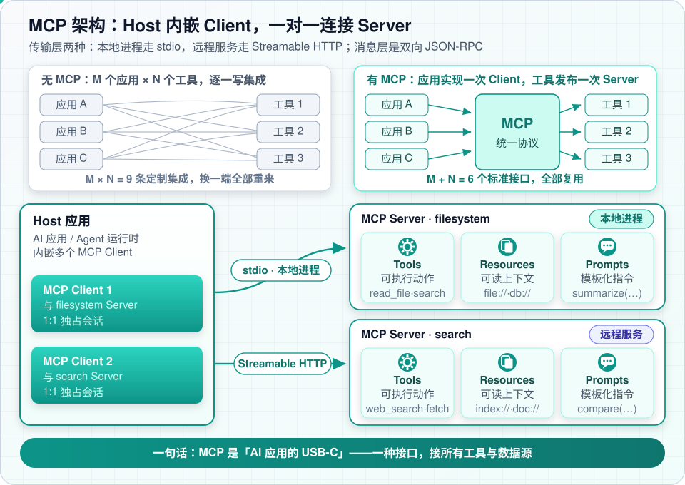
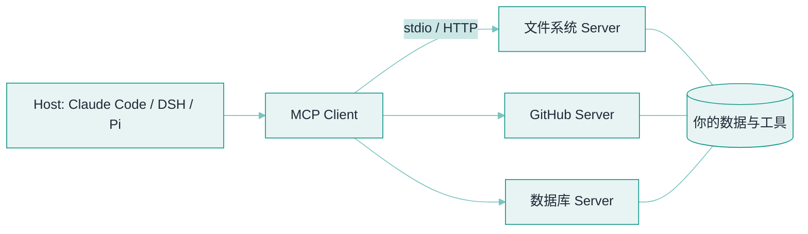
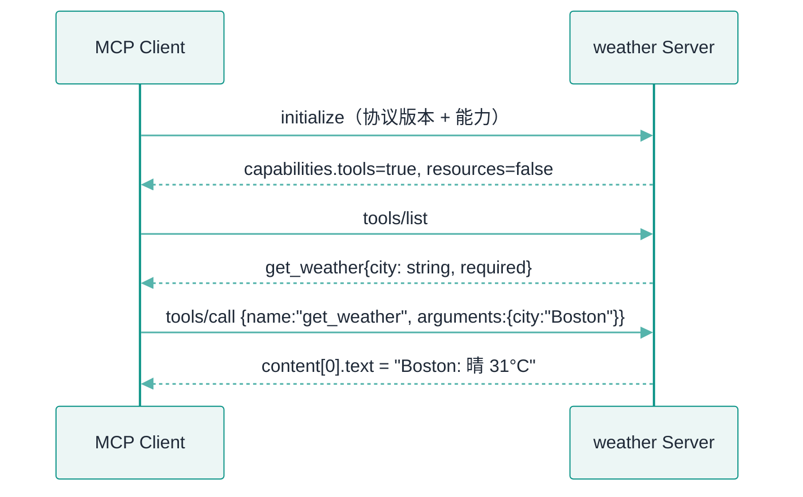
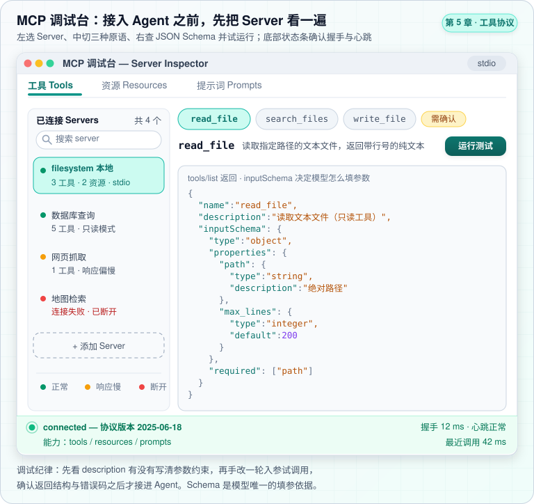
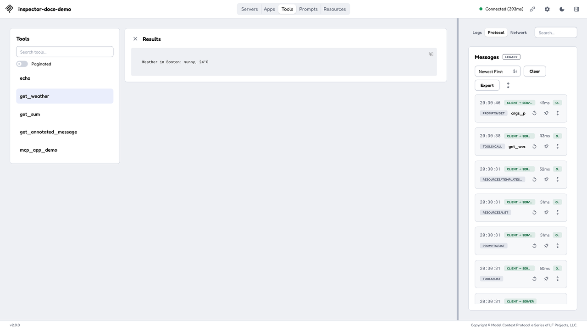

# MCP：Model Context Protocol


**一句话**：MCP 是 Anthropic 于 2024 年 11 月开源的协议，为「模型 ↔ 工具/数据源」定义统一接口——AI 应用的 USB-C：写一次 Server，所有支持的客户端都能用。




*《图：上下两半是同一批应用与工具——上面连出 M×N 条定制集成，下面换成 MCP 后只剩 M+N 个标准接口》*
## 先看结论

- 解决 N×M 问题：过去 M 个 Agent 对接 N 个工具要写 M×N 个集成；MCP 之后是 M+N
- 架构：Host（Agent 应用）内嵌 Client，与独立进程的 Server 通信；传输支持 stdio（本地）与 Streamable HTTP（远程）
- 三大原语：Tools（模型可调用）、Resources（上下文数据）、Prompts（预置提示模板）
- 协议基于 JSON-RPC 2.0，连接建立时做**能力协商**
- 已成事实标准：Claude Code、DeepSeek Harness、Pi、Gemini CLI 等主流 harness 均已接入

## 核心机制

### 1. 从 N×M 到 N+M

没有标准协议时，每接一个新工具就要写一套适配；$$M$$ 个客户端与 $$N$$ 个工具需要 $$M\times N$$ 份集成代码。统一协议后，双方各自实现协议即可，集成量降为：

$$
M\times N \;\longrightarrow\; M+N
$$

这就是「USB-C 类比」的准确含义：不是能力变多，而是**接口标准化**。

### 2. JSON-RPC 2.0 与能力协商

MCP 用 JSON-RPC 2.0 做消息格式。连接开始时先 `initialize`，双方交换各自支持的能力，避免调用对方不认识的接口：

| 方法 | 方向 | 作用 |
|---|---|---|
| `initialize` | 双向 | 握手：协议版本 + 能力协商 |
| `tools/list` | Client → Server | 列出可用工具（含 inputSchema） |
| `tools/call` | Client → Server | 调用工具并取回结果 |
| `resources/list` / `resources/read` | Client → Server | 列出/读取只读上下文 |
| `prompts/list` / `prompts/get` | Client → Server | 获取预置提示模板 |
| `notifications/*` | 双向 | 变更通知（工具列表更新等） |

**能力协商的意义**：Server 可以声明「我支持 tools 但不支持 resources」，Client 也能声明自己的版本——这让协议可以渐进演进而不破坏兼容。

### 3. 传输方式

| 传输 | 适用 | 特点 |
|---|---|---|
| stdio | 本地 Server | 客户端把 Server 作为子进程启动，走标准输入输出；最简单、无网络暴露 |
| Streamable HTTP | 远程 Server | 走 HTTP，支持流式响应与多客户端；取代了早期的 HTTP+SSE 方案 |

选型经验：**本地工具优先 stdio**（无端口、无认证负担、天然进程隔离）；跨网络/多租户才用 HTTP，且必须配认证与授权。

### 4. 安全模型：为什么 MCP 是新的攻击面

MCP 把「外部工具」引入了 Agent 的上下文，随之带来三类风险：

- **工具投毒**：第三方 Server 的 `description` 里可以藏指令，模型会把它当可信说明读取——这是提示注入的 MCP 版本（见 [提示注入](../10-evaluation-safety/prompt-injection.md)）
- **混淆代理（confused deputy）**：Server 以你的身份去访问下游系统，可能越权
- **令牌受众**：远程 Server 的 OAuth 令牌必须绑定正确的 audience，否则会被转发到别处滥用

对策是**权限最小化 + 审批 + 审计**：把 MCP 工具与内置工具放进同一条执行流水线，享受同样的治理。

## 架构图



*《图：Host 只有一条边连到内嵌的那个 Client，真正扇出文件系统/GitHub/数据库三条通道的是 Client；数据与工具全挂在 Server 侧，Host 从不直连》*

## 三大原语

| 原语 | 控制方 | 用途 | 例 |
|---|---|---|---|
| Tools | 模型决定调用 | 执行动作 | 查订单、发消息、跑查询 |
| Resources | 应用决定注入 | 只读上下文 | 文件内容、表结构 |
| Prompts | 用户选择 | 模板化任务 | 「/review 这个 PR」 |


**提示**：Tools 由**模型**控制（它决定何时调），Resources 由**应用**控制（它决定何时注入），Prompts 由**用户**控制（它决定何时用）。这个「控制方」划分是理解三大原语的关键。


## 最小 Server 只暴露三份 JSON-RPC 报文

一个「查天气」Server 对客户端能说的全部话，就是握手、`tools/list`、`tools/call` 三份报文。Server 名叫 `weather`、版本 `1.0.0`、走 stdio 传输；`get_weather` 只有一个必填参数 `city`。



*《图：一次 Server 生命周期里 Client 主动发三种请求；Server 的 `tools/call` 回包里只有一块 `type:"text"`，其余全是 Client 侧的事》*

**握手与能力协商**：`initialize` 双向交换协议版本与支持的能力，Server 可声明「我有 tools、没有 resources」，Client 据此决定后续调用哪些方法。

```json
{
  "jsonrpc": "2.0",
  "id": 1,
  "method": "initialize",
  "params": {
    "protocolVersion": "2025-06-18",
    "clientInfo": { "name": "claude-code", "version": "1.0" },
    "capabilities": { "tools": true, "resources": false }
  }
}
```

**`tools/list` 的返回**：这份 `inputSchema` 会直接投影成模型看到的工具说明书——`city` 是 `string`、`required` 里必须有它。

```json
{
  "jsonrpc": "2.0",
  "id": 2,
  "result": {
    "tools": [
      {
        "name": "get_weather",
        "description": "查询指定城市的实时天气",
        "inputSchema": {
          "type": "object",
          "properties": { "city": { "type": "string" } },
          "required": ["city"]
        }
      }
    ]
  }
}
```

**`tools/call` 的请求与回包**：请求带 `name` + `arguments`；回包的 `content` 是一个块数组，本例只有一块 `type:"text"`，`isError:false`。

```json
{
  "jsonrpc": "2.0",
  "id": 3,
  "method": "tools/call",
  "params": { "name": "get_weather", "arguments": { "city": "Boston" } }
}
```

```json
{
  "jsonrpc": "2.0",
  "id": 3,
  "result": {
    "content": [ { "type": "text", "text": "Boston: 晴 31°C" } ],
    "isError": false
  }
}
```

## 分步演示：从拉起 Server 到结果落地




#### 第 1 步：Client 把 Server 当子进程拉起来

本地 Server 走 stdio：Client 启动 Server 进程，双方靠标准输入输出收发 JSON-RPC 报文。无端口、无网络暴露、天然进程隔离——这也是「本地工具优先 stdio」的原因。




#### 第 2 步：`initialize` 握手，先谈能力再谈调用

双方交换协议版本（示例里 `2025-06-18`）与 `capabilities`。Server 声明支持哪些原语，Client 就不会去调它不认识的方法。能力协商让协议能渐进演进而不破坏兼容——这是 MCP 敢在规范里加新原语的底气。




#### 第 3 步：`tools/list` 拿到工具清单

Client 发出 `tools/list`，Server 返回上面那份带 `inputSchema` 的清单。清单里的 `description` 与参数约束会原样进模型的上下文，所以 Server 作者写工具描述，本质是在写模型的行为边界。




#### 第 4 步：模型选中工具，Client 发 `tools/call`

模型决定「查天气」，Client 组装 `params: {name:"get_weather", arguments:{city:"Boston"}}`。注意 Client 只负责把参数搬过去，**不保证参数合法**——校验得 Server 自己做。




#### 第 5 步：Server 执行，回一个 `content` 块数组

Server 侧做输入校验与真正的查询，返回 `content:[{type:"text", text:"Boston: 晴 31°C"}]` 且 `isError:false`。失败也要走同一条通道：`isError:true` + 说明文字，而不是抛个 JSON-RPC 协议错——那会让 Client 无法把「工具报错」当成正常结果喂回模型。




#### 第 6 步：`content` 交回模型续跑

Client 把这块文本当作工具结果并回对话，模型据此续答。到这一步 MCP 的职责就结束了：循环、记忆、编排都还是 harness 的事，MCP 只管「工具从哪来、怎么描述、怎么调」。




**Server 的输入校验不能省**：`tools/list` 里 `city` 写成 `z.string()` 是 Server 内部的约束，Client 传来的 `arguments` 并不会自动被 zod 卡住。第三方 Client 完全可能发来 `{city: 123}` 或缺字段的报文——Server 侧同样要跑一遍 schema 校验与权限判断，别信「对面一定是我的官方客户端」。


## 源码案例

- **DeepSeek Harness 把 MCP 做成一层包**（[仓库](https://github.com/deepseek-ai/deepseek-harness)）：`packages/mcp` 独立于核心工具系统，MCP 工具与内置工具经同一条执行流水线（Hook → 审批 → 权限 → 沙箱）——外部工具享受与内置工具同等的安全治理，这是把 MCP「收编」进 harness 的正确姿势
- **官方 Server 仓库**（[modelcontextprotocol/servers](https://github.com/modelcontextprotocol/servers)）：文件系统、GitHub、Slack、Postgres 等参考实现——读 filesystem server 的源码是入门 MCP 的最佳路径
- **Claude Code 的 MCP 管理**：通过 `claude mcp add` 注册、按项目/用户分级 scope、MCP 工具进权限管道——生态接入与安全管控并行

接 Server 进 Agent 之前，先用官方 **MCP Inspector** 把三种原语逐个试一遍——`tools/list` 返回的 `inputSchema` 决定模型怎么填参数，握手与心跳状态在底栏一目了然。



*《图：Inspector 左选 Server、中切 tools/resources/prompts 三原语、右栏现填 inputSchema 并当场 Run Tool——一次握手就能把三种能力各点一遍》*

上图是我们按真实布局画的示意；下面这张是官方 Inspector 的实际界面。



*《图：右侧 Messages 流水把每次 JSON-RPC 往返（TOOLS/CALL、RESOURCES/LIST）连 41ms、43ms 耗时一起摊开——协议长什么样，这里比任何规范文本都直观》*

*读图提示：原图 1280px 排进 608px 正文列只剩 0.475 倍，右侧 Messages 那串 41ms、43ms 会糊成一团——点开图片放大到 1216px，逐条 JSON-RPC 往返才读得清。*

*来源：MCP 官方文档 [modelcontextprotocol.io/docs/tools/inspector](https://modelcontextprotocol.io/docs/tools/inspector) 内嵌的 demo 截图，访问日期 2026-09-22。*

看右侧那条 Messages 流水比看结果更有价值：`PROMPTS/GET`、`TOOLS/CALL`、`RESOURCES/LIST` 每行就是一次 JSON-RPC 往返，41ms、43ms 的耗时直接标在旁边。左侧 `get_weather` 被点选、中间 Results 里那句 `Weather in Boston: sunny, 24°C`，就是 `tools/call` 的 `content` 原样落地——**协议长什么样，在这张图里比在任何规范文本里都直观**。

## 工程含义

- **MCP 是工具来源，不是运行时**：它解决「工具从哪来、怎么描述」，不负责循环、记忆、编排——那些仍是 harness 的职责。
- **写 Server 前先问值不值**：本地一次性函数直接注册更轻；MCP 的价值在跨应用复用与进程隔离。
- **Server 要做输入校验**：不要相信 Client 传来的参数；Server 侧同样需要 schema 校验与权限判断。

## 常见误区

- ❌ MCP 是模型能力：它是协议，模型只看到「多了一堆工具」；工具好坏仍取决于 schema 设计
- ❌ 所有工具都该 MCP 化：简单本地函数直接注册更轻；MCP 的价值在跨应用复用与独立进程隔离
- ❌ 远程 MCP 无风险：第三方 Server 是供应链风险点，工具描述可被注入恶意指令，权限与审计不能省
- ❌ MCP 能替代 A2A：MCP 连「Agent ↔ 工具」，A2A 连「Agent ↔ Agent」，层次不同

## 小练习

把你常用的三个内部 API 封装成一个 MCP Server：选 stdio 还是 HTTP？哪些暴露为 Tools、哪些作为 Resources、哪些做成 Prompts？再列出你会加的输入校验与权限规则。

## 实战手记

- **本地 Server 的成本在启动那一下**：stdio 每接一个都要拉起子进程。经验值上，一个 Node 写的 Server 冷启动一秒到三秒，挂到第五六个时用户会明显觉得「怎么半天没反应」；这类延迟跟模型能力无关，纯是握手排队：先分清是排队慢还是推理慢，再决定动哪一侧。
- **工具清单会悄悄变大**：装第三方 Server 前后各拉一次 `tools/list`，把结果存进仓库对比。我们常见的项目里，多出来两个能发消息的工具，只有 diff 能看出来——模型不会主动汇报这件事。
- **Server 崩在半轮上**：子进程挂了，Client 回填给模型的往往是一个空结果或超时文本，模型很自然地把它读成「这里确实没有数据」，然后带着这个结论再走好几轮。所以「工具没起来」和「工具返回空」必须是两种不同的回填内容，这一字之差决定了故障在第几轮被发现。

## 参考资料

- [MCP 官方文档](https://modelcontextprotocol.io/docs/learn/architecture)
- [MCP 规范（2025-06-18）](https://modelcontextprotocol.io/specification/2025-06-18)
- [MCP 传输层规范](https://modelcontextprotocol.io/specification/2025-06-18/basic/transports)
- [modelcontextprotocol/servers](https://github.com/modelcontextprotocol/servers)

## 相关知识点

- [Function Calling](function-calling.md)
- [A2A](a2a.md)
- [工具权限与沙箱](tool-permission-sandbox.md)

