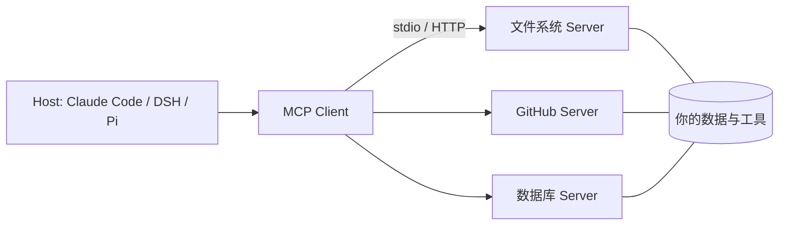

# MCP：Model Context Protocol

> **一句话**：MCP 是 Anthropic 于 2024 年 11 月开源的协议，为「模型 ↔ 工具/数据源」定义统一接口——AI 应用的 USB-C：写一次 Server，所有支持的客户端都能用。
> **难度**：进阶
> **标签**：`#mcp` `#tooling`

## 先看结论

- 解决 N×M 问题：过去 M 个 Agent 对接 N 个工具要写 M×N 个集成；MCP 之后是 M+N
- 架构：Host（Agent 应用）内嵌 Client，与独立进程的 Server 通信；传输支持 stdio（本地）与 Streamable HTTP（远程）
- 三大原语：Tools（模型可调用）、Resources（上下文数据）、Prompts（预置提示模板）
- 已成事实标准：Claude Code、DeepSeek Harness、Pi、Gemini CLI 等主流 harness 全部接入

## 架构图



## 三大原语

| 原语 | 控制方 | 用途 | 例 |
|---|---|---|---|
| Tools | 模型决定调用 | 执行动作 | 查订单、发消息、跑查询 |
| Resources | 应用决定注入 | 只读上下文 | 文件内容、表结构 |
| Prompts | 用户选择 | 模板化任务 | 「/review 这个 PR」 |

## 最小 Server（TypeScript）

```typescript
import { McpServer } from "@modelcontextprotocol/sdk/server/mcp.js";
import { StdioServerTransport } from "@modelcontextprotocol/sdk/server/stdio.js";
import { z } from "zod";

const server = new McpServer({ name: "weather", version: "1.0.0" });
server.tool("get_weather", { city: z.string() },
  async ({ city }) => ({ content: [{ type: "text", text: `${city}: 晴 31°C` }] }));

await server.connect(new StdioServerTransport());
```

## 源码案例

- **DeepSeek Harness 把 MCP 做成一层包**（[仓库](https://github.com/deepseek-ai/deepseek-harness)）：`packages/mcp/` 独立于核心工具系统，MCP 工具与内置工具经同一条执行流水线（Hook → 审批 → 权限 → 沙箱）——外部工具享受与内置工具同等的安全治理，这是把 MCP「收编」进 harness 的正确姿势
- **Pi 的 MCP 桥接**：Pi 提供 MCP 支持层，把 MCP 工具转成 Pi 原生工具三件套（name/schema/execute）， reaffirming「MCP 是工具来源，不是运行时」
- **官方 Server 仓库**（[modelcontextprotocol/servers](https://github.com/modelcontextprotocol/servers)）：文件系统、GitHub、Slack、Postgres 等参考实现——读 filesystem server 的 ~200 行源码是入门 MCP 的最佳路径
- **Claude Code 的 MCP 管理**：`claude mcp add` 注册、scope 分级（项目/用户）、MCP 工具进 permission 管道——生态接入与安全管控并行

## 常见误区

- ❌ MCP 是模型能力：它是协议，模型只看到「多了一堆工具」；工具好坏仍取决于 schema 设计
- ❌ 所有工具都该 MCP 化：简单的本地函数直接注册更轻；MCP 的价值在跨应用复用与独立进程隔离
- ❌ 远程 MCP 无风险：第三方 Server 是供应链风险点，工具描述可被注入恶意指令（→ [提示注入](../10-evaluation-safety/prompt-injection.md)），权限与审计不能省

## 小练习

把你常用的三个内部 API 封装成一个 MCP Server：选 stdio 还是 HTTP？哪些暴露为 Tools、哪些作为 Resources？

## 相关资源

- [MCP 官方文档](https://modelcontextprotocol.io)
- [modelcontextprotocol/servers](https://github.com/modelcontextprotocol/servers)

## 相关知识点

- [Function Calling](function-calling.md)
- [A2A](a2a.md)
- [工具权限与沙箱](tool-permission-sandbox.md)
