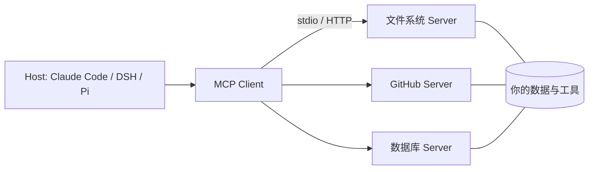

# MCP：Model Context Protocol

> **一句话**：MCP 是 Anthropic 于 2024 年 11 月开源的协议，为「模型 ↔ 工具/数据源」定义统一接口——AI 应用的 USB-C：写一次 Server，所有支持的客户端都能用。

## 先看结论

- 解决 N×M 问题：过去 M 个 Agent 对接 N 个工具要写 M×N 个集成；MCP 之后是 M+N
- 架构：Host（Agent 应用）内嵌 Client，与独立进程的 Server 通信；传输支持 stdio（本地）与 Streamable HTTP（远程）
- 三大原语：Tools（模型可调用）、Resources（上下文数据）、Prompts（预置提示模板）
- 协议基于 JSON-RPC 2.0，连接建立时做**能力协商**
- 已成事实标准：Claude Code、DeepSeek Harness、Pi、Gemini CLI 等主流 harness 均已接入

## 核心机制

### 1. 从 N×M 到 N+M

没有标准协议时，每接一个新工具就要写一套适配；$M$ 个客户端与 $N$ 个工具需要 $M\times N$ 份集成代码。统一协议后，双方各自实现协议即可，集成量降为：

$$
M\times N \;\longrightarrow\; M+N
$$

这就是「USB-C 类比」的准确含义：不是能力变多，而是**接口标准化**。

### 2. JSON-RPC 2.0 与能力协商

MCP 用 JSON-RPC 2.0 做消息格式。连接开始时先 `initialize`，双方交换各自支持的能力，避免调用对方不认识的接口：

| 方法 | 方向 | 作用 |
|---|---|---|
| `initialize` | 双向 | 握手：协议版本 + 能力协商 |
| `tools/list` | Client → Server | 列出可用工具（含 inputSchema） |
| `tools/call` | Client → Server | 调用工具并取回结果 |
| `resources/list` / `resources/read` | Client → Server | 列出/读取只读上下文 |
| `prompts/list` / `prompts/get` | Client → Server | 获取预置提示模板 |
| `notifications/*` | 双向 | 变更通知（工具列表更新等） |

**能力协商的意义**：Server 可以声明「我支持 tools 但不支持 resources」，Client 也能声明自己的版本——这让协议可以渐进演进而不破坏兼容。

### 3. 传输方式

| 传输 | 适用 | 特点 |
|---|---|---|
| stdio | 本地 Server | 客户端把 Server 作为子进程启动，走标准输入输出；最简单、无网络暴露 |
| Streamable HTTP | 远程 Server | 走 HTTP，支持流式响应与多客户端；取代了早期的 HTTP+SSE 方案 |

选型经验：**本地工具优先 stdio**（无端口、无认证负担、天然进程隔离）；跨网络/多租户才用 HTTP，且必须配认证与授权。

### 4. 安全模型：为什么 MCP 是新的攻击面

MCP 把「外部工具」引入了 Agent 的上下文，随之带来三类风险：

- **工具投毒**：第三方 Server 的 `description` 里可以藏指令，模型会把它当可信说明读取——这是提示注入的 MCP 版本（见 [提示注入](../10-evaluation-safety/prompt-injection.md)）
- **混淆代理（confused deputy）**：Server 以你的身份去访问下游系统，可能越权
- **令牌受众**：远程 Server 的 OAuth 令牌必须绑定正确的 audience，否则会被转发到别处滥用

对策是**权限最小化 + 审批 + 审计**：把 MCP 工具与内置工具放进同一条执行流水线，享受同样的治理。

## 架构图



## 三大原语

| 原语 | 控制方 | 用途 | 例 |
|---|---|---|---|
| Tools | 模型决定调用 | 执行动作 | 查订单、发消息、跑查询 |
| Resources | 应用决定注入 | 只读上下文 | 文件内容、表结构 |
| Prompts | 用户选择 | 模板化任务 | 「/review 这个 PR」 |

> **提示**：Tools 由**模型**控制（它决定何时调），Resources 由**应用**控制（它决定何时注入），Prompts 由**用户**控制（它决定何时用）。这个「控制方」划分是理解三大原语的关键。

## 最小 Server（TypeScript）

```typescript
import { McpServer } from "@modelcontextprotocol/sdk/server/mcp.js";
import { StdioServerTransport } from "@modelcontextprotocol/sdk/server/stdio.js";
import { z } from "zod";

const server = new McpServer({ name: "weather", version: "1.0.0" });
server.tool("get_weather", { city: z.string() },
  async ({ city }) => ({ content: [{ type: "text", text: `${city}: 晴 31°C` }] }));

await server.connect(new StdioServerTransport());
```

## 源码案例

- **DeepSeek Harness 把 MCP 做成一层包**（[仓库](https://github.com/deepseek-ai/deepseek-harness)）：`packages/mcp` 独立于核心工具系统，MCP 工具与内置工具经同一条执行流水线（Hook → 审批 → 权限 → 沙箱）——外部工具享受与内置工具同等的安全治理，这是把 MCP「收编」进 harness 的正确姿势
- **官方 Server 仓库**（[modelcontextprotocol/servers](https://github.com/modelcontextprotocol/servers)）：文件系统、GitHub、Slack、Postgres 等参考实现——读 filesystem server 的源码是入门 MCP 的最佳路径
- **Claude Code 的 MCP 管理**：通过 `claude mcp add` 注册、按项目/用户分级 scope、MCP 工具进权限管道——生态接入与安全管控并行

## 工程含义

- **MCP 是工具来源，不是运行时**：它解决「工具从哪来、怎么描述」，不负责循环、记忆、编排——那些仍是 harness 的职责。
- **写 Server 前先问值不值**：本地一次性函数直接注册更轻；MCP 的价值在跨应用复用与进程隔离。
- **Server 要做输入校验**：不要相信 Client 传来的参数；Server 侧同样需要 schema 校验与权限判断。

## 常见误区

- ❌ MCP 是模型能力：它是协议，模型只看到「多了一堆工具」；工具好坏仍取决于 schema 设计
- ❌ 所有工具都该 MCP 化：简单本地函数直接注册更轻；MCP 的价值在跨应用复用与独立进程隔离
- ❌ 远程 MCP 无风险：第三方 Server 是供应链风险点，工具描述可被注入恶意指令，权限与审计不能省
- ❌ MCP 能替代 A2A：MCP 连「Agent ↔ 工具」，A2A 连「Agent ↔ Agent」，层次不同

## 小练习

把你常用的三个内部 API 封装成一个 MCP Server：选 stdio 还是 HTTP？哪些暴露为 Tools、哪些作为 Resources、哪些做成 Prompts？再列出你会加的输入校验与权限规则。

## 参考资料

- [MCP 官方文档](https://modelcontextprotocol.io/docs/learn/architecture)
- [MCP 规范（2025-06-18）](https://modelcontextprotocol.io/specification/2025-06-18)
- [MCP 传输层规范](https://modelcontextprotocol.io/specification/2025-06-18/basic/transports)
- [modelcontextprotocol/servers](https://github.com/modelcontextprotocol/servers)

## 相关知识点

- [Function Calling](function-calling.md)
- [A2A](a2a.md)
- [工具权限与沙箱](tool-permission-sandbox.md)
