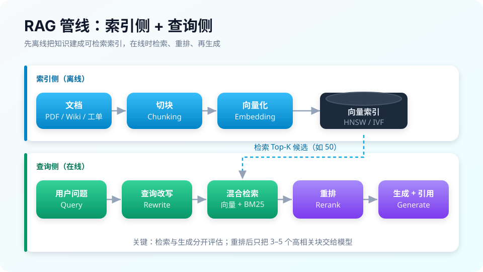
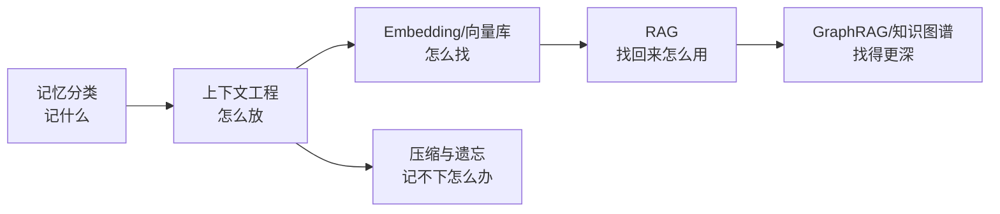

# 06 记忆与 RAG

> **一句话**：上下文窗口是 Agent 唯一的工作记忆。本章讲「记什么、怎么存、怎么找、怎么省」：记忆分类、上下文工程、向量检索、RAG 管线与图谱增强。

## 你将学到

- 记忆五分类：短期、长期、情景、语义、程序
- 上下文工程：把正确的信息在正确的时刻放进上下文
- Embedding 检索原理与向量数据库选型
- RAG 完整管线与失败模式，GraphRAG 与知识图谱的进阶
- 压缩与遗忘：Claude Code auto-compact、Pi 三段压缩、DeepSeek Harness 事件投影

## 全章地图

## 本站页面

- [记忆类型：短期、长期、情景、语义、程序](memory-types.md)
- [上下文工程](context-engineering.md)
- [Embedding 与相似度检索](embedding-similarity.md)
- [向量数据库](vector-database.md)
- [RAG 基础](rag-basics.md)
- [GraphRAG](graphrag.md)
- [知识图谱](knowledge-graph.md)
- [记忆压缩、遗忘与摘要](memory-compression-forgetting.md)
