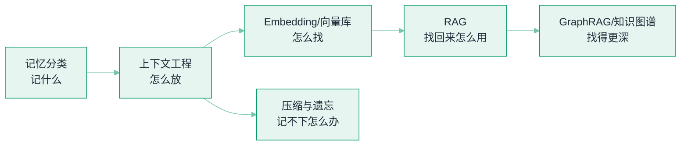

# 06 记忆与 RAG


**一句话**：上下文窗口是 Agent 唯一的工作记忆。本章讲「记什么、怎么存、怎么找、怎么省」：记忆分类、上下文工程、向量检索、RAG 管线与图谱增强。


## 你将学到

- 记忆五分类：短期、长期、情景、语义、程序
- 上下文工程：把正确的信息在正确的时刻放进上下文
- Embedding 检索原理与向量数据库选型
- RAG 完整管线与失败模式，GraphRAG 与知识图谱的进阶
- 压缩与遗忘：Claude Code auto-compact、Pi 三段压缩、DeepSeek Harness 事件投影

## 全章地图

## 本站页面

- [记忆类型：短期、长期、情景、语义、程序](memory-types.md)
- [上下文工程](context-engineering.md)
- [Embedding 与相似度检索](embedding-similarity.md)
- [向量数据库](vector-database.md)
- [RAG 基础](rag-basics.md)
- [GraphRAG](graphrag.md)
- [知识图谱](knowledge-graph.md)
- [记忆压缩、遗忘与摘要](memory-compression-forgetting.md)

## 读完能做到

- [ ] 把「用户口味偏好 / 昨天聊过的电影 / 常用报销流程 / 本会话第一句话」分别归到短期·长期·情景·语义·程序五类，并说各自存哪、怎么取
- [ ] 估算 1000 万条 768 维 FP32 向量的内存量级，说出两条降本路径（降维 / 量化）
- [ ] 讲清 RAG 完整管线与失败三大主因（切块烂 / 检索偏 / 上下文组装差），并解释为什么「先修检索再换模型」
- [ ] 判断一个查询该走普通 RAG、GraphRAG 局部搜索还是全局搜索，并说清 GraphRAG「一次性贵、查询便宜」的成本结构
- [ ] 为跑 3 小时、200 轮、每轮 2K token 的爬虫 Agent 设计压缩策略：水位线、哪些保留、哪些摘要、哪些丢弃

## 章末自测

1. **回忆**：为什么说「向量库不提供正确性」？召回质量取决于哪三件事？（提示：见 embedding-similarity.md、vector-database.md）
2. **应用**：50 万条客服 FAQ + 每日增量 + 按部门权限过滤——选哪个向量库？写出内存估算、索引类型和召回—延迟目标。（提示：见 vector-database.md）
3. **判断**：「上下文越长越好」错在哪？用 lost-in-the-middle 与「动态内容混进静态前缀导致缓存全 miss」两条反驳。（提示：见 context-engineering.md）

