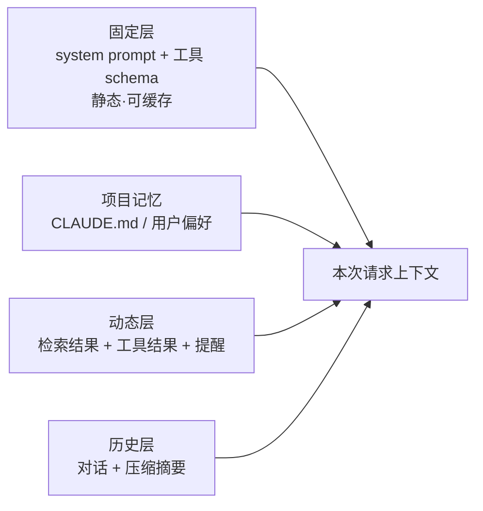

# 上下文工程

> **一句话**：Context Engineering 是 Prompt Engineering 的进化——不止写指令，而是构建「每次调用时，上下文里到底放什么」的动态系统。

## 问题动机

Agent 每一步调用都要重新决定：系统提示写什么、检索哪些片段、带哪些工具、保留多少历史。硬约束是上下文窗口有限（见 [Token、Embedding、上下文窗口](../03-llm/token-embedding-context.md)），而候选内容远超预算。于是这不是「写一段好 prompt」的问题，而是一个**在预算约束下分配信息的优化问题**。

## 核心机制

### 1. 上下文组装是带约束的优化

把上下文看成若干成分 $c_1,\dots,c_n$（指令、记忆、检索片段、工具 schema、历史、状态），每个成分贡献效用 $U_i$、消耗 token $|c_i|$：

$$
\max_{\{|c_i|\}}\;\sum_{i=1}^{n}U_i\big(|c_i|\big)
\qquad\text{s.t.}\qquad
\sum_{i=1}^{n}|c_i|\;\le\;T_{\max}-T_{\text{out}}
$$

在最优解处，各成分的**边际效用/每 token**相等：

$$
\frac{\partial U_i}{\partial |c_i|}=\lambda\quad(\text{对所有被纳入的成分})
$$

这条式子给出的是可操作的直觉：如果「多塞 1K 历史」的收益低于「多塞 1K 检索内容」，就该砍历史。工程上就是**给每类内容设预算上限并监控占比**。

### 2. 信噪比与位置效应

注意力是 $O(n^2)$ 的（见 [Transformer 与 Attention](../03-llm/transformer-attention.md)），加入低相关内容不仅花 token，还会**稀释对关键内容的注意力**。而且信息利用率与位置非均匀：长上下文的中部容易被略过（lost in the middle）。因此：

$$
\text{有效信息量} \;\ll\; \text{名义上下文长度}
$$

两条对策：关键指令在**首尾各出现一次**；检索片段**少而精**（重排后 3–5 条，见 [RAG 基础](rag-basics.md)）。

### 3. 静态/动态分离与缓存

prompt 缓存要求前缀**字节级一致**。设静态前缀 $T_s$、动态部分 $T_d$，则成本为：

$$
\text{cost}=c_{\text{in}}\Big(\frac{T_s}{\alpha}+T_d\Big)+c_{\text{out}}T_{\text{out}}
$$

$\alpha$ 是缓存折扣倍数（常见约 10）。**任何混进静态前缀的动态内容（时间戳、文件树、随机 ID）都会让整段缓存失效**，这是成本翻倍最常见的隐形原因。

## 每步调用的上下文组装

## 工程含义

- **渐进披露**：工具 schema 先只给名字与一句话，需要时再加载完整定义；检索结果先给摘要/前 N 行，模型要更多再展开。
- **按步动态组装**：同一任务的不同阶段，上下文构成应不同（探索阶段只给只读工具，确认后才开放写入工具）。
- **上下文可观测**：把每次请求的上下文各成分 token 占比打进日志，才能定位「预算黑洞」。

## 源码案例

**Claude Code 的上下文工程是行业标杆**（社区逆向：[架构深拆](https://gist.github.com/yanchuk/0c47dd351c2805236e44ec3935e9095d) / [提示词全集](https://github.com/Piebald-AI/claude-code-system-prompts)）：

- **三层 prompt 组装**：默认 prompt blocks（静态，缓存友好）→ effective prompt 选择器（按模式取段）→ attachment 运行时提醒（动态注入）
- **预算意识渗透全链路**：子 Agent 工具列表挪到 attachment、技能列表限量、agent listing 从工具描述剥离
- **auto-compact / microcompact / snip** 三档压缩按窗口水位触发

**DeepSeek Harness：上下文 = 事件的投影**（[仓库](https://github.com/deepseek-ai/deepseek-harness)）：

- `preStep()` 每步现场组装：system prompt 分区 + 动态上下文 + 工具 schema
- 数据面 Session Event Log 与投影（Projection）分离——「模型看到什么」是事件流的函数，可审计可重放

**Pi：压缩即上下文工程**（[earendil-works/pi](https://github.com/earendil-works/pi)）：三种压缩机制守在窗口临界点，机制少而清晰。

## 常见误区

- ❌ 上下文越长越好：噪声稀释注意力，长上下文中部检索率显著下降
- ❌ 一次性模板思维：上下文应是「每步计算的产物」
- ❌ 忽略缓存结构：动态内容混进静态前缀 = 缓存全 miss，成本翻倍
- ❌ 不做占比监控：不知道预算花在哪，优化只能靠猜

## 小练习

审计一个现有 Agent：打印它的完整请求上下文，统计四类成分的 token 占比，找出「预算黑洞」并给出两条优化。

## 参考资料

- [Lost in the Middle: How Language Models Use Long Contexts](https://arxiv.org/abs/2307.03172)（Liu et al., 2023）
- [MemGPT: Towards LLMs as Operating Systems](https://arxiv.org/abs/2310.08560)（Packer et al., 2023，分层记忆与上下文管理）
- [LongLLMLingua: Accelerating and Enhancing LLMs in Long Context Scenarios via Prompt Compression](https://arxiv.org/abs/2310.06839)（Jiang et al., 2023）

## 相关知识点

- [Token、Embedding、上下文窗口](../03-llm/token-embedding-context.md)
- [记忆压缩、遗忘与摘要](memory-compression-forgetting.md)
- [缓存与成本优化](../11-engineering/caching-cost-optimization.md)
