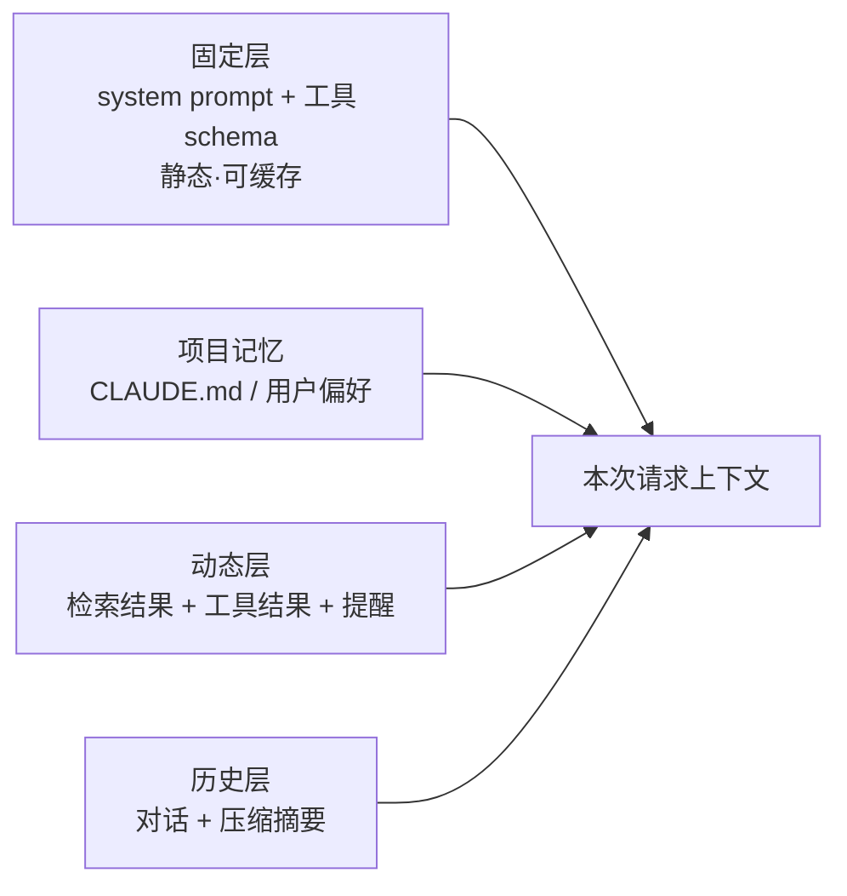

# 上下文工程

> **一句话**：Context Engineering 是 Prompt Engineering 的进化——不止写指令，而是构建「每次调用时，上下文里到底放什么」的动态系统。
> **难度**：进阶
> **标签**：`#memory` `#engineering`

## 先看结论

- 上下文的四类成分：指令（system prompt）、知识（RAG/记忆）、工具（schema）、状态（对话历史/任务进度）
- 三条铁律：稀缺性（窗口是预算）、时效性（每步动态组装）、信噪比（垃圾进垃圾出）
- 静态与动态分离：静态部分保持字节一致以命中 prompt 缓存，动态部分后置
- 「规则场」理念：Claude Code 用 attachment 在对话中动态注入规则提醒，上下文是持续被操纵的场，不是一次性模板

## 每步调用的上下文组装

## 源码案例

**Claude Code 的上下文工程是行业标杆**（社区逆向：[架构深拆](https://gist.github.com/yanchuk/0c47dd351c2805236e44ec3935e9095d) / [提示词全集](https://github.com/Piebald-AI/claude-code-system-prompts)）：

- **三层 prompt 组装**：默认 prompt blocks（静态，缓存友好）→ effective prompt 选择器（按模式取段）→ attachment 运行时提醒（动态注入：token 用量、Todo 提醒、MCP 指令）
- **预算意识渗透全链路**：子 Agent 工具列表挪到 attachment、技能列表限量、agent listing 从工具描述剥离——每一项都在为上下文「省钱」
- **auto-compact / microcompact / snip** 三档压缩按窗口水位触发

**DeepSeek Harness：上下文 = 事件的投影**（[仓库](https://github.com/deepseek-ai/deepseek-harness)）：

- `preStep()` 每步现场组装：system prompt 分区 + 动态上下文 + 工具 schema
- 数据面 Session Event Log 与投影（Projection）分离——「模型看到什么」是事件流的函数，可审计可重放

**Pi：压缩即上下文工程**（[earendil-works/pi](https://github.com/earendil-works/pi)）：三种压缩机制守在窗口临界点，机制少而清晰。

## 最佳实践

- 关键指令首尾各出现一次（对抗 lost-in-the-middle）
- 工具结果按需注入：先给摘要/前 N 行，模型要更多再展开（渐进披露）
- 每类内容设预算上限并监控占比，像管内存一样管上下文

## 常见误区

- ❌ 上下文越长越好：噪声稀释注意力，长上下文中部检索率显著下降
- ❌ 一次性模板思维：上下文应是「每步计算的产物」，DeepSeek Harness 的 preStep 就是证明
- ❌ 忽略缓存结构：动态内容混进静态前缀 = 缓存全 miss，成本翻倍

## 小练习

审计一个现有 Agent：打印它的完整请求上下文，统计四类成分的 token 占比，找出「预算黑洞」并给出两条优化。

## 相关知识点

- [Token、Embedding、上下文窗口](../03-llm/token-embedding-context.md)
- [记忆压缩、遗忘与摘要](memory-compression-forgetting.md)
- [缓存与成本优化](../11-engineering/caching-cost-optimization.md)
