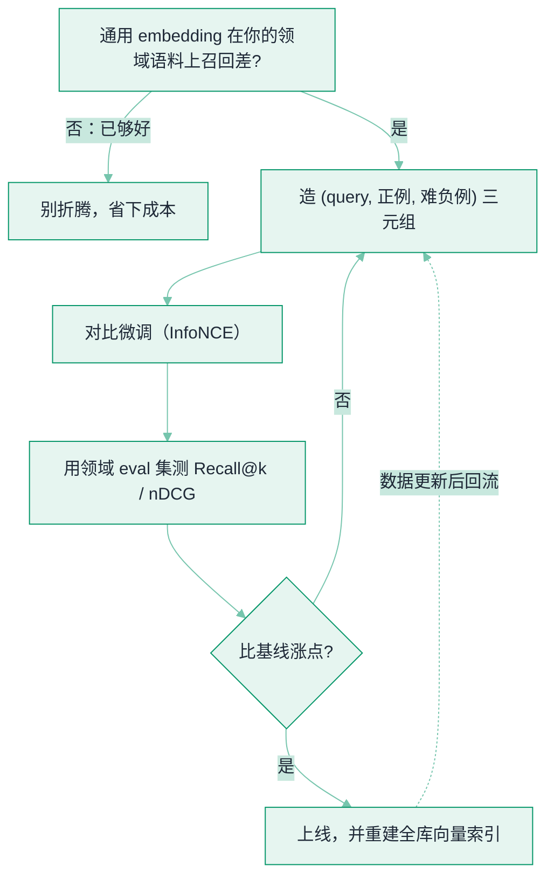

# Embedding 微调：让检索跟上你的领域


**一句话**：通用 embedding 是在公开语料上训的，遇到你的**黑话、缩写、产品代号、近义却不同义的行话**就常「语义相近却答非所问」。用少量领域标注对（query、正例、**难负例**）做对比微调，往往是 RAG 提精度**性价比最高的一步**——比换更大的生成模型便宜得多。


## 问题动机

[Embedding 与相似度检索](embedding-similarity.md) 讲过：检索质量取决于「相关的东西在向量空间里离得近」。但通用 embedding 的「近」是按**大众语料**定义的。在你的领域里——同一缩写指代特定系统、两个词在你的业务里根本不等价、某型号名压根没进过公开语料——通用向量会把「不该近的」判近、「该近的」判远，于是**召回阶段就漏了对的料**，后面重排、生成都救不回来（见 [RAG 检索质量调优](retrieval-quality-tuning.md)：检索是上限）。

微调 embedding 的目标很单纯：**把领域里「谁该离谁近」重新教一遍**。

## 核心机制

### 1. 对比学习（InfoNCE）

给一个 query $$q$$、它的正例 $$d^+$$、若干负例 $$\{d_j^-\}$$，把三者的相似度放进一个 softmax：拉近正例、推开负例。

$$
\mathcal{L}_{\text{NCE}}=-\log\frac{\exp(\mathrm{sim}(q,d^{+})/\tau)}{\exp(\mathrm{sim}(q,d^{+})/\tau)+\sum_{j}\exp(\mathrm{sim}(q,d_{j}^{-})/\tau)}
$$

$$\tau$$ 是温度，越小越「较真」于最难的那几个负例。Sentence-BERT 证明：用孪生网络结构在（句对, 标签）上微调，就能把任意句子编码器变成好用的句向量。

### 2. 难负例是灵魂

随机抽的负例（和 query 八竿子打不着）几乎没梯度信号——模型早就会把它们推远。**真正涨点的是「难负例」**：字面/语义接近、但对本题是错的那些段落。用 BM25 或当前模型自己召回 Top-k 再剔除正例，就是最实用的难负例来源。没有难负例，微调等于白训。

### 3. 标注从哪来（不必大量人工）

- **点击/采纳日志**：用户搜了哪句、点了哪条，天然是 (query, 正例)。
- **LLM 合成**：让模型对每篇文档反向生成「这段能回答什么问题」，造 (query, doc) 正例对。
- **同义/改写构造**：把术语换成黑话造正例，把「最易混的错误段落」造难负例。
- **少样本起步**：SetFit 表明用几十~上百条标注、先在小样本上训孪生头，就能在分类/检索式任务上拿到不错的向量；[INSTRUCTOR](https://arxiv.org/abs/2212.09741) 则走「指令微调一个通用 embedder，让它按任务说明适配零样本新任务」的路子。

## 什么时候值得微调

*《图：微调是一条带闸门的回路——先确认通用模型在你领域确实召回差，造难负例微调后必须用领域 eval 集量出涨点才上线，且上线即意味着全库向量要重建》*

## 概念速查

| 概念 | 一句话 | 关键权衡 |
|---|---|---|
| 对比微调 | 拉近正例、推开负例重学「谁该近」 | 需标注对，但比换大模型便宜 |
| InfoNCE 损失 | softmax 化的对比目标，温度控难度 | τ 太小对难负例过敏感 |
| 难负例 | 接近却错误的段落，涨点主力 | 随机负例几乎无信号 |
| SetFit / INSTRUCTOR | 少样本 / 指令式适配 embedder | 标注极少也能起步 |
| 重建索引 | 换 embedder 后全库向量作废 | 微调收益要扣掉重建成本 |

## 直觉解释

通用 embedding 像一个**只会普通话的翻译**：日常够用，但你公司里「P0」「老系统」「A 型号」到底指什么、哪两个词在你们语境里不等价，它一概不知。微调就是**给它塞一本领域词典 + 一本错题本**——而「错题本」里最值钱的就是那些**它以前搞混的相似案例**（难负例），专挑这些纠错，进步才快。

## 工程含义

- **先建领域 eval 集，再谈微调**：没有「问题→该召回哪几段」的黄金集，你根本无法判断微调是涨是退，全凭感觉就是自欺（指标见 [RAG 检索质量调优](retrieval-quality-tuning.md)）。
- **微调 ≠ 替代重排**：embedding 管**粗召回**（从百万里捞出候选），cross-encoder 重排管**精排**；两者互补，别指望微调一个就把另一个省了。
- **换 embedder 要重建全库索引**：旧向量与新向量不在同一空间，混用等于随机检索；把重建成本算进「值不值得微调」这笔账。
- **防数据泄漏**：合成正例时，别让 eval 集的问题混进训练对，否则线上指标虚高。

## 源码案例

- **Sentence-BERT**（[论文](https://arxiv.org/abs/1908.10084)）：用孪生/三联 BERT 在有监督句对上微调，把句子编码器变成可直接做相似度检索的向量——embedding 微调的奠基工作
- **INSTRUCTOR**（[论文](https://arxiv.org/abs/2212.09741)）：指令微调单个通用 embedder，靠任务指令零样本适配新领域/新任务
- **SetFit**（[论文](https://arxiv.org/abs/2209.11055)）：少样本下先训孪生网络再分类，几百条标注即可逼近大模型微调效果，是「小数据起步」的代表

## 常见误区

- ❌ 用随机负例微调：模型早会推开无关项，没梯度信号，白训——一定要挖难负例
- ❌ 不建 eval 集凭感觉调：无法判断涨退，容易越调越差还不自知
- ❌ 微调后沿用旧向量索引：新旧向量不同空间，检索直接崩，必须重建
- ❌ 以为微调能取代重排：召回与精排是两个环节，各解各的问题
- ❌ 通用问答场景硬要微调：领域不特殊时收益小、成本（标注+重建）反而亏

## 参考资料

- [Sentence-BERT: Sentence Embeddings using Siamese BERT-Networks](https://arxiv.org/abs/1908.10084)（Reimers & Gurevych, 2019）
- [One Embedder, Any Task: Instruction-Finetuned Text Embeddings](https://arxiv.org/abs/2212.09741)（Su et al., 2022，INSTRUCTOR）
- [Efficient Few-Shot Learning Without Prompts](https://arxiv.org/abs/2209.11055)（Tunstall et al., 2022，SetFit）

## 相关知识点

- [Embedding 与相似度检索](embedding-similarity.md)
- [RAG 检索质量调优](retrieval-quality-tuning.md)
- [向量数据库](vector-database.md)
- [用轨迹微调 Agent](../03-llm/agent-traj-finetuning.md)
