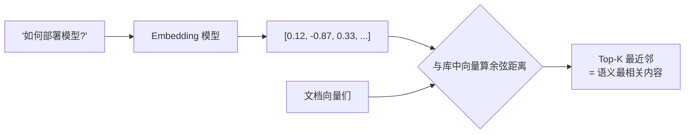

# 📚 Embedding 与相似度检索

> **一句话**：Embedding 把文本变成语义空间中的向量，「找相似」就变成「算距离」——这是语义搜索、RAG、记忆检索的共同地基。
> **难度**：⭐️⭐️ 进阶
> **标签**：`#rag`

## 📌 先看结论

- 相似度度量：余弦相似度最常用（向量方向），内积/欧氏距离各有场景
- 「语义近」≠「答案对」：向量检索找的是相关内容，精确匹配（型号、错误码）仍需关键词
- 生产标配是**混合检索**：向量（语义）+ BM25（关键词）+ 重排序（Rerank）
- 选 embedding 模型看三件事：你的语言、你的领域、你的维度/成本预算

## 🖼️ 图示



## 🍜 生活类比

语义空间像一座「意思之城」：意思相近的文本住在同一个街区。「如何部署模型」和「模型怎么上线」措辞不同但住在隔壁；「模型部署」和「军队部署」字面像却相距十万八千里——余弦距离一眼看穿。

## 💻 最小示例

```python
from sentence_transformers import SentenceTransformer
model = SentenceTransformer("BAAI/bge-m3")   # 中文友好的开源模型
docs = ["MCP 是工具接入协议", "RAG 用检索增强生成", "向量库存语义向量"]
emb = model.encode(docs)
query = model.encode("什么是RAG")
import numpy as np
scores = emb @ query / (np.linalg.norm(emb, axis=1) * np.linalg.norm(query))
print(docs[int(np.argmax(scores))])   # → RAG 用检索增强生成
```

## 📦 源码案例

- **FAISS**（[GitHub](https://github.com/facebookresearch/faiss)）：Meta 开源的向量检索库，百万级向量毫秒检索，几乎所有向量库的底层引擎之一——读它的 IndexHNSW/IndexIVF 文档能理解「为什么向量库能快」
- **混合检索实践**：[Qdrant](https://github.com/qdrant/qdrant)、[Weaviate](https://github.com/weaviate/weaviate) 内置 BM25+向量的混合查询与 RRF 融合；中文场景常见组合是 Elasticsearch/BM25 打底 + bge 系列向量召回 + bge-reranker 精排
- **Agent 场景的记忆检索**：Mem0（[GitHub](https://github.com/mem0ai/mem0)）把对话提炼成事实条目再向量化，检索时按用户/会话过滤——「先过滤后检索」的元数据设计比纯向量更准

## ⚠️ 常见误区

- ❌ 向量检索无所不能：数字比较、精确 ID、布尔条件是向量盲区，混合检索是必须
- ❌ 切块（chunk）随便切：切得太碎丢上下文、太粗稀释语义；按结构边界（标题/段落）切 + 保留标题路径是通行做法
- ❌ 只建索引不更新：文档改了索引没改 = 检索到旧知识，增量更新管线要从第一天设计

## 🧪 小练习

构建「公司制度问答」检索：300 份 PDF。设计切块策略、embedding 选型（考虑中文）、混合检索权重，并想好如何评估检索质量（召回哪些该召回的）。

## 📚 相关知识点

- [向量数据库](vector-database.md)
- [RAG 基础](rag-basics.md)
