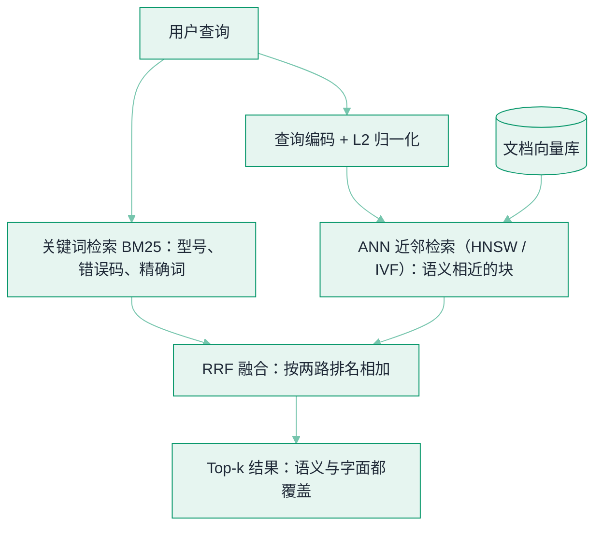
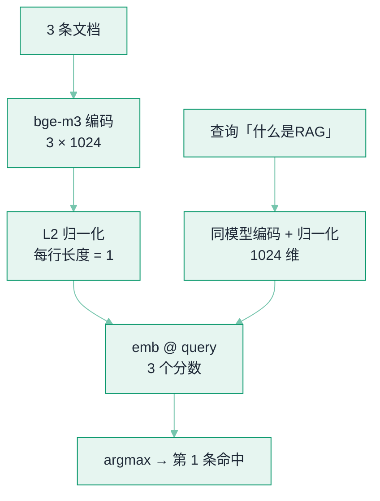

# Embedding 与相似度检索


**一句话**：Embedding 把文本变成语义空间中的向量，「找相似」就变成「算距离」——这是语义搜索、RAG、记忆检索的共同地基。


## 问题动机

关键词检索的盲区是「字面不同、意思相同」：「如何部署模型」和「模型怎么上线」一个词都不重合，倒排索引匹配不到。Embedding 把文本映射到向量空间，让语义相近的文本在空间里距离近，检索就从「匹配字符串」变成「找最近邻」。

## 核心机制

### 1. 三种相似度度量

给定两个向量 $$\mathbf{u},\mathbf{v}\in\mathbb{R}^d$$：

**余弦相似度**（最常用，只看方向、不看长度）：

$$
\cos(\mathbf{u},\mathbf{v})=\frac{\mathbf{u}\cdot\mathbf{v}}{\|\mathbf{u}\|_2\,\|\mathbf{v}\|_2}
=\frac{\sum_{i=1}^{d}u_i v_i}{\sqrt{\sum_{i=1}^{d}u_i^2}\,\sqrt{\sum_{i=1}^{d}v_i^2}}
$$

**内积**（点积）：

$$
\mathbf{u}\cdot\mathbf{v}=\|\mathbf{u}\|_2\|\mathbf{v}\|_2\cos(\mathbf{u},\mathbf{v})
$$

**欧氏距离**：

$$
\|\mathbf{u}-\mathbf{v}\|_2^2=\|\mathbf{u}\|_2^2+\|\mathbf{v}\|_2^2-2\,\mathbf{u}\cdot\mathbf{v}
$$

三者的关系是工程选型的关键：当所有向量都做了 **L2 归一化**（$$\|\mathbf{u}\|_2=\|\mathbf{v}\|_2=1$$）时，余弦相似度等价于内积，欧氏距离随内积单调递减。因此向量库通常预先把向量归一化，然后用内积（MIPS）做检索——这也是为什么「归一化」在向量检索里是默认操作。

### 2. 为什么需要 ANN

精确最近邻要逐个算距离，$$N$$ 个向量、查询 $$Q$$ 次是 $$O(NQd)$$，亿级规模不可接受。近似最近邻（ANN）用索引把复杂度压到亚线性：

- **HNSW**：多层跳表式图，从稀疏顶层粗跳到稠密底层精找，通常用很小的召回损失换取数量级的速度提升
- **IVF**：先用聚类把空间划分成若干桶，查询时只扫最近的几个桶，以召回率换速度

### 3. 混合检索：为什么单靠向量不够

向量擅长语义，但**数字大小、型号、错误码、布尔条件**是它的盲区（「A100 和 H100 哪个贵」语义上几乎不可分）。因此生产标配是关键词检索 + 向量检索融合。关键词侧的事实标准是 BM25：

$$
\text{BM25}(q,d)=\sum_{t\in q}\text{IDF}(t)\cdot
\frac{f(t,d)\cdot(k_1+1)}{f(t,d)+k_1\Big(1-b+b\,\frac{|d|}{\mathrm{avgdl}}\Big)}
$$

其中 $$f(t,d)$$ 是词 $$t$$ 在文档 $$d$$ 中的频次，$$|d|$$ 是文档长度，$$\mathrm{avgdl}$$ 是平均文档长度，$$k_1,b$$ 是可调参数。IDF 抑制高频词的权重，长度归一化防止长文档占优。

两路结果融合最常用 **RRF（Reciprocal Rank Fusion）**，它只看排名、不看分数，因而无需对齐两路的分数量纲：

$$
\text{RRF}(d)=\sum_{r\in R}\frac{1}{k+\mathrm{rank}_r(d)}
$$

$$R$$ 是各路检索器，$$\mathrm{rank}_r(d)$$ 是文档 $$d$$ 在第 $$r$$ 路的排名，$$k$$ 通常取 60。

## 混合检索流程图

两路各补短板——向量路管「意思像」，关键词路管「字面准」，RRF 只按排名融合、不必对齐分数量纲：



## 直觉解释

语义空间像一座「意思之城」：意思相近的文本住在同一个街区。「如何部署模型」和「模型怎么上线」措辞不同但住在隔壁；「模型部署」和「军队部署」字面像却相距十万八千里——余弦相似度一眼看穿。

## 最小示例：把三条文档排一次序

检索的一次调用只有四份数据：**语料**、**查询**、**编码选项**、**打分方式**。用三条短句做语料把它们补齐，语义搜索的骨架就完整了。

```json
{
  "encoder": {
    "model": "BAAI/bge-m3",
    "library": "sentence-transformers",
    "dense_dim": 1024,
    "encode_options": { "normalize_embeddings": true }
  },
  "corpus": [
    { "id": 0, "text": "MCP 是工具接入协议" },
    { "id": 1, "text": "RAG 用检索增强生成" },
    { "id": 2, "text": "向量库存语义向量" }
  ],
  "query": { "text": "什么是RAG", "normalize_embeddings": true },
  "scoring": {
    "op": "emb @ query",
    "why": "归一化之后内积就等于余弦相似度",
    "select": "argmax(scores)",
    "expect_top1": { "id": 1, "text": "RAG 用检索增强生成" }
  }
}
```

`normalize_embeddings: true` 同时作用于语料与查询，是这份契约里唯一的「隐藏前提」：正因为每条向量都被拉回单位长度，`emb @ query` 这一个矩阵乘法才同时是余弦相似度，`scores` 才落在 $$[-1,1]$$ 这个可比区间里。少了它，打分仍然是数，只是不再等于你嘴上说的那个度量。

`expect_top1` 是这条链路的最小验收项：问「什么是RAG」，命中 `id: 1` 那条（`RAG 用检索增强生成`）才算通；没命中时先怀疑两件事——查询与文档是不是走了同一套编码，以及归一化有没有漏在一侧。

## 分步演示：一次向量检索的账



*《图：语料与查询必须走同一个模型、同一套归一化，才只剩下一次矩阵乘法；查询侧与文档侧走了不同的编码，是这类链路最常见的错法》*



#### 第 1 步：模型加载 `BAAI/bge-m3`

稠密向量是 1024 维，中文场景常用，且一个模型能同时出稠密、稀疏、多向量三路表示（见本页末尾）。查询与文档共用同一个编码器——如果模型卡说明它是**非对称**的（查询侧要加指令前缀），两侧就必须按各自的走法编码。


#### 第 2 步：三条文档 → 3 × 1024 的矩阵

`model.encode(docs, normalize_embeddings=True)` 一次批量编码，返回形状 `emb[3, 1024]`。`normalize_embeddings=True` 是逐行除以各自的 $$\|\mathbf u\|_2$$，于是每行长度都是 1。**这一步决定了后面所有分数的含义**：同样一次矩阵乘法，归一化前是点积、归一化后就是余弦。


#### 第 3 步：查询走同一条编码路径

`model.encode("什么是RAG", normalize_embeddings=True)` 得到形状 `[1024]` 的 $$\mathbf q$$。注意是**同一次 `encode` 调用**而不是另一套预处理，否则向量空间就不一致了。


#### 第 4 步：`emb @ query` 得到三个分数

$$3\times1024$$ 乘 $$1024$$ 得一个长度 3 的向量。因为 $$\|\mathbf u\|_2=\|\mathbf v\|_2=1$$，内积展开后正是 $$\cos(\mathbf u,\mathbf v)$$，三个分数可以直接当余弦相似度读，取值 $$[-1,1]$$。「MCP 是工具接入协议」与「向量库存语义向量」都只与问题沾边，所以契约里的 `expect_top1` 要求它们排在第二条之后——这三个数就是这条链路的全部输出。


#### 第 5 步：`argmax` 取冠军，并写进验收集

`docs[int(argmax(scores))]` → `RAG 用检索增强生成`。生产里这一步通常不取 1 而是取 $$k$$（3–5 个交给 RAG），并且**只有 `argmax` 命中才算这条链路通了**——所以这条 query–doc 对应作为一条最小评估样本存下来，改 embedding 模型或改切块策略时重跑，才能立刻看出是不是检索退化。



## 三种度量给出的排序并不一致（点标签切换）

上面那次 L2 归一化不是可选的装饰——它决定「内积 = 余弦」这句话成不成立。为什么非要不可？用两个维度的手算例子看：**查询 $$\mathbf q=(1,1)$$，候选 A $$=(10,10)$$、B $$=(3,2)$$**。A 与 $$\mathbf q$$ 完全同向，只是模长大 10 倍；B 方向偏一点但长度接近。

| 度量 | A 的得分 | B 的得分 | 谁排第一 |
|---|---|---|---|
| 余弦相似度（越大越近） | 1.000 | 0.981 | A |
| 原始点积（越大越近） | 20 | 5 | A |
| 欧氏距离（越小越近） | 12.73 | 2.24 | **B** |
| L2 归一化后的点积 | 1.000 | 0.981 | A |
| L2 归一化后的欧氏² | 0.000 | 0.039 | A |

数值都能手验：$$\cos(\mathbf q,\mathbf A)=20/(\sqrt2\cdot\sqrt{200})=1$$；$$\cos(\mathbf q,\mathbf B)=5/(\sqrt2\cdot\sqrt{13})=0.981$$；$$\|\mathbf q-\mathbf A\|=\sqrt{81+81}=12.73$$，$$\|\mathbf q-\mathbf B\|=\sqrt{4+1}=2.24$$。归一化后 B 变成 $$(0.83205,\;0.55470)$$、$$\mathbf q$$ 变成 $$(0.70711,\;0.70711)$$，差向量的平方和是 $$0.01561+0.02323=0.03884$$，与 $$2-2\cos(\mathbf q,\mathbf B)=2-1.96116=0.03884$$ 对得上（表里的 0.981 与 0.039 都是四舍五入后的值）。

**未归一化的欧氏距离把「长度差」也当成「不相关」**，于是 A 被判成最不像——这是唯一一处会让结论翻盘的度量选择。



只看方向：$$\cos(\mathbf u,\mathbf v)=\mathbf u\cdot\mathbf v/(\|\mathbf u\|_2\|\mathbf v\|_2)$$，取值 $$[-1,1]$$。语义检索的默认选择，因为「同义」表现为方向一致，与文本长短带来的模长差无关。代价：每次比较要先算两个模长再除一次，除非提前归一化——归一化之后它就退化成一次内积，这也正是本页示例的做法。



$$\mathbf u\cdot\mathbf v=\|\mathbf u\|_2\|\mathbf v\|_2\cos(\mathbf u,\mathbf v)$$：方向之外还乘上两个长度，因此它把「重要程度、出现频次」这类模长信息一并算了进去。归一化后与余弦完全等价，而且它本身就是「最大内积搜索」（MIPS）的目标函数，比较时不必再引入两个模长项，所以工程上常见组合就是「离线归一化 + 在线内积」。不归一化直接用，就要接受它与余弦给出的排序不同。



$$\|\mathbf u-\mathbf v\|_2^2=\|\mathbf u\|_2^2+\|\mathbf v\|_2^2-2\,\mathbf u\cdot\mathbf v$$：越小越近，比的是相似度度量的反方向。归一化后它随内积单调递减（上表最后两行就是这个关系），所以与余弦等价；**不归一化时它偏向短向量**，上面的 A 就输给了 B。代价是每次比较要多算一个差向量；通常只在索引侧只提供距离函数、或下游需要把分数换算成几何阈值（「半径 0.3 以内」）时才选它。




**提示**：分数只在「同一个模型、同一侧编码」之内可比。换 embedding 模型等于换尺子，原来调好的阈值必须重新标定；而归一化之所以要做，是因为它同时买到三样东西：余弦与内积等价、欧氏随内积单调、阈值变成有界且可解释的 $$[-1,1]$$。


## 工程含义

- **召回质量取决于三件事**：切块策略、embedding 模型与检索融合方式。向量库本身不提供「正确性」。
- **「语义近」≠「答案对」**：向量检索找的是相关内容，精确匹配（型号、错误码）仍需关键词，所以混合检索是必须项。
- **选模型看三件事**：你的语言、你的领域、维度与成本预算；跨语言/长文档场景优先看 MTEB/C-MTEB 榜与模型卡上的训练目标（对称 vs 非对称检索）。

## 源码案例

- **FAISS**（[GitHub](https://github.com/facebookresearch/faiss)）：Meta 开源的向量检索库，几乎所有向量库的底层引擎之一——读它的 `IndexHNSW`/`IndexIVF` 文档能理解「为什么向量库能快」
- **BGE-M3**（[论文](https://arxiv.org/abs/2402.03216) / [模型](https://huggingface.co/BAAI/bge-m3)）：同时支持稠密、稀疏、多向量三种检索表示，中文场景常用——理解「一个模型出三路召回」的现代混合检索架构
- **Agent 场景的记忆检索**：Mem0（[GitHub](https://github.com/mem0ai/mem0)）把对话提炼成事实条目再向量化，检索时按用户/会话过滤——「先过滤后检索」的元数据设计比纯向量更准

## 常见误区

- ❌ 向量检索无所不能：数字比较、精确 ID、布尔条件是向量盲区，混合检索是必须
- ❌ 切块（chunk）随便切：切得太碎丢上下文、太粗稀释语义；按结构边界（标题/段落）切 + 保留标题路径是通行做法
- ❌ 只建索引不更新：文档改了索引没改 = 检索到旧知识，增量更新管线要从第一天设计
- ❌ 忘记归一化：混用「原始向量内积」和「余弦」会得到不同排序，工程上统一归一化 + 内积最省心

## 参考资料

- [Sentence-BERT: Sentence Embeddings using Siamese BERT-Networks](https://arxiv.org/abs/1908.10084)（Reimers & Gurevych, 2019）
- [The Probabilistic Relevance Framework: BM25 and Beyond](https://www.staff.city.ac.uk/~sbrp622/papers/foundations_bm25_review.pdf)（Robertson & Zaragoza, 2009）
- [Reciprocal Rank Fusion Outperforms Condorcet and Individual Rank Learning Methods](https://dl.acm.org/doi/10.1145/1571941.1572114)（Cormack et al., SIGIR 2009）
- [BGE M3-Embedding](https://arxiv.org/abs/2402.03216)（Chen et al., 2024）

## 相关知识点

- [向量数据库](vector-database.md)
- [RAG 基础](rag-basics.md)
- [Embedding 微调](embedding-finetuning.md)

