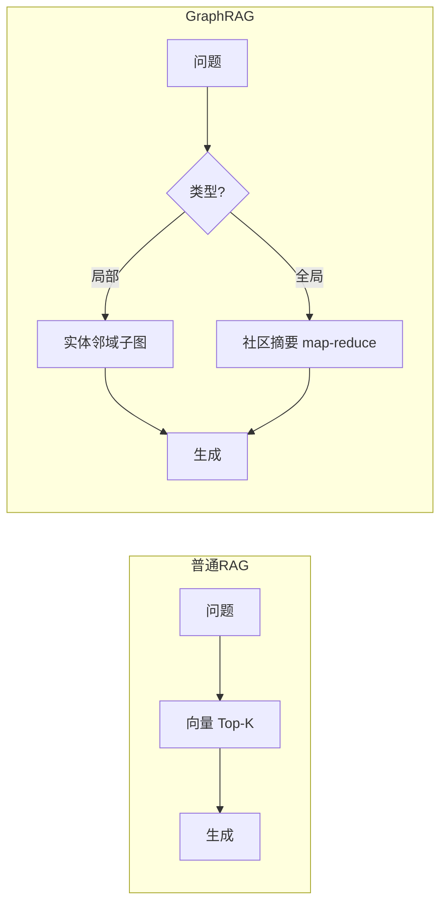

# GraphRAG

> **一句话**：GraphRAG 在向量检索之上加一层知识图谱：先从文档抽取实体与关系建图，检索时按「社区」和「关系路径」组织上下文——擅长回答「全局性、关系型」问题。

## 先看结论

- 普通 RAG 的盲区：「这批文档整体讲了什么」「A 和 B 有什么间接关系」——答案散落在几百个 chunk 里，Top-K 捞不全
- GraphRAG 两阶段：离线建图（LLM 抽实体/关系 → 社区检测 → 逐社区生成摘要）+ 在线查询（局部走实体邻域；全局汇总社区摘要）
- 代价：建图要烧大量 LLM 调用（成本是普通 RAG 的数倍到数十倍），索引更新重
- 适用判据：问题是否天然带「多跳关系」与「全局归纳」——没有就别用

## 核心机制

### 1. 索引管线：从文本到「带摘要的图」

GraphRAG 的离线阶段是一条固定的流水线：

$$
\underbrace{\text{切块}}_{\text{chunks}}
\to
\underbrace{\text{LLM 抽实体与关系}}_{\text{三元组}}
\to
\underbrace{\text{建图}}_{\mathcal{G}}
\to
\underbrace{\text{社区检测}}_{\text{划分}}
\to
\underbrace{\text{逐社区摘要}}_{\text{社区报告}}
$$

前三步与 [知识图谱](knowledge-graph.md) 的建图相同；后两步是 GraphRAG 的特色——它不满足于「有图」，而是把图**划分成层次化的社区**，再为每个社区生成一段自然语言摘要。

**社区划分**用模块度最大化（Leiden 算法）。模块度衡量「社区内连接是否比随机情况更密」：

$$
Q=\frac{1}{2m}\sum_{ij}\Big(A_{ij}-\frac{k_i k_j}{2m}\Big)\delta(c_i,c_j)
$$

社区内部越紧密、社区之间越稀疏，$$Q$$ 越大。划分出的社区再按层次组织（大社区含小社区），摘要也分层生成。

### 2. 两种查询路径

$$
\text{问题}\;\to\;
\begin{cases}
\text{局部搜索} & \text{从问题中的实体出发，取邻域子图 + 相关原文 chunk}\\
\text{全局搜索} & \text{对所有社区摘要做 map-reduce，汇总出整体性回答}
\end{cases}
$$

**全局搜索为什么要 map-reduce**：社区摘要数量可能有几百上千条，超过单次上下文预算。于是先对每批摘要分别生成「部分答案」（map），再合并成最终答案（reduce）：

$$
\text{Answer}=\mathrm{reduce}\Big(\big\{\mathrm{map}(\text{summary}_i,\;q)\big\}_{i=1}^{K}\Big)
$$

这与 [记忆压缩](memory-compression-forgetting.md) 里处理超长上下文的手法同源。

### 3. 成本模型

建图的主要开销是 LLM 调用次数，量级约为：

$$
\text{calls}\approx
\underbrace{|\text{chunks}|}_{\text{抽取实体关系}}
+\underbrace{|\text{entities}|}_{\text{合并同一实体的描述}}
+\underbrace{|\text{communities}|}_{\text{生成社区摘要}}
$$

三项都随语料规模增长，其中社区摘要是最多轮次的（层次化后数量更多）。所以 GraphRAG 的成本结构是「**一次性昂贵、查询便宜**」——语料频繁变动时，重建成本会迅速变得不可接受。

## 对比图

## 直觉解释

普通 RAG 是「把书里相关段落复印给你」；GraphRAG 是「先给你画一张全书人物关系图 + 每章摘要卡片」——问「主角和谁有仇」直接看图，问「这本书主题是什么」看摘要卡。

## 工程含义

- **按问题类型分工**：事实型单跳问题（「报销上限多少」）交给普通 RAG，又快又准；全局归纳与多跳关系才走 GraphRAG，两者是组合关系而非替代。
- **抽取 prompt 必须领域调优**：图谱质量约等于抽取质量，通用 prompt 会引入大量近义实体与噪声边，检索反而变差。
- **增量更新是选型硬指标**：文档改一段就全量重建图，成本不可持续；先确认工具支持增量索引。
- **抽象成 Agent 的一个工具**：把「图检索」封装成按需调用的上下文提供者，而不是做成独立问答系统——需要跨文档关系推理时再调用。

## 源码案例

- **Microsoft GraphRAG**（[GitHub](https://github.com/microsoft/graphrag) / [论文](https://arxiv.org/abs/2404.16130)）：官方实现，Leiden 社区检测 + 分层社区摘要，CLI 一条命令建索引。读它的 prompt 目录可以看到「实体抽取/社区摘要」的 prompt 设计，比读论文更快上手
- **LightRAG**（[GitHub](https://github.com/HKUDS/LightRAG) / [论文](https://arxiv.org/abs/2410.05779)）：轻量替代，去掉昂贵的社区层级，采用双层级检索（实体 + 主题），建图成本显著下降——中小语料的务实选择
- **与 Agent 结合**：把 GraphRAG 检索封装成一个「上下文提供者」工具，在需要跨文档关系推理时按需调用，而非做成独立的问答系统

## 常见误区

- ❌ GraphRAG 全面取代向量 RAG：事实型单跳问题普通 RAG 又快又准，两者是组合关系
- ❌ 图谱质量 = LLM 抽取质量：抽取 prompt 不针对领域调优，图会充满噪声实体，检索反而变差
- ❌ 忽视增量更新：文档改一段就全量重建图，成本不可持续
- ❌ 忽略建图成本：把 GraphRAG 用在日变更语料上，索引成本会压垮系统
- ❌ 对所有查询都走全局搜索：局部问题用全局 map-reduce 是浪费，应按问题类型路由

## 小练习

你有一万封内部邮件语料。列三个「普通 RAG 答不了、GraphRAG 能答」的问题；再估一次建图的 LLM 调用量级（用上面的成本模型），并说明哪些问题你会路由给局部搜索、哪些给全局搜索。

## 参考资料

- [From Local to Global: A Graph RAG Approach to Query-Focused Summarization](https://arxiv.org/abs/2404.16130)（Edge et al., 2024，Microsoft GraphRAG）
- [LightRAG: Simple and Fast Retrieval-Augmented Generation](https://arxiv.org/abs/2410.05779)（Guo et al., 2024）
- [Knowledge Graphs](https://arxiv.org/abs/2003.02320)（Hogan et al., 2020）

## 相关知识点

- [RAG 基础](rag-basics.md)
- [知识图谱](knowledge-graph.md)
- [向量数据库](vector-database.md)
