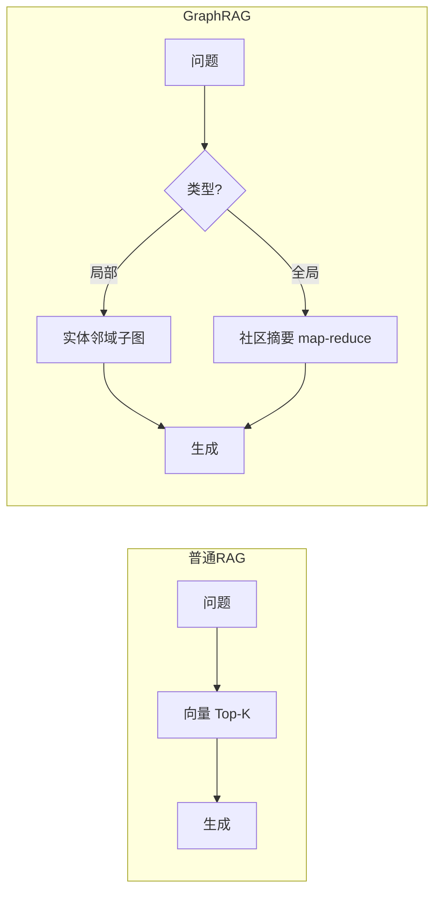

# GraphRAG

> **一句话**：GraphRAG 在向量检索之上加一层知识图谱：先从文档抽取实体与关系建图，检索时按「社区」和「关系路径」组织上下文——擅长回答「全局性、关系型」问题。
> **难度**：高级
> **标签**：`#rag` `#advanced`

## 先看结论

- 普通 RAG 的盲区：「这批文档整体讲了什么」「A 和 B 有什么间接关系」——答案散落在几百个 chunk 里，Top-K 捞不全
- GraphRAG 两阶段：离线建图（LLM 抽实体/关系 → 社区检测 → 逐社区生成摘要）+ 在线查询（局部：走实体邻域；全局：汇总社区摘要）
- 代价：建图要烧大量 LLM 调用（成本是普通 RAG 的数倍到数十倍），索引更新重
- 适用判据：问题是否天然带「多跳关系」与「全局归纳」——没有就别用

## 对比图

## 生活类比

普通 RAG 是「把书里相关段落复印给你」；GraphRAG 是「先给你画一张全书人物关系图 + 每章摘要卡片」——问「主角和谁有仇」直接看图，问「这本书主题是什么」看摘要卡。

## 源码案例

- **Microsoft GraphRAG**（[GitHub](https://github.com/microsoft/graphrag) / [论文](https://arxiv.org/abs/2404.16130)）：官方实现，Leiden 社区检测 + 分层社区摘要，CLI 一条命令建索引。读它的 prompt 目录可以看到「实体抽取/社区摘要」的 prompt 设计，比读论文更快上手
- **LightRAG**（[HKUDS/LightRAG](https://github.com/HKUDS/LightRAG)）：轻量替代，去掉了昂贵的社区层级，双层级检索（实体+主题），建图成本降一个数量级——中小语料的务实选择
- **与 Agent 结合**：把 GraphRAG 检索封装成一个「上下文提供者」工具，在需要跨文档关系推理时按需调用，而非做成独立的问答系统——这是把图检索接进 Agent 循环的通用做法

## 常见误区

- ❌ GraphRAG 全面取代向量 RAG：事实型单跳问题（「报销上限多少」）普通 RAG 又快又准，两者是组合关系
- ❌ 图谱质量 = LLM 抽取质量：抽取 prompt 不针对领域调优，图会充满噪声实体，检索反而变差
- ❌ 忽视增量更新：文档改一段就全量重建图？成本不可持续，选型时确认增量索引能力

## 小练习

你有一万封内部邮件语料。列三个「普通 RAG 答不了、GraphRAG 能答」的问题；再估一次建图的 LLM 调用量级。

## 相关资源

- [Microsoft GraphRAG 论文](https://arxiv.org/abs/2404.16130)

## 相关知识点

- [RAG 基础](rag-basics.md)
- [知识图谱](knowledge-graph.md)
