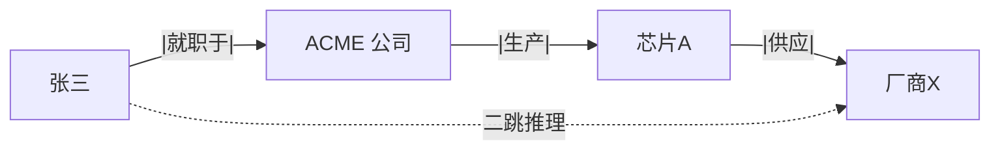

# 知识图谱

> **一句话**：知识图谱用「实体-关系-实体」三元组把知识织成网，精确、可推理、可解释；LLM 时代它常与向量检索搭配，而不是被取代。

## 问题动机

向量检索擅长「意思相近」，却不擅长**精确的关系查询**。问「张三所在公司生产的芯片供应给了谁」，答案要跨三条关系才能拼出来：向量检索会把三句话分别召回，却无法保证三者真能串成一条链，也无法验证「张三是否真的在这家公司」。图谱把关系显式存成边，多跳查询就是图上的路径遍历——精确、可验证、可展示推理路径。

## 核心机制

### 1. 知识图谱的形式定义

图谱是一组三元组的集合：

$$
\mathcal{G}=\{(h,\,r,\,t)\mid h,t\in\mathcal{E},\; r\in\mathcal{R}\}
$$

$$\mathcal{E}$$ 是实体集合，$$\mathcal{R}$$ 是关系集合。`(张三, 就职于, ACME)` 与 `(ACME, 生产, 芯片A)` 就是两条边。

### 2. 多跳查询 = 图的连接（join）

两跳查询在集合上就是一个连接操作：

$$
\text{Answer}=\{\,t\;\mid\;(h_0,r_1,m)\in\mathcal{G}\;\wedge\;(m,r_2,t)\in\mathcal{G}\,\}
$$

$$k$$ 跳就是把连接重复 $$k$$ 次。这在图数据库里是一条 Cypher/SPARQL 查询，返回的**路径本身**就是可展示的解释：

```cypher
MATCH (p:Person {name:'张三'})-[:就职于]->(c:Company)
      -[:生产]->(chip:Chip)-[:供应]->(buyer:Company)
RETURN buyer, [p, c, chip, buyer] AS path
```

### 3. 图上的两个常用度量

**度中心性**衡量节点的重要程度——邻居越多越重要；**PageRank** 进一步考虑「谁指向你」的权重：

$$
\mathrm{PR}(u)=\frac{1-d}{N}+d\sum_{v\in B_u}\frac{\mathrm{PR}(v)}{L(v)}
$$

$$B_u$$ 是指向 $$u$$ 的节点集合，$$L(v)$$ 是 $$v$$ 的出度，$$d$$ 是阻尼系数（通常 0.85）。

**模块度**用于社区发现（GraphRAG 用它划分「社区」再做摘要）：

$$
Q=\frac{1}{2m}\sum_{ij}\Big(A_{ij}-\frac{k_i k_j}{2m}\Big)\,\delta(c_i,c_j)
$$

$$A$$ 是邻接矩阵，$$k_i$$ 是节点度，$$m$$ 是总边数，$$c_i$$ 是节点所属社区。$$Q$$ 越大，社区内部连接越紧密、社区之间越稀疏——这正是 GraphRAG「先分区、再逐区摘要」的依据。

### 4. 与向量检索的分工

| 维度 | 向量 RAG | 知识图谱 |
|---|---|---|
| 擅长 | 模糊语义匹配、文本段落 | 精确关系、多跳推理、聚合统计 |
| 构建 | 切块+embedding，便宜 | 实体关系抽取，昂贵 |
| 更新 | 追加容易 | 改实体要动图结构 |
| 可解释 | 弱（相似度分） | 强（推理路径可展示） |

两者是**组合关系**：向量负责模糊召回，图负责精确约束与多跳。

## 图示



## 工程含义

- **LLM × KG 的三种关系**：LLM 抽取建图（把最贵的环节自动化）、图验证 LLM 输出（抗幻觉）、图提供多跳上下文（增强 RAG）。
- **schema 仍需人来定**：实体与关系的类型体系靠 LLM 全自动推断会得到一堆近义边（「就职于/任职于/工作于」），必须做归一化。
- **领域窄、关系密才值得**：维护成本高，通用开放域不如老老实实做混合检索。

## 源码案例

- **Neo4j + LLM 工具链**（[neo4j/neo4j](https://github.com/neo4j/neo4j) / [neo4j-labs/llm-graph-builder](https://github.com/neo4j-labs/llm-graph-builder)）：图数据库事实标准；llm-graph-builder 用 LLM 从 PDF 自动抽取三元组入图，是「LLM 建图」的参考流水线
- **GraphRAG 中的图谱**：微软 GraphRAG（[仓库](https://github.com/microsoft/graphrag) / [论文](https://arxiv.org/abs/2404.16130)）实质是「轻量知识图谱 + 社区摘要」——不需要传统 KG 的本体工程，大幅降低建图门槛（→ [GraphRAG](graphrag.md)）
- **Agent 用图抗幻觉**：把图查询（Cypher/SPARQL）做成 Agent 的一个工具，对关系型问题强制查图作答并附推理路径（→ [幻觉问题](../10-evaluation-safety/hallucination.md)）

## 常见误区

- ❌ KG 是老技术所以过时了：LLM 降低了建图成本，KG 正以 GraphRAG 的形态翻红
- ❌ 全自动建图不用人工审：核心实体与关系的 schema 设计仍需领域专家定调，否则图是「看起来很美」的噪声网
- ❌ 图谱能替代向量库存文本：图不擅长存长文本与模糊匹配，生产系统几乎都是图+向量混合
- ❌ 忽略多跳的代价：$$k$$ 跳查询的组合数会爆炸，必须给路径长度与分支数设上限

## 小练习

给「供应商风险监控」建图：列 5 种实体、8 种关键关系；写一个「二级供应商断供影响哪些产品线」的多跳查询思路。

## 参考资料

- [GraphRAG: Unlocking LLM Discovery on Narrative Private Data](https://arxiv.org/abs/2404.16130)（Edge et al., 2024，社区检测与摘要）
- [Translating Embeddings for Modeling Multi-relational Data](https://arxiv.org/abs/1301.3781)（Bordes et al., 2013，TransE，图嵌入基础）
- [Knowledge Graphs](https://arxiv.org/abs/2003.02320)（Hogan et al., 2020，综述）
- [Neo4j 文档](https://neo4j.com/docs/)

## 相关知识点

- [GraphRAG](graphrag.md)
- [Embedding 与相似度检索](embedding-similarity.md)
