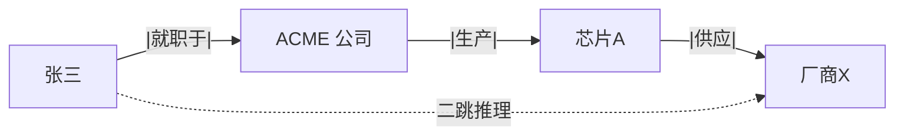

# 知识图谱

> **一句话**：知识图谱用「实体-关系-实体」三元组把知识织成网，精确、可推理、可解释；LLM 时代它常与向量检索搭配，而不是被取代。
> **难度**：高级
> **标签**：`#rag`

## 先看结论

- 三元组（头实体， 关系， 尾实体）是基本单元：`(张三, 就职于, ACME)`、`(ACME, 生产, 芯片A)`
- 相比向量检索：图谱支持多跳推理（A 认识 B、B 供职 C → A 可能认识 C 圈层）与精确约束查询
- LLM × KG 的三种关系：LLM 抽取建图（自动化了最大成本）、图验证 LLM 输出（抗幻觉）、图提供多跳上下文（增强 RAG）
- 建图维护成本高，领域窄、关系密的场景才值得

## 图示

「张三所在公司生产的芯片卖给了谁」——向量检索难捞全，图谱一跳两跳直达。

## 与向量 RAG 对比

| 维度 | 向量 RAG | 知识图谱 |
|---|---|---|
| 擅长 | 模糊语义匹配、文本段落 | 精确关系、多跳推理、聚合统计 |
| 构建 | 切块+embedding，便宜 | 实体关系抽取，昂贵 |
| 更新 | 追加容易 | 改实体要动图结构 |
| 可解释 | 弱（相似度分） | 强（推理路径可展示） |

## 源码案例

- **Neo4j + LLM 工具链**（[neo4j/neo4j](https://github.com/neo4j/neo4j) / [neo4j-labs/llm-graph-builder](https://github.com/neo4j-labs/llm-graph-builder)）：图数据库事实标准；llm-graph-builder 用 LLM 从 PDF 自动抽取三元组入图，是「LLM 建图」的参考流水线
- **GraphRAG 中的图谱**：微软 GraphRAG（[仓库](https://github.com/microsoft/graphrag)）实质是「轻量知识图谱 + 社区摘要」——不需要传统 KG 的本体工程，LLM 抽什么图就是什么，大幅降低建图门槛（→ [GraphRAG](graphrag.md)）
- **Agent 用图抗幻觉**：让 Agent 的工具面包含一个图查询工具（Cypher/SPARQL），对「关系型问题」强制查图作答并附推理路径——图成为可验证的知识源，呼应 [幻觉问题](../10-evaluation-safety/hallucination.md) 的治理

## 常见误区

- ❌ KG 是老技术所以过时了：LLM 降低了建图成本，KG 正在以 GraphRAG 的形态翻红
- ❌ 全自动建图不用人工审：核心实体与关系的 schema 设计仍需领域专家定调，否则图是「看起来很美」的噪声网
- ❌ 图谱能替代向量库存文本：图不擅长存长文本与模糊匹配，生产系统几乎都是图+向量混合

## 小练习

给「供应商风险监控」建图：列 5 种实体、8 种关键关系；写一个「二级供应商断供影响哪些产品线」的多跳查询思路。

## 相关资源

- [GraphRAG 论文](https://arxiv.org/abs/2404.16130)

## 相关知识点

- [GraphRAG](graphrag.md)
- [Embedding 与相似度检索](embedding-similarity.md)
