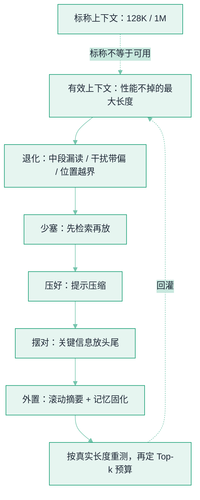

# 长上下文退化与有效上下文窗口


**一句话**：厂商标称的 128K / 1M 是「**能塞进去**」的长度，不是「**塞进去还答得对**」的长度。上下文越长，模型往往越容易漏读中段、被无关内容带偏——真正该按「**有效上下文**」来规划你往窗口里放什么、放多少。


## 问题动机

大窗口带来一个危险的错觉：既然能放一百万 token，那就把整段对话史、整个代码库、所有候选文档一股脑塞进去，让模型「自己找」。但一批评测反复发现：**很多模型的实际可用长度远低于标称**，而且在**本应很简单**的任务上，只要把输入拉长、干扰项变多，准确率就会明显下滑。RULER 的结论很直白——标称 128K 的模型，在固定性能门槛下的**有效长度常常只有其几分之一**。

把上下文想成一条**会随长度衰减的资源**，而不是一个「越大越好」的容器，是这页的核心心智。它与[上下文工程](context-engineering.md)、[RAG 检索质量调优](retrieval-quality-tuning.md) 是同一枚硬币：那两页讲「怎么摆、怎么取」，这页讲「**为什么不能贪多、以及贪多会怎么坏**」。

## 退化长什么样

长上下文变差不是玄学，至少有四条互相叠加的机制：

- **注意力稀释**：softmax 要在更多 token 间分配注意力，每个关键 token 拿到的权重被摊薄，长文里「找那一根针」自然更难。
- **中段丢失（Lost in the Middle）**：模型对**开头和结尾**的信息用得好，对**正中间**的信息利用率显著下降，性能随关键信息所在位置呈 **U 形**——把最要紧的约束放在中段，等于半丢弃。
- **位置外推失配**：训练时见过的长度有限，推理超出后位置编码进入分布外区域，越靠后越不稳。
- **干扰项敏感**：无关但看似相关的内容越多，越容易把模型「带偏」，于是出现「任务没变难、只是上下文变长，就答错」的退化。

## 怎么量：别用「大海捞针」自欺

经典 needle-in-a-haystack（在长文里藏一句原话再问）太简单，几乎测不出真实退化。更狠的做法是 **RULER** 这类合成基准：多根针、多跳聚合、变量追踪等任务，**可控地把长度一路拉到 128K**，看性能曲线何时掉下门槛。要点有二：

1. 报告的是「**达到某性能水平时的最大长度**」，而不是「能接受的最大输入」——两者可能差数倍。
2. **要测你自己那台模型、你自己的任务分布**，厂商标称长度只是上限，不是承诺。

## 怎么治：一条「少塞、压好、摆对、外置」的漏斗

*《图：治长上下文退化是一条自上而下的漏斗——少塞、压好、摆对、外置依次收窄，末端「按真实长度重测」再回灌到「有效上下文」，而非拿厂商标称当容量》*

- **少塞**：能检索就别整篇塞。把[检索质量调优](retrieval-quality-tuning.md)里的召回+重排做好，只让 Top 几条真正相关的进窗口。
- **压好**：用 **LongLLMLingua** 这类提示压缩，按困惑度/重要性删掉低信息密度的词，实测能在大幅缩短输入的同时保住甚至提升表现。
- **摆对**：既然中段最容易被忽略，就把**关键指令与约束放在开头或结尾**，长文档做**重排**让最相关的落在两端。
- **外置**：长会话不要无限堆原始记录，靠**滚动摘要**与[记忆固化](sleep-time-memory-consolidation.md)携带「蒸馏后的状态」，把窗口留给当下真正要推理的内容。

## 概念速查

| 概念 | 一句话 | 关键权衡 |
|---|---|---|
| 标称 vs 有效上下文 | 能塞进去 ≠ 塞进去还答得对 | 以性能门槛定义可用长度 |
| 注意力稀释 | token 越多，每个拿到的注意力越薄 | 长文找关键信息更难 |
| Lost in the Middle | 头尾用得好、中段易漏（U 形） | 关键信息别放中段 |
| 干扰项敏感 | 无关内容越多越易被带偏 | 「塞更多」常是负收益 |
| RULER / 长上下文评测 | 合成多任务拉满长度测真实曲线 | 别用大海捞针自欺 |
| 提示压缩 | 删低信息密度 token 保性能 | 压太狠会丢关键细节 |

## 直觉解释

把上下文窗口想成**考场能带的资料**：名义上你能抱一整面墙的书进场，但**书越多，翻找越慢、越容易被相似却无关的页带错**，而且摊在中间那几页你几乎不会去看。聪明做法不是抱得越多越好，而是**只带贴好便签、按相关度排在最顺手位置的那几页**——这正是「少塞 + 摆对 + 压缩」的工程含义。

## 工程含义

- **按有效长度定预算，而非按标称**：先测出你这台模型在目标任务上的有效上下文，再据此设 RAG 的 Top-k 与拼接上限；把「窗口还有空」当「可以继续塞」是最贵的错误。
- **长会话要主动遗忘/固化**：Agent 跑久了，别把全量历史留在窗口里，滚动摘要 + 外置记忆把状态压小，否则成本与退化同时上涨。
- **结构比长度更重要**：同样多的 token，把关键约束放头尾、把长文档重排，往往比单纯减少几百 token 更有效。
- **警惕「上下文越多越准」的直觉**：多出来的内容若与任务弱相关，只是噪声与账单；用评测确认每一段是否真的在帮忙。

## 源码案例

- **RULER**（[论文](https://arxiv.org/abs/2404.06654)）：合成基准把长度拉到 128K 测真实曲线，揭示多数模型的「有效上下文」远低于标称
- **Lost in the Middle**（[论文](https://arxiv.org/abs/2307.03172)）：Liu et al. 2023，证明关键信息在长上下文中段时性能呈 U 形塌陷
- **LongLLMLingua**（[论文](https://arxiv.org/abs/2310.06839)）：以困惑度驱动的提示压缩，在显著缩短输入的同时保住下游表现

## 常见误区

- ❌ 把「标称窗口」当「可用容量」：厂商标的是能输入的上限，不是不掉性能的长度
- ❌ 用大海捞针测长上下文：太简单，测不出干扰与中段丢失，应上 RULER 类多任务
- ❌ 关键指令塞在长文档中间：正中 Lost-in-the-Middle 的塌陷区
- ❌ 长会话只增不减：既不摘要也不外置，退化和成本一起涨
- ❌ 以为压缩无损：压太狠会删掉真正承载答案的低频 token

## 参考资料

- [RULER: What's the Real Context Size of Your Long-Context Language Models?](https://arxiv.org/abs/2404.06654)（Hsieh et al., 2024）
- [Lost in the Middle: How Language Models Use Long Contexts](https://arxiv.org/abs/2307.03172)（Liu et al., 2023）
- [LongLLMLingua: Accelerating and Enhancing LLMs in Long Context Scenarios via Prompt Compression](https://arxiv.org/abs/2310.06839)（Jiang et al., 2023）

## 相关知识点

- [上下文工程](context-engineering.md)
- [RAG 检索质量调优](retrieval-quality-tuning.md)
- [记忆压缩与遗忘](memory-compression-forgetting.md)
- [记忆固化与睡眠时计算](sleep-time-memory-consolidation.md)
