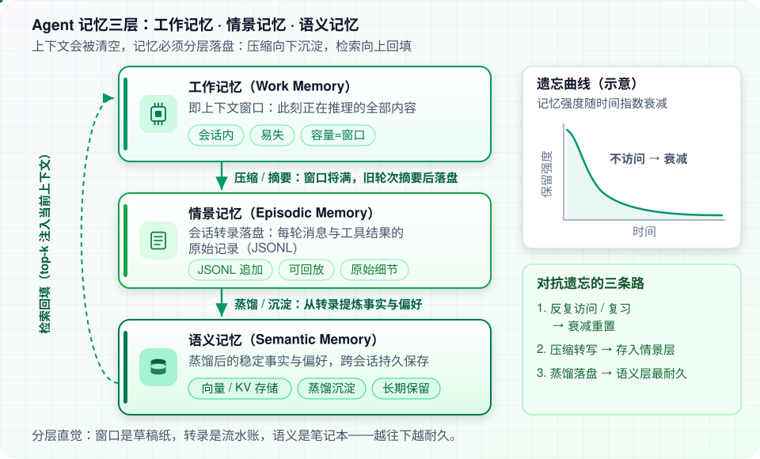
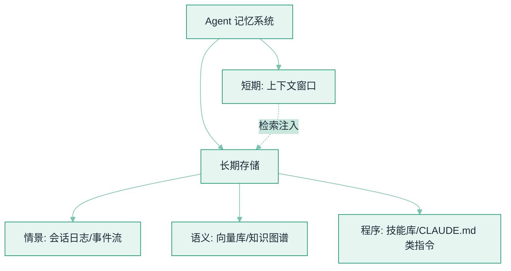

# 记忆类型：短期、长期、情景、语义、程序


**一句话**：借认知科学的五分类给 Agent 记忆建模——不同记忆放不同地方、用不同机制存取。
  **难度**：入门
  **标签**：`#memory`


## 先看结论

- 短期记忆 = 上下文窗口本身；长期记忆 = 外部存储 + 检索
- 情景记忆记「发生过什么」，语义记忆记「事实与知识」，程序记忆记「怎么做」
- 分类不是教条：设计记忆系统时先问「这条信息什么时候会被需要」，再选机制

## 五分类速查

| 类型 | 存什么 | Agent 实现 | 例子 |
|---|---|---|---|
| 短期记忆 | 当前对话上下文 | 消息列表（窗口内） | 刚才用户说的需求 |
| 长期记忆 | 跨会话持久信息 | 数据库/文件 + 检索 | 用户偏好「回复用繁体中文」 |
| 情景记忆 | 具体经历与过程 | 会话日志（append-only） | 「上周那次部署失败因为漏配 env」 |
| 语义记忆 | 事实与概念知识 | 知识库 / KG / RAG 索引 | 公司产品规格、API 文档 |
| 程序记忆 | 技能与操作流程 | Skill/工具集/提示模板 | 「部署要先跑迁移再灰度」 |

## 图示

## 三个操作：写入、检索、遗忘

分类只回答「放哪儿」，能落地的系统是三个操作的组合。

**写入**要先判类型与冲突，再决定放哪：

| 问题 | 判据 | 落到 |
|---|---|---|
| 还在这轮对话里有用吗 | 窗口内 / 几轮内 | 短期：留在消息列表，别写库 |
| 是关于「这个用户」的稳定事实 | 可复述、跨会话成立 | 语义记忆（带来源与时间戳） |
| 是一次经历 | 有前后因果 | 情景记忆（append-only 事件流） |
| 是可复用做法 | 能被执行或照做 | 程序记忆（Skill / 命令 / 模板） |
| 与已有条目矛盾 | 新旧同 key | **覆盖 + 记旧值**，不要并存两条 |

**检索**常被直接套 Generative Agents 的三因子打分（原论文见本页「参考资料」）：

$$
\text{score}(m \mid q) = \alpha \underbrace{e^{-\Delta t_m/\tau}}_{\text{时近性}} + \beta \underbrace{\text{imp}_m}_{\text{重要度}} + \gamma \underbrace{\cos(\mathbf{q}, \mathbf{k}_m)}_{\text{相关性}}
$$

工程上三个量都要归一化后再加权；只按相关性检索的系统，会把「半年前一句随口的话」顶到今天面前。

**遗忘**有三种粒度，实现代价递增：

1. **不注入**（软遗忘）：条目留着但不进上下文——最常用，也最容易被审计追问「为什么这条没生效」
2. **衰减与降权**：$$\Delta t$$ 越大权重越小，需要可解释的 $$\tau$$
3. **压缩上卷**：把细粒度情景折成摘要后归档原始事件（见 [记忆压缩、遗忘与摘要](memory-compression-forgetting.md)）

## 源码案例

- **DeepSeek Harness：情景记忆的工程化**（[仓库](https://github.com/deepseek-ai/deepseek-harness)）：append-only 会话日志完整记录每段经历（推理、工具调用、子 Agent 调度），恢复 = 重放事件流——情景记忆被做成了系统底座而非附属功能
- **Claude Code 的三层记忆**（逆向分析，[提示词全集](https://github.com/Piebald-AI/claude-code-system-prompts)）：CLAUDE.md（语义+程序：项目约定与命令）/ TodoWrite（短期任务状态）/ 会话转写文件（情景）；`/init` 命令自动把「项目记忆」从情景中提炼成 CLAUDE.md
- **Letta（MemGPT）**（[GitHub](https://github.com/letta-ai/letta)）：把操作系统的虚拟内存思想搬进 Agent——上下文满了自动把旧信息换出到外部「主存」，需要时换入，是长期记忆管理的经典开源实现；同类产品 **Mem0**（[GitHub](https://github.com/mem0ai/mem0)）专注「记忆抽取-存储-检索」的独立记忆层

## 常见误区

- ❌ 对话历史 = 记忆：全量历史既放不下也不该全放，「记住该记的」才叫记忆管理
- ❌ 记忆越多越聪明：过时、矛盾的记忆会主动坑害 Agent——遗忘机制与记忆同等重要
- ❌ 程序记忆只能靠 prompt：技能可以做成可执行产物（脚本、MCP 工具），不必永远是文本指令

## 小练习

给个人助理 Agent 分类：用户口味偏好、昨天聊过的电影、你常用的报销流程、本次对话的第一句话——各属于哪种记忆？分别怎么存？

## 参考资料

- [MemGPT 论文（把上下文当分页虚拟内存的原始设计）](https://arxiv.org/abs/2310.08560)
- [Letta（MemGPT 的后续开源实现）](https://github.com/letta-ai/letta)
- [Mem0（记忆分层与检索的服务化实现）](https://github.com/mem0ai/mem0)
- [Generative Agents 论文（记忆流 + 反思 + 重要度检索的实证）](https://arxiv.org/abs/2304.03442)

## 相关知识点

- [上下文工程](context-engineering.md)
- [记忆压缩、遗忘与摘要](memory-compression-forgetting.md)

