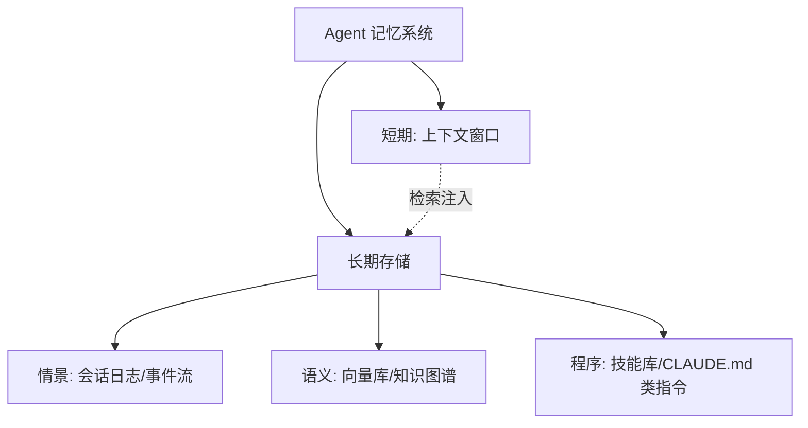

# 记忆类型：短期、长期、情景、语义、程序

> **一句话**：借认知科学的五分类给 Agent 记忆建模——不同记忆放不同地方、用不同机制存取。
> **难度**：入门
> **标签**：`#memory`

## 先看结论

- 短期记忆 = 上下文窗口本身；长期记忆 = 外部存储 + 检索
- 情景记忆记「发生过什么」，语义记忆记「事实与知识」，程序记忆记「怎么做」
- 分类不是教条：设计记忆系统时先问「这条信息什么时候会被需要」，再选机制

## 五分类速查

| 类型 | 存什么 | Agent 实现 | 例子 |
|---|---|---|---|
| 短期记忆 | 当前对话上下文 | 消息列表（窗口内） | 刚才用户说的需求 |
| 长期记忆 | 跨会话持久信息 | 数据库/文件 + 检索 | 用户偏好「回复用繁体中文」 |
| 情景记忆 | 具体经历与过程 | 会话日志（append-only） | 「上周那次部署失败因为漏配 env」 |
| 语义记忆 | 事实与概念知识 | 知识库 / KG / RAG 索引 | 公司产品规格、API 文档 |
| 程序记忆 | 技能与操作流程 | Skill/工具集/提示模板 | 「部署要先跑迁移再灰度」 |

## 图示

## 源码案例

- **DeepSeek Harness：情景记忆的工程化**（[仓库](https://github.com/deepseek-ai/deepseek-harness)）：append-only 会话日志完整记录每段经历（推理、工具调用、子 Agent 调度），恢复 = 重放事件流——情景记忆被做成了系统底座而非附属功能
- **Claude Code 的三层记忆**（逆向分析，[提示词全集](https://github.com/Piebald-AI/claude-code-system-prompts)）：CLAUDE.md（语义+程序：项目约定与命令）/ TodoWrite（短期任务状态）/ 会话转写文件（情景）；`/init` 命令自动把「项目记忆」从情景中提炼成 CLAUDE.md
- **Letta（MemGPT）**（[GitHub](https://github.com/letta-ai/letta)）：把操作系统的虚拟内存思想搬进 Agent——上下文满了自动把旧信息换出到外部「主存」，需要时换入，是长期记忆管理的经典开源实现；同类产品 **Mem0**（[GitHub](https://github.com/mem0ai/mem0)）专注「记忆抽取-存储-检索」的独立记忆层

## 常见误区

- ❌ 对话历史 = 记忆：全量历史既放不下也不该全放，「记住该记的」才叫记忆管理
- ❌ 记忆越多越聪明：过时、矛盾的记忆会主动坑害 Agent——遗忘机制与记忆同等重要
- ❌ 程序记忆只能靠 prompt：技能可以做成可执行产物（脚本、MCP 工具），不必永远是文本指令

## 小练习

给个人助理 Agent 分类：用户口味偏好、昨天聊过的电影、你常用的报销流程、本次对话的第一句话——各属于哪种记忆？分别怎么存？

## 相关知识点

- [上下文工程](context-engineering.md)
- [记忆压缩、遗忘与摘要](memory-compression-forgetting.md)
