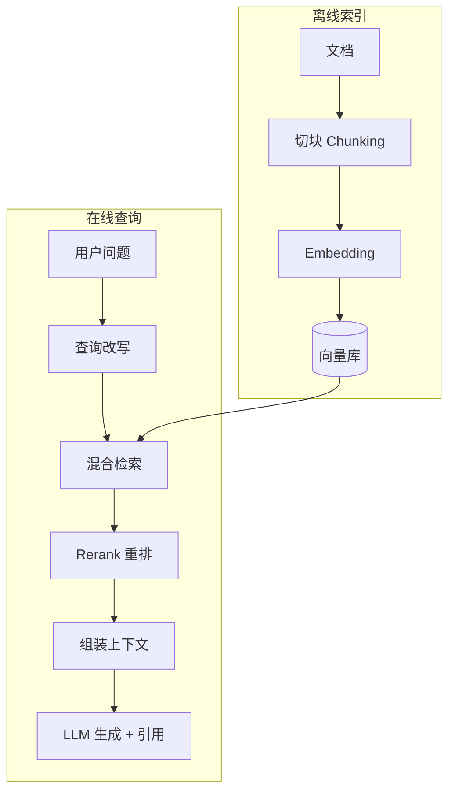

# RAG 基础

> **一句话**：RAG（Retrieval-Augmented Generation，检索增强生成）= 回答前先去知识库里捞相关资料，再让 LLM 按资料作答——给模型「开卷考试」的能力。

## 问题动机

LLM 的知识冻结在训练数据里：企业内部文档、昨天的公告、私有的产品参数，它都不知道；而且它被问到不知道的事时，倾向于编一个听起来合理的答案。RAG 的思路是把「记忆」外置到可随时更新的检索库里，回答时把相关资料塞进上下文——知识可更新、答案可溯源、私有数据不必进模型训练。

## 核心机制

### 1. 完整管线

$$
\underbrace{\text{Chunk}\to\text{Embed}\to\text{Index}}_{\text{索引侧（离线）}}
\quad+\quad
\underbrace{\text{Query}\to\text{Retrieve}\to\text{Rerank}\to\text{Generate}}_{\text{查询侧（在线）}}
$$

索引侧把文档切成块、编码成向量、建成可检索的索引；查询侧把问题编码后检索候选、精排、组装进 prompt 交给 LLM 生成。

### 2. 检索质量怎么量化

检索环节的好坏用排序指标衡量（定义见 [Agent 评估指标](../10-evaluation-safety/evaluation-metrics.md)）：

$$
\text{Recall@}k=\frac{\#\{\text{前 }k\text{ 个结果中的相关文档}\}}{\#\{\text{全部相关文档}\}}
$$

$$
\text{MRR}=\frac{1}{|Q|}\sum_{i=1}^{|Q|}\frac{1}{\mathrm{rank}_i}
$$

**为什么要分开测检索与生成**：最终答案错，可能是没检索到（召回问题），也可能是检索到了但模型没用对（生成问题）。不分开测就只能猜。

### 3. 生成质量：忠实度与答案相关性

RAGAS 提出的两个无参考指标可直接评估生成侧。

**忠实度（Faithfulness）**：把答案拆成若干陈述 $$S$$，统计其中能被检索上下文 $$c$$ 支持的比例：

$$
\text{Faithfulness}=\frac{\big|\{s\in S:\;s\ \text{被}\ c\ \text{支持}\}\big|}{|S|}
$$

它直接度量「有没有编」——幻觉的答案忠实度低。

**答案相关性（Answer Relevance）**：让模型根据答案反推可能的问题 $$\{q_1,\dots,q_N\}$$，再算它们与原问题的平均余弦相似度：

$$
\text{Answer Relevance}=\frac{1}{N}\sum_{i=1}^{N}\cos\!\big(\mathbf{q},\,\mathbf{q}_i\big)
$$

答案若跑题，反推出来的问题就与原问题不像，分数低。

### 4. 为什么「Top-K 不是越多越好」

检索到的每个块都会占用上下文并参与注意力。低相关块会稀释有效信息、诱发幻觉，还会推高成本。生产上的常见做法是**先召回较多候选（如 Top-50），再重排取 Top-3~5** 交给模型。

## 管线图



## 直觉解释

闭卷考试（纯 LLM）：全靠脑子，过时的、没学的都答不了还爱瞎编。
开卷考试（RAG）：先翻书找到相关段落，照着书写答案并注明页码——又新又可查证。

## 最小 RAG（5 行）

```python
from llama_index.core import VectorStoreIndex, SimpleDirectoryReader

docs = SimpleDirectoryReader("docs/").load_data()      # 读文档
index = VectorStoreIndex.from_documents(docs)          # 切块+embedding+入库
engine = index.as_query_engine(similarity_top_k=3)     # 检索+组装+生成
print(engine.query("公司的年假政策是什么？"))            # 带引用的回答
```

## 工程含义

- **失败大多不在模型**：切块烂、检索偏、上下文组装差是三大主因；先修检索再考虑换模型。
- **要能溯源**：把 chunk 的来源（文件、页码）带进生成结果，便于人工核验与合规审计。
- **增量更新要从第一天设计**：文档改了索引没改，系统会一本正经地引用旧知识。

## 源码案例

- **LlamaIndex**（[GitHub](https://github.com/run-llama/llama_index)）：为 RAG 而生的框架，上面 5 行就是完整管线；进阶看它的 `SentenceWindowNodeParser`（句窗检索）与 `AutoMergingRetriever`（自动合并父块）——两个经典「切块两难」解法
- **LangChain 的 RAG 教程**（[文档](https://python.langchain.com/docs/tutorials/rag/)）：生产级管线模板（加载→切分→存储→检索→生成），适合对照理解每个环节的可替换点
- **Anthropic 的多 Agent 研究系统**（[工程博客](https://www.anthropic.com/engineering/built-multi-agent-research-system)）：其 Lead Agent 把「搜索」拆给多个子 Agent 并行 RAG，披露了 token 消耗与准确率的真实权衡——RAG 与多 Agent 组合的一手工程数据

## 常见误区

- ❌ RAG = 买个向量库：向量库只是存储环节，管线质量取决于切块与检索策略
- ❌ 检索 Top-K 越多越好：喂 20 个低相关块会稀释注意力、诱发幻觉，重排后 3–5 个最佳
- ❌ 只评答案不通：答案对不代表检索系统好（可能蒙对），分环节评估才能定位问题
- ❌ 用同一个 embedding 模型处理「查询」和「文档」：很多模型是非对称的，查询侧与文档侧要用对应的编码方式

## 参考资料

- [Retrieval-Augmented Generation for Knowledge-Intensive NLP Tasks](https://arxiv.org/abs/2005.11401)（Lewis et al., 2020，RAG 原始论文）
- [Dense Passage Retrieval for Open-Domain Question Answering](https://arxiv.org/abs/2004.04906)（Karpukhin et al., 2020，DPR）
- [RAGAS: Automated Evaluation of Retrieval Augmented Generation](https://arxiv.org/abs/2309.15217)（Es et al., 2023）

## 相关知识点

- [Embedding 与相似度检索](embedding-similarity.md)
- [GraphRAG](graphrag.md)
