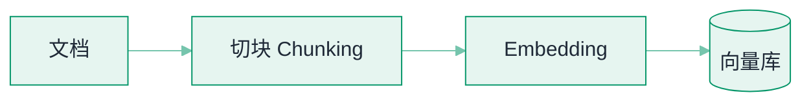
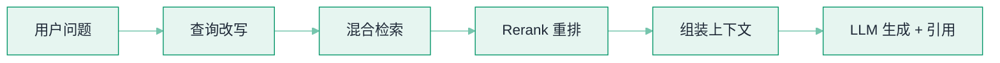

# RAG 基础


**一句话**：RAG（Retrieval-Augmented Generation，检索增强生成）= 回答前先去知识库里捞相关资料，再让 LLM 按资料作答——给模型「开卷考试」的能力。


## 问题动机

LLM 的知识冻结在训练数据里：企业内部文档、昨天的公告、私有的产品参数，它都不知道；而且它被问到不知道的事时，倾向于编一个听起来合理的答案。RAG 的思路是把「记忆」外置到可随时更新的检索库里，回答时把相关资料塞进上下文——知识可更新、答案可溯源、私有数据不必进模型训练。

## 核心机制

### 1. 完整管线

$$
\begin{aligned}
&\underbrace{\text{Chunk}\to\text{Embed}\to\text{Index}}_{\text{索引侧（离线）}}\\
&+\;\underbrace{\text{Query}\to\text{Retrieve}\to\text{Rerank}\to\text{Generate}}_{\text{查询侧（在线）}}
\end{aligned}
$$

索引侧把文档切成块、编码成向量、建成可检索的索引；查询侧把问题编码后检索候选、精排、组装进 prompt 交给 LLM 生成。

### 2. 检索质量怎么量化

检索环节的好坏用排序指标衡量：**Recall@k** 看前 $$k$$ 个结果捞回了多少该捞的，**MRR** 看第一条相关结果排在第几位（两者定义式见 [Agent 评估指标](../10-evaluation-safety/evaluation-metrics.md)）。RAG 的日常调参里 Recall@k 决定「重排之前有没有料」，MRR 决定「喂给 LLM 的前几块有没有用」。

**为什么要分开测检索与生成**：最终答案错，可能是没检索到（召回问题），也可能是检索到了但模型没用对（生成问题）。不分开测就只能猜。

### 3. 生成质量：忠实度与答案相关性

RAGAS 提出的两个无参考指标可直接评估生成侧。

**忠实度（Faithfulness）**：把答案拆成若干陈述 $$S$$，统计其中能被检索上下文 $$c$$ 支持的比例：

$$
\text{Faithfulness}=\frac{\big|\{s\in S:\;s\ \text{被}\ c\ \text{支持}\}\big|}{|S|}
$$

它直接度量「有没有编」——幻觉的答案忠实度低。

**答案相关性（Answer Relevance）**：让模型根据答案反推可能的问题 $$\{q_1,\dots,q_N\}$$，再算它们与原问题的平均余弦相似度：

$$
\text{Answer Relevance}=\frac{1}{N}\sum_{i=1}^{N}\cos\!\big(\mathbf{q},\,\mathbf{q}_i\big)
$$

答案若跑题，反推出来的问题就与原问题不像，分数低。

### 4. 为什么「Top-K 不是越多越好」

检索到的每个块都会占用上下文并参与注意力。低相关块会稀释有效信息、诱发幻觉，还会推高成本。生产上的常见做法是**先召回较多候选（如 Top-50），再重排取 Top-3~5** 交给模型。

## 管线图



*《图：离线侧——文档切块、向量化后入库；这一步的产物只服务下图的在线链路》*



*《图：在线侧——问题经改写、混合检索、重排、组装上下文再交给 LLM 生成带引用的回答；两图唯一接口是「向量库供混合检索读取」》*

## 直觉解释

闭卷考试（纯 LLM）：全靠脑子，过时的、没学的都答不了还爱瞎编。
开卷考试（RAG）：先翻书找到相关段落，照着书写答案并注明页码——又新又可查证。

## 最小 RAG：四步管线的三份数据

一个能跑的最小 RAG，接口面只有三份数据：**入库时喂什么**、**检索时问什么**、**回答里必须带回什么**。以「问公司年假政策」为例，四步链路各自的数据形状如下。

```json
{
  "ingest": {
    "reader": "SimpleDirectoryReader",
    "root": "docs/",
    "call": "load_data()",
    "index": "VectorStoreIndex.from_documents(docs)",
    "hidden_steps": ["切块", "embedding", "入库"],
    "stored_unit": {
      "chunk_id": "string",
      "text": "一个块的原文",
      "embedding": "float[]，维度由模型决定",
      "metadata": { "source_path": "docs/hr/leave.md", "page": 3, "section_path": "假期 > 年假" }
    }
  },
  "query": {
    "engine": "index.as_query_engine(similarity_top_k=3)",
    "question": "公司的年假政策是什么？",
    "recall": "语义最近的 3 个块"
  },
  "answer": {
    "text": "只依据资料作答的自然语言回答",
    "citations": [
      { "chunk_id": "string", "source_path": "docs/hr/leave.md", "page": 3 }
    ]
  }
}
```

这份契约里最值得盯的是两处。**其一**，`from_documents` 一次调用背后藏着三个环节——切块决定检索粒度，embedding 决定「像不像」，入库决定能不能被找到；把它当黑盒，出错时就无从下手。**其二**，`metadata` 里的 `source_path` 与 `page` 必须在切块时就写好、跟着向量一路带到回答里，否则 `citations` 填不出来——「要能溯源」不是生成阶段的功夫，是索引阶段的债。另外注意 `similarity_top_k: 3` 在默认装配下**就是最终进 prompt 的块数**（检索到几个就塞几个）；生产上它更该被当作召回额度，后面挂一层重排、只把精排后的 Top-3~5 交给模型。



#### 第 1 步：读文档，得到原始节点

`SimpleDirectoryReader("docs/").load_data()` 把目录下每个文件变成一个文档节点，带上文件路径等元数据。这一步的坑在格式而非算法：PDF 里的表格、扫描件的图片文字、Markdown 里的代码块，读进来的形状完全不同，而下游切块是按字符长度下刀的。


#### 第 2 步：切块 + embedding + 入库，一次调用打包

`VectorStoreIndex.from_documents(docs)` 把每个文档切成 chunk（默认按句子边界累积到约一千 token 上下）、逐块编码、写入向量存储。每块都保留 `metadata`，这是后面 `citations` 唯一的来源。**块长是一次权衡**：块小召回准但缺上下文，块大信息全但语义被稀释、还多占生成预算。


#### 第 3 步：检索——`similarity_top_k: 3` 取回最近邻

`as_query_engine(similarity_top_k=3)` 里同时装配了「检索 + 组装 + 生成」三件事，一次提问就走完整条在线链路：问题编码成向量、在索引里取语义最近的 3 个块。命中质量取决于第 2 步的切块与 embedding，模型再强也补不回来——这正是「失败大多不在模型」的具体含义。


#### 第 4 步：组装 prompt——把 3 个块塞进上下文

提示模板里通常包含：系统约束（「只依据下列资料作答，资料里没有就说不知道」）、3 个块及其编号、原始问题。编号是给引用用的：模型答完要能指回「依据资料 2」，而这一步的 token 开销也直接由 `similarity_top_k` 决定。


#### 第 5 步：生成回答，带回引用

输出是 `answer.text` 加一组 `citations`（`chunk_id`、`source_path`、`page`）。引用不只是给用户看的装饰：它是**唯一能自动核验「模型有没有照着资料说」的钩子**——有了它，忠实度指标才能把答案拆成陈述、逐条回查上下文。



## `similarity_top_k` 是成本旋钮，不是准确度旋钮（点标签切换）

同一个「公司的年假政策是什么？」，只改这一个参数会怎样：



上下文最省、幻觉面最小，但只要答案横跨两块（年假天数在总则、折算规则在附则）就必然漏。适合「一问一答、事实单点」的封闭库，比如产品型号参数查询。



够覆盖跨段落的政策问题，上下文占用约为单块的 3 倍。这个量级的意义在于**它是重排前的召回额度**：真正交给模型的应该是精排后的 3~5 个块，而不是原始邻居。



多出来的 7 块里通常只有 1–2 块真的相关，其余是同主题的邻近段落。低相关块会稀释有效信息并诱发幻觉（模型会把它们也当成依据），成本按块数线性上涨。想靠「多给点总不会错」提高准确率，方向就错了：这是**召回换精度**的活，该交给重排。



向量检索负责「别漏」，重排模型负责「挑准」，交给 LLM 的只有 5 个高相关块。代价是每次查询多一次重排调用，在线延迟增加几十到几百毫秒量级（→ [向量数据库](vector-database.md) 的索引取舍）。政策问答、工单检索这类答错有代价的场景，这是默认配置。




**注意**：`top_k` 同时决定**答案覆盖率**和**每次查询的 token 成本**，两者都随它线性上涨，而准确率不是。先把召回与生成分开量（Recall@k 与忠实度），再动这个数字。


## 工程含义

- **失败大多不在模型**：切块烂、检索偏、上下文组装差是三大主因；先修检索再考虑换模型。
- **要能溯源**：把 chunk 的来源（文件、页码）带进生成结果，便于人工核验与合规审计。
- **增量更新要从第一天设计**：文档改了索引没改，系统会一本正经地引用旧知识。

## 源码案例

- **LlamaIndex**（[GitHub](https://github.com/run-llama/llama_index)）：为 RAG 而生的框架，上面那四步契约就是它的全部主线（读文档 → `from_documents` 建索引 → `as_query_engine(similarity_top_k=3)` → 提问）；进阶看它的 `SentenceWindowNodeParser`（句窗检索）与 `AutoMergingRetriever`（自动合并父块）——两个经典「切块两难」解法
- **LangChain 的 RAG 教程**（[文档](https://python.langchain.com/docs/tutorials/rag/)）：生产级管线模板（加载→切分→存储→检索→生成），适合对照理解每个环节的可替换点
- **Anthropic 的多 Agent 研究系统**（[工程博客](https://www.anthropic.com/engineering/built-multi-agent-research-system)）：其 Lead Agent 把「搜索」拆给多个子 Agent 并行 RAG，披露了 token 消耗与准确率的真实权衡——RAG 与多 Agent 组合的一手工程数据

## 常见误区

- ❌ RAG = 买个向量库：向量库只是存储环节，管线质量取决于切块与检索策略
- ❌ 检索 Top-K 越多越好：喂 20 个低相关块会稀释注意力、诱发幻觉，重排后 3–5 个最佳
- ❌ 只评答案不通：答案对不代表检索系统好（可能蒙对），分环节评估才能定位问题
- ❌ 用同一个 embedding 模型处理「查询」和「文档」：很多模型是非对称的，查询侧与文档侧要用对应的编码方式

## 实战手记

- **切块最先疼的是表格**：真实项目里最怕的不是长文，而是费用标准和参数表这类横向表格——被拦腰切断后检索分数一切正常，模型却只能拿半行去填空。经验值上，与其调全库的块长，不如把表格密集章节单独按「整表带说明」重新切，往往一天就能把最顽固的那类错答消掉大半。
- **检索问题要到日志里认领**：上线后第一周建议人工翻一百条左右真实 query，我们常见的项目里总能抓到连续多天检索失败的同一批问题，成因多半不是算法，而是某类文档没同步、或者业务黑话和索引里的叫法对不上。往评估集里补十几条再重跑，比凭感觉换 embedding 模型稳妥得多。
- **重排是花钱买时间**：召回 Top-50 再精排到 Top-5 是常见配置，但在线重排模型每 query 的开销是几十到几百毫秒量级，链路再叠两层优化器，p99 会难看得多。先量端到端延迟预算，再决定精排做几级。

## 参考资料

- [Retrieval-Augmented Generation for Knowledge-Intensive NLP Tasks](https://arxiv.org/abs/2005.11401)（Lewis et al., 2020，RAG 原始论文）
- [Dense Passage Retrieval for Open-Domain Question Answering](https://arxiv.org/abs/2004.04906)（Karpukhin et al., 2020，DPR）
- [RAGAS: Automated Evaluation of Retrieval Augmented Generation](https://arxiv.org/abs/2309.15217)（Es et al., 2023）

## 相关知识点

- [Embedding 与相似度检索](embedding-similarity.md)
- [GraphRAG](graphrag.md)

