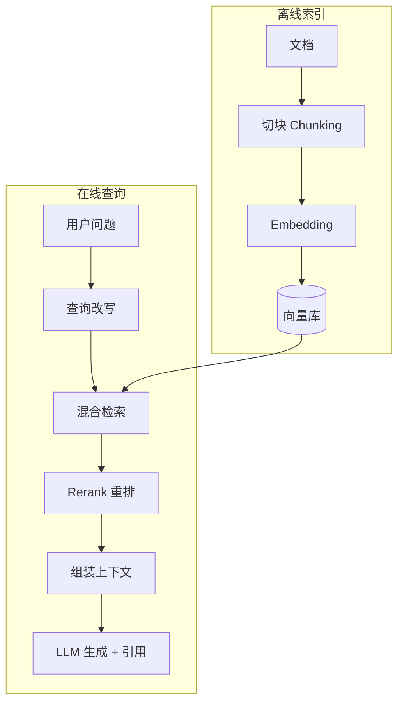

# 📚 RAG 基础

> **一句话**：RAG（Retrieval-Augmented Generation，检索增强生成）= 回答前先去知识库里捞相关资料，再让 LLM 按资料作答——给模型「开卷考试」的能力。
> **难度**：⭐️ 入门
> **标签**：`#rag`

## 📌 先看结论

- 价值三连：知识实时更新、答案可溯源、私有知识不进模型
- 完整管线 = 索引侧（切块 → embedding → 入库）+ 查询侧（检索 → 重排 → 生成 → 引用）
- RAG 失败的锅大多不在模型：切块烂、检索偏、上下文组装差是三大主因
- 评估要分开测：检索质量（命中率）与生成质量（忠实度）分开算

## 🖼️ 管线图



## 🍜 生活类比

闭卷考试（纯 LLM）：全靠脑子，过时的、没学的都答不了还爱瞎编。
开卷考试（RAG）：先翻书找到相关段落，照着书写答案并注明页码——又新又可查证。

## 💻 最小 RAG（30 行）

```python
from llama_index.core import VectorStoreIndex, SimpleDirectoryReader

docs = SimpleDirectoryReader("docs/").load_data()      # 读文档
index = VectorStoreIndex.from_documents(docs)          # 切块+embedding+入库
engine = index.as_query_engine(similarity_top_k=3)     # 检索+组装+生成
print(engine.query("公司的年假政策是什么？"))            # 带引用的回答
```

## 📦 源码案例

- **LlamaIndex**（[GitHub](https://github.com/run-llama/llama_index)）：为 RAG 而生的框架，上面 5 行就是完整管线；进阶看它的 SentenceWindowNodeParser（句窗检索）与 AutoMergingRetriever（自动合并父块）——两个经典「切块两难」解法
- **LangChain 的 RAG 教程**（[文档](https://python.langchain.com/docs/tutorials/rag/)）：生产级管线模板（加载→切分→存储→检索→生成），适合对照理解每个环节的可替换点
- **企业实践参考**：Anthropic 工程博客的多 Agent 研究系统（[Building a multi-agent research system](https://www.anthropic.com/engineering/built-multi-agent-research-system)）披露：其研究 Lead Agent 把「搜索」拆给多个子 Agent 并行 RAG，token 消耗是普通聊天的 15 倍但准确率大幅提升——RAG 与多 Agent 组合的真实成本/收益数据

## ⚠️ 常见误区

- ❌ RAG = 买个向量库：向量库只是存储环节，管线质量取决于切块与检索策略
- ❌ 检索 Top-K 越多越好：喂 20 个低相关块会稀释注意力、诱发幻觉，重排后 3–5 个最佳
- ❌ 只评答案不通：答案对不代表检索系统好（可能蒙对），分环节评估才能定位问题（→ [Agent 评估指标](../10-evaluation-safety/evaluation-metrics.md)）

## 🧪 小练习

为「内部 IT 知识库问答」设计 RAG：文档含 PDF/Wiki/工单三类。列出切块策略差异、检索过滤条件、以及三个你会先测的失败用例。

## 🔗 相关资源

- [RAG 原始论文（Lewis et al.）](https://arxiv.org/abs/2005.11401)

## 📚 相关知识点

- [Embedding 与相似度检索](embedding-similarity.md)
- [GraphRAG](graphrag.md)
