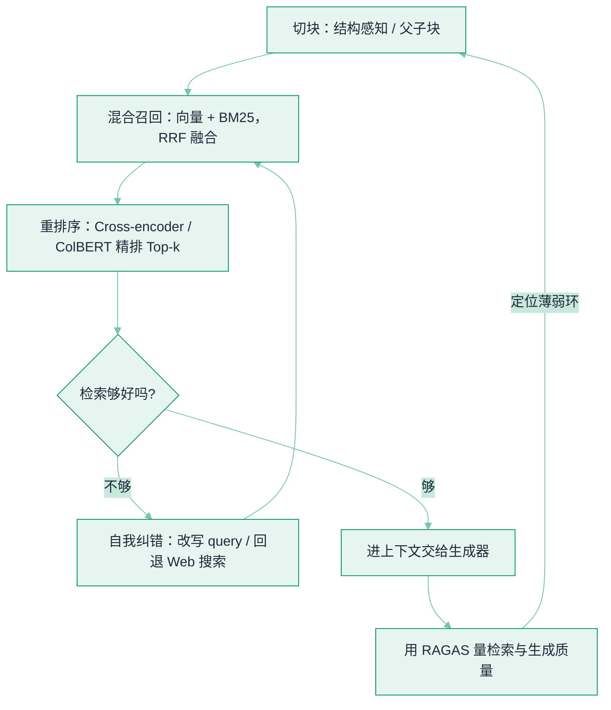

# RAG 检索质量调优


**一句话**：RAG 的上限由**检索**决定，不是由生成模型决定——检索没捞到对的内容，再强的模型也只能基于错料编。本页把散在各页的检索质量手段汇成一条可调优的「漏斗」。


## 问题动机

一个「能跑」的 RAG 往往卡在：**分块切碎了语义、向量检索召回了语义相近但答非所问的段落、Top-k 里真正有用的那条排在第 8 位被截掉、模型对长上下文中部信息视而不见**。RAG 原始论文（Lewis et al., 2020）把检索器和生成器分开优化，正是承认：**提升答案质量的第一杠杆是提升检索质量**。把检索想成一条漏斗——从「怎么切」到「怎么召回」到「怎么排序」到「怎么自我纠错」到「怎么衡量」，每一环都能单独调优。

## 调优漏斗的五个环节

### 环节 1 · 切块（Chunking）：决定「能被检索到的最小单元」

- **固定长度**最简单，但会把一句话/一个论证腰斩。
- **递归/结构感知切块**：优先按段落、标题、句界下刀，尽量让一块是一个完整语义。
- **父子块 / small-to-big**：用小块做精准召回，命中后再把它所属的大块喂给模型——兼顾「检索准」与「上下文全」。
- 经验：块越大召回越少但信息越全，块越小召回越准但易断上下文；**没有万能值，用评估环节去定**。

### 环节 2 · 混合召回（Hybrid Retrieval）：向量的语义 + 关键词的精确

纯向量检索对**专名、代码、ID、稀有词**不敏感，纯关键词（BM25）又不解语义。做法是两路各出一版结果，再用 **倒数排名融合（Reciprocal Rank Fusion, RRF）** 合并——某文档在两路里排名越靠前，融合分越高。它不需要调两路分数的权重，稳健且常是最划算的一步。

### 环节 3 · 重排序（Reranking）：先粗召回、再细排

召回阶段要**快而全**（从百万块里粗筛 Top-50），重排阶段要**准**（对这 50 条逐一精算 query-相关性，留 Top-5 进上下文）。

- **Cross-encoder 重排**：把 query 与候选**拼在一起**过一遍模型，交互充分、精度高，但每条都要前向一次，只能用在召回后的候选集上。
- **ColBERT 的 late interaction**：把每个 token 存成向量、用 MaxSim 细粒度打分，在精度与速度间取得平衡，适合更大候选集。
- 核心权衡：**召回看 Recall@k（别漏），重排看 nDCG/MRR（把对的排前面）**。

### 环节 4 · 自我纠错（Agentic RAG）：让检索会「反思」

一次性检索不够时，让流程自己纠：

- **Self-RAG**：模型按需决定是否检索，并对检索到的段落**打分与自我批判**，只采纳有用的。
- **CRAG（Corrective RAG）**：用一个轻量评估器判定检索质量，**不合格就走备选路径**（改写 query 再检索 / 回退到 Web 搜索），而不是硬塞给生成器。
- 本质：把「检索」从单向管道变成有反馈回路的 Agent 步骤。

### 环节 5 · 评估（Evaluation）：没有度量就是在调玄学

- **端到端指标**：忠实度（答案是否只基于检索料）、答案相关性。
- **检索侧指标**：Context Precision（上下文里有用信息的占比/排序）、Context Recall（该找到的都找到了吗）。
- **RAGAS** 等框架用 LLM 当裁判自动算这些指标，无需每轮人工标注——但要注意裁判本身的偏差，重要决策仍抽样人评。

## 关键指标的数学

上面反复点名的 RRF、Recall@k、MRR、nDCG 都不是黑话，各有明确的算法。把它们写清楚，才知道每一环到底在优化什么：

**混合召回的融合分（RRF，Reciprocal Rank Fusion）**——只用排名、不用原始分数，天然免调两路权重：

$$
\mathrm{RRF}(d)=\sum_{r\in R}\frac{1}{k+\mathrm{rank}_r(d)},\qquad k\approx 60
$$

某文档在各路召回里排名越靠前，累加的融合分越高；$k$ 是平滑常数，压掉头部名次的过度主导。

**检索侧的两个基本盘**——召回看「别漏」，排序看「把对的排前面」：

$$
\mathrm{Recall@}k=\frac{|\text{相关}\cap \text{Top-}k|}{|\text{相关}|},\qquad
\mathrm{MRR}=\frac{1}{|Q|}\sum_{i=1}^{|Q|}\frac{1}{\mathrm{rank}_i}
$$

Recall@k 衡量前 k 条覆盖了多少该找的东西；MRR 只对「第一条正确结果排多前」敏感（越靠前分越高），适合「用户只看第一条」的场景。

**带位置折扣的排序质量（nDCG@k）**——把「相关度」和「排在第几位」一起算：

$$
\mathrm{DCG@}k=\sum_{i=1}^{k}\frac{2^{rel_i}-1}{\log_2(i+1)},\qquad
\mathrm{nDCG@}k=\frac{\mathrm{DCG@}k}{\mathrm{IDCG@}k}
$$

分母 $\log_2(i+1)$ 让越靠后的命中折扣越大，$\mathrm{IDCG}$ 是理想排序的 DCG（归一化用），于是 nDCG 落在 0–1，可直接跨查询比较。重排环节「把对的排前面」的成效，就用它来量。

## 检索质量漏斗

*《图：检索是一条漏斗，自我纠错会横向回灌到召回，而评估会纵向指出该调哪一环——切块、召回、重排、纠错、评估每环都可单独度量单独优化》*

## 概念速查

| 环节 | 一句话 | 关键权衡 |
|---|---|---|
| 切块 | 决定可检索的最小语义单元 | 小块准但碎，大块全但糙 |
| 混合召回 | 向量语义 + 关键词精确，RRF 合并 | 免调权重，最划算的第一步 |
| 重排序 | 召回后对少数候选精算相关性 | 精度↑，但只能用于小候选集 |
| Self-RAG / CRAG | 检索不够就改写/回退，带反馈 | 更准，代价是多次调用与延迟 |
| RAGAS | 自动量检索与答案质量 | 免人工标注，但裁判有偏 |

## 直觉解释

把 RAG 想成「开卷考试」：切块是**怎么给课本贴标签方便翻**，混合召回是**既按意思找又按关键词找**，重排是**先把可能相关的几十页摆桌上、再挑最相关的五页带进考场**，自我纠错是**发现手头的页没用、再去翻别的参考书**，评估是**模拟考打分看看到底哪一步拖了后腿**。答案写不好，多半不是脑子（模型）不行，而是带进考场的那几页（检索）就不对。

## 工程含义

- **先修检索再换大模型**：答案质量差时，先看 Context Recall——十有八九是对的内容压根没召回，换更大的生成器救不了。
- **上下文别贪多**：塞更多 Top-k 常因 `Lost in the Middle` 反而变差；宁可少而精 + 重排，也别把噪声堆进上下文。
- **每一环都可插拔**：切块、embedding 模型、重排器、检索策略是不同旋钮，配好评估后逐项 A/B，别一次全改。

## 源码案例

- **RAG 原始论文**（[论文](https://arxiv.org/abs/2005.11401)）：Lewis et al. 2020 提出检索增强的生成框架，把「检索」确立为可独立优化的组件
- **ColBERT**（[论文](https://arxiv.org/abs/2004.12832)）：late interaction 的细粒度相关性打分，兼顾精度与效率的经典检索器
- **Self-RAG**（[论文](https://arxiv.org/abs/2310.11511)）：让模型自主决定何时检索并自我批判检索结果
- **CRAG**（[论文](https://arxiv.org/abs/2401.15884)）：轻量评估器判定检索质量、不合格即走纠正路径

## 常见误区

- ❌ 以为 embedding 模型越强 RAG 就越好：不切块、不混合、不重排，单换 embedding 收益有限
- ❌ 把 Top-k 调大当万能药：超出模型有效注意力后，多出来的段落只增噪声与成本
- ❌ 只看端到端准确率调优：不拆检索/生成两侧指标，就不知道是「没找到」还是「找到了没用好」
- ❌ 让 LLM 裁判全自动拍板：裁判对冗长、对自身风格有偏好，关键场景必须抽样人评校准

## 参考资料

- [Retrieval-Augmented Generation for Knowledge-Intensive NLP Tasks](https://arxiv.org/abs/2005.11401)（Lewis et al., 2020，RAG 原始论文）
- [ColBERT: Efficient and Effective Passage Search via Contextualized Late Interaction over BERT](https://arxiv.org/abs/2004.12832)（Khattab & Zaharia, 2020）
- [Retrieval-Augmented Generation for Large Language Models: A Survey](https://arxiv.org/abs/2312.10997)（Gao et al., 2023，RAG 综述）
- [Self-RAG: Learning to Retrieve, Generate, and Critique through Self-Reflection](https://arxiv.org/abs/2310.11511)（Asai et al., 2023）
- [Corrective Retrieval Augmented Generation](https://arxiv.org/abs/2401.15884)（Yan et al., 2024）
- [Ragas: Automated Evaluation of Retrieval Augmented Generation](https://arxiv.org/abs/2309.15217)（Es et al., 2023）
- [Lost in the Middle: How Language Models Use Long Contexts](https://arxiv.org/abs/2307.03172)（Liu et al., 2023）

## 相关知识点

- [RAG 基础](rag-basics.md)
- [Embedding 与相似度检索](embedding-similarity.md)
- [向量数据库](vector-database.md)
- [上下文工程](context-engineering.md)
- [长上下文退化与有效上下文窗口](long-context-degradation.md)
- [Embedding 微调](embedding-finetuning.md)
