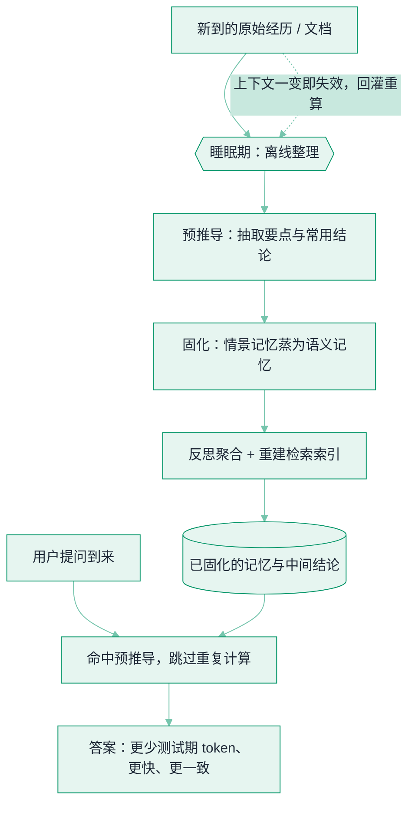

# 记忆固化与睡眠时计算


**一句话**：Agent 不必把全部力气花在「被提问的那一刻」——可以利用**空闲窗口先把原始经历读透、抽成结论、固化进记忆、重建索引**，等查询真正到来时直接命中预推导。这把「昂贵的临场思考」变成「便宜的提前准备」，本质是**给 Agent 的记忆做物化视图**。


## 问题动机

主流推理优化都盯着**测试期（test-time）**：查询进来，模型现场把上下文从头读一遍、再一步步推。但 Agent 的记忆是**持续累积**的——长会话、跨任务的历史、不断膨胀的文档，若每次提问都把这一切重新过一遍，代价随记忆规模线性上涨，而且**同一批内容被反复重算**。

Sleep-time compute（睡眠时计算，Lin et al., 2025）提出换个时间轴：在**没有查询进来的空闲期**，让 Agent 主动去「消化」新到手的原始数据——抽取要点、预推导常用结论、把情景记忆压成语义记忆、更新检索索引。真正提问时，很多推理**已经替你做完了**。作者报告：在若干基准上，这能把**测试期所需 token 最高省下约 5×**，并**首次做到在降低测试期算力的同时反而提升准确率**（约百分之十量级的增益，作者实验设定下）——因为提前想清楚的东西，比临场硬想更稳。

这与「上下文工程」「检索质量调优」是同一目标下的不同杠杆：检索解决「**取到对的料**」，睡眠时计算解决「**取到之后先想清楚再存起来**」。

## 三个动作拆开看

睡眠期跑的其实是一条**离线整理流水线**，可拆成三类可独立调度的动作：

### 动作 1 · 预推导（Anticipatory Reasoning）：先把「大概率会被问到的」算好

对新增上下文，猜测性地生成一些中间产物：这段对话的关键事实、某文档的摘要、常见查询的答案草稿、跨会话的实体对齐表。查询命中时直接复用，未命中也不浪费太多——它们是**可复用的派生事实**，不是死答案。

### 动作 2 · 固化（Consolidation）：从情景记忆蒸出语义记忆

零散的「发生过什么」（episodic）经过反复出现，应被**归纳成稳定的「什么是真的」（semantic）与「该怎么做」（procedural）**。这正是人类睡眠中海马体向新皮层固化记忆的工程类比：把一次性的观察，压成可泛化的知识与技能。与[记忆压缩与遗忘](memory-compression-forgetting.md)是一体两面——压缩是「删冗余」，固化是「升抽象」。

### 动作 3 · 反思与重建索引（Reflection & Re-index）

周期性地把底层观察向上聚合成**高阶洞察**（Generative Agents 里的 reflection 树就是这么做的），并顺带**重算嵌入、重建检索索引、修正过时条目**。索引是查询期的入口，离线整备好，在线才既快又准。

## 什么时候触发、什么时候作废

睡眠期计算的全部难点，其实收敛成两个调度问题：**何时开跑**、**跑完的结果何时算旧**。

- **触发的三种常见策略**：① **定时轮询**——每隔一段固定时间把这段时间新到的上下文整理一遍，实现最简单，但会「攒着」，长尾信息延迟高；② **事件驱动**——每写入一批新记忆就触发，新鲜度最高，代价是高频写入下会频繁重算；③ **成本/价值预算**——只有当「预计这段记忆被复用的次数 × 单次现算成本」超过整理成本时才整理，把算力优先给高复用内容。成熟系统常是三者混合：事件驱动保新鲜、预算门控控成本、定时兜底补漏。
- **失效粒度决定成败**：整块上下文一变就把所有预推导推倒重来，等于没做睡眠期；太粗又会读到脏结论。可行的做法是给每条预推导**记下它依赖了哪些原始片段**（类似物化视图的依赖追踪），只有这些片段变化才让对应条目失效。这与[上下文工程](context-engineering.md)里「把稳定的静态前缀和易变的动态内容分开、避免整段缓存全 miss」是同一个道理——**分区越干净，失效波及面越小**。
- **一句话取舍**：睡眠期计算收益最大的地方，是**记忆高度复用、查询可预测、且写入相对平缓**的场景；反过来，一次性、随机、问完即弃的任务，预推导几乎必然落空，不该做。

## 在线 vs 睡眠期

*《图：昂贵的临场推理被挪到空闲期先做完，测试期只做「命中」；下方虚线是关键约束——源上下文一旦变化，预推导就要失效重算，否则固化下来的恰恰是错的结论》*

## 概念速查

| 概念 | 一句话 | 关键权衡 |
|---|---|---|
| 睡眠时计算 | 空闲期先整理记忆/预推导，降低测试期负担 | 总算力可能上升，但延迟与关键路径成本下降 |
| 预推导 | 提前算好「大概率会用到」的派生事实 | 猜得准才省，纯投机是浪费 |
| 固化 | 情景→语义/程序性，升抽象而非只删冗余 | 蒸得太狠会丢可回溯细节 |
| 失效与重算 | 源上下文变化即作废相关预推导 | 越激进越一致，也越费；是缓存一致性问题 |
| 与检索互补 | 检索管「取到」，睡眠期管「取到后想清楚再存」 | 两者都压测试期，作用点不同 |

## 直觉解释

把它想成**数据库的物化视图**：每次都现算那条昂贵的多表 JOIN，不如把结果**预先物化**存下来，查询直接读。睡眠期计算就是给 Agent 的记忆建「物化视图」——把反复要用的连接（推理）在后台算好。代价也和物化视图一模一样：**基表一变，物化视图就得刷新**；刷早了浪费、刷晚了读到脏数据。所以真正的工程难点不在「要不要预计算」，而在**用什么触发、把失效粒度切多细**。

## 工程含义

- **是「挪算力」不是「省算力」**：多数场景总 token 会上升，赚的是**测试期延迟**和**关键路径质量**。要不要做，取决于你的查询是否高价值、是否可预测——低频且随机的提问不适合预计算。
- **失效策略是命门**：这本质是一个**缓存一致性问题**。新消息、纠错、文档更新都必须能判定「哪些预推导作废」，并把重算挂在**低优先级异步队列**上错峰跑，别把空闲期变成新的成本黑洞。
- **与检索/上下文工程叠加**：先用[检索质量调优](retrieval-quality-tuning.md)保证「取得对」，再用睡眠期固化保证「存得聪明」，最后靠[上下文工程](context-engineering.md)把有限的上下文窗口装进最该装的预推导结果。
- **固化≠遗忘**：把情景记忆蒸成语义记忆时，保留可回溯指针（指回原始片段），否则出错时无法审计「这个结论从哪来」。

## 源码案例

- **Sleep-time Compute**（[论文](https://arxiv.org/abs/2504.13171)）：Lin et al., 2025（Letta），把测试期计算搬到空闲期，确立「提前消化上下文」这一范式，报告测试期 token 最高省约 5×、准确率同时提升
- **Generative Agents**（[论文](https://arxiv.org/abs/2304.03442)）：Park et al., 2023 的 reflection 机制——周期性把观察聚合成高阶洞察，是睡眠期「固化+反思」的经典先声
- **MemGPT**（[论文](https://arxiv.org/abs/2310.08560)）：Packer et al., 2023，用操作系统式的分页与自编辑记忆主动管理上下文，为「离线整理记忆」提供了内存管理层

## 常见误区

- ❌ 以为睡眠期计算是「免费的」：它把成本从测试期挪到空闲期，总开销常**上升**；省的是延迟与临场算力，不是钱本身
- ❌ 只固化不做失效：源上下文变了却还用旧的预推导，等于把**错误结论缓存**下来，比不预计算更糟
- ❌ 对任意查询分布都硬上：提问不可预测时，预推导命中率低，纯属投机浪费
- ❌ 把固化当成一味压缩：过度抽象会丢失可回溯的原始证据，破坏可审计性

## 参考资料

- [Sleep-time Compute: Beyond Inference Scaling at Test-time](https://arxiv.org/abs/2504.13171)（Lin et al., 2025，Letta）
- [Generative Agents: Interactive Simulacra of Human Behavior](https://arxiv.org/abs/2304.03442)（Park et al., 2023）
- [MemGPT: Towards LLMs as Operating Systems](https://arxiv.org/abs/2310.08560)（Packer et al., 2023）

## 相关知识点

- [记忆类型：情景 / 语义 / 程序性](memory-types.md)
- [记忆压缩与遗忘](memory-compression-forgetting.md)
- [RAG 检索质量调优](retrieval-quality-tuning.md)
- [上下文工程](context-engineering.md)
