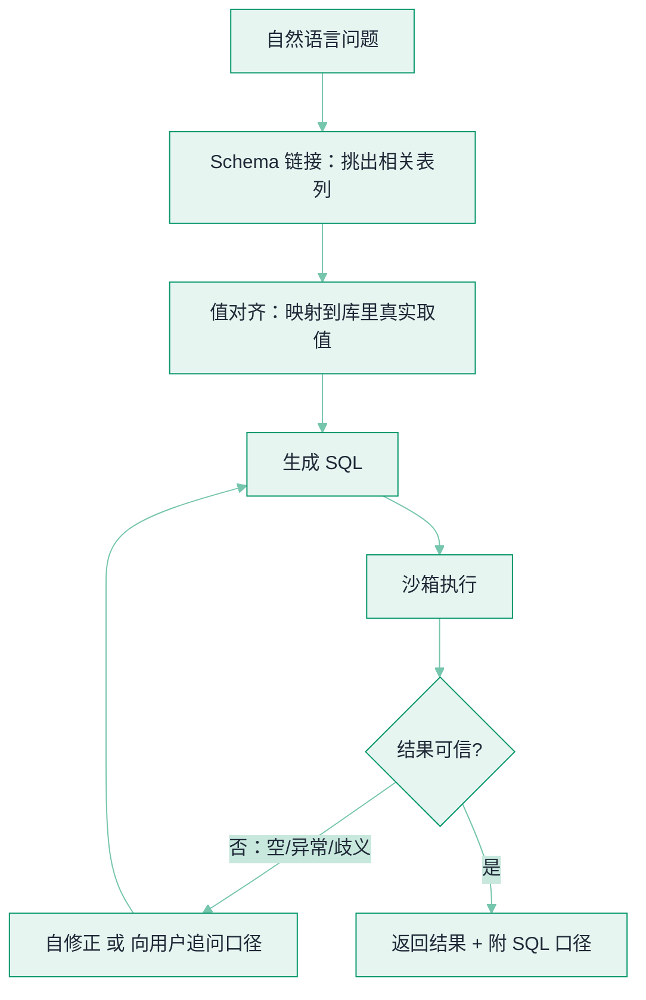

# Text-to-SQL：让 Agent 查结构化数据


**一句话**：把自然语言翻成 SQL 是 Agent 最高频的落地能力之一，但难点从来不是「写出合法语法」，而是**选对表列、对齐库里的真实取值、并验证结果对不对**——schema 一大、数据一脏、问题一含糊，demo 就崩。


## 问题动机

企业真正的业务事实大多躺在**关系库/数仓**里，不在文档里。让业务人员用一句话查数（「上季度华东区毛利最高的三个品类」），是 Agent 最有价值的应用之一。但 Text-to-SQL 的「演示—生产」落差极大：模型能写出语法正确的 SQL，却常常**语义错**——join 错表、聚合粒度错、把「营收」算成含税而口径要不含税。它和向量 RAG 是互补的两条检索路：**RAG 查非结构化文本，Text-to-SQL 查结构化数据**（图谱路线见 [GraphRAG](graphrag.md)）。

## 三个真正的难点

### 1. Schema 链接（选对表与列）

真实数仓动辄几百张表、上万列。把整份 schema 塞进 prompt 既爆上下文、又触发[长上下文退化](long-context-degradation.md)（中段被忽略）。可行做法是**先按问题检索出相关的少数表/列**再注入——本质就是[工具选择与路由](../07-planning/tool-selection-routing.md) 的那套「先筛候选再让模型挑」，只不过候选是 schema 元素。

### 2. 值对齐（把「北京」映射到库里真实取值）

用户说的「北京」，库里可能存的是 `Beijing`、`北京市`、或某个 `region_id=3`。`WHERE city='北京'` 语法没错，却查回空表。**值链接（value grounding）**要把自然语言里的实体对齐到列的实际取值，常靠对该列采样、建向量/倒排索引来匹配。

### 3. 正确 ≠ 能跑

SQL 执行成功不代表结果对。聚合粒度错、笛卡尔积、漏 distinct，都能「跑通但算错」。所以**验证不能只看有没有报错**，要看结果集本身是否可信（空值、量级、对账）。

## 怎么衡量：看执行准确率，别看字符串

Text-to-SQL 的标准指标是 **execution accuracy（EX）**：把预测 SQL 与 gold SQL **各自执行**，比较**结果集**是否一致——而不是比对 SQL 文本（同一问题有多种正确写法）。两个里程碑基准：

- **Spider**：跨域、复杂查询的经典基准，把「未见过的库」作为泛化考验。
- **BIRD**：面向**真实、大规模、脏值**数据库，且引入外部知识，人与 SOTA 的差距被显著拉大——它证明「在干净小库上刷高分」离生产还很远。

读榜单要盯：EX 口径、库的规模与脏度、是否含外部知识，别拿 Spider 的分去预期 BIRD 的表现。

## 提升可靠性：一条漏斗

*《图：可靠性来自一条带反馈的漏斗——先链接 schema、再对齐取值，生成后必过「执行 + 结果可信」这道闸，不过就自修正或回问口径，而非跑通即交付》*

关键手段：**少样本与分解**（DAIL-SQL 系统比较了示例选择/问题分解等提示策略，把 GPT 类模型在 Spider 上推到很高 EX）；**生成后自校验**（执行一遍、或把 SQL 回译成自然语言让模型自查）；**语义层锁口径**（把「GMV 怎么算」交给指标定义层，Agent 引用而非现场发明，见 [数据分析 Agent](../12-applications/data-analysis-agent.md)）；**歧义就追问**，别猜。

## 概念速查

| 概念 | 一句话 | 关键权衡 |
|---|---|---|
| Schema 链接 | 从海量表列里挑出本题相关者 | 全塞爆上下文，先筛再注入 |
| 值对齐 | 把口语实体映射到库里真实取值 | 需对列采样/建索引 |
| 执行准确率 EX | 比结果集而非 SQL 文本 | 同题多写法，字符串比对会误杀 |
| Spider / BIRD | 跨域泛化 / 真实脏库+外部知识 | BIRD 更接近生产难度 |
| 语义层 | 指标口径集中定义供引用 | 前期投入换「每次算得一致」 |

## 直觉解释

Text-to-SQL 像**给一个只懂语法、不懂你们公司的翻译官**派活：它能把你说的话翻成结构正确的 SQL，但「营收」到底对应哪张表哪一列、含不含税、退款算不算进去——这些**业务口径**它不知道。所以真正的工程，是帮它「查字典」（schema 链接）、「对术语」（值对齐）、并在它翻完后「核对意思」（执行校验 + 语义层），而不是相信它一次就翻对。

## 工程含义

- **以 EX 为准绳做回归**：在自己的库上攒「问题→期望结果」用例集，每次改 prompt/换模型跑一遍，别拿公开榜分当业务正确率。
- **schema 精简注入 + 采样值**：只给相关表列，并对高频过滤列附几个真实取值，直接压掉「值对不上」这类空结果。
- **跑通≠跑对**：把「结果可信」做成硬闸——空结果、量级异常、维度不闭合就回炉，而非直接出图下结论。
- **警惕 SQL 注入**：让模型生成的 SQL 里，用户可控文本要走参数化，别把输入拼进语句（见 [提示注入](../10-evaluation-safety/prompt-injection.md)）。

## 源码案例

- **Spider**（[论文](https://arxiv.org/abs/1809.08887)）：跨域复杂 Text-to-SQL 的奠基基准，确立「未见库泛化」的评测范式
- **BIRD**（[论文](https://arxiv.org/abs/2305.03111)）：大规模、脏值、含外部知识的真实库基准，把「LLM 能否当数据库接口」的差距拉到生产尺度
- **DAIL-SQL**（[论文](https://arxiv.org/abs/2308.15363)）：系统评测 LLM 提示策略（示例选择、问题分解等）如何显著抬升执行准确率

## 常见误区

- ❌ 只看 SQL 有没有报错：跑通但算错才是分析事故，必须校验结果集
- ❌ 把整库 schema 塞进 prompt：既爆上下文又触发中段退化，应先做 schema 检索
- ❌ 用字符串比对判对错：同一问题多种正确 SQL，要用执行准确率
- ❌ 拿 Spider 高分当生产能力：真实库的脏值与口径歧义，BIRD 上会掉一大截
- ❌ 把用户输入直接拼进 SQL：注入风险，过滤值一律参数化

## 参考资料

- [Spider: A Large-Scale Human-Labeled Dataset for Complex and Cross-Domain Semantic Parsing and Text-to-SQL Task](https://arxiv.org/abs/1809.08887)（Yu et al., 2018）
- [Can LLM Already Serve as A Database Interface? A BIg Bench for Large-Scale Database Grounded Text-to-SQLs](https://arxiv.org/abs/2305.03111)（Li et al., 2023，BIRD）
- [Text-to-SQL Empowered by Large Language Models: A Benchmark Evaluation](https://arxiv.org/abs/2308.15363)（Dong et al., 2023，DAIL-SQL）

## 相关知识点

- [数据分析 Agent](../12-applications/data-analysis-agent.md)
- [GraphRAG](graphrag.md)
- [RAG 检索质量调优](retrieval-quality-tuning.md)
- [工具选择与路由](../07-planning/tool-selection-routing.md)
- [长上下文退化与有效上下文窗口](long-context-degradation.md)
