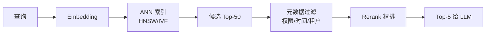

# 向量数据库

> **一句话**：向量数据库专门存 Embedding 并做近邻搜索（ANN），是 RAG 与 Agent 记忆的存储引擎；选型看规模、过滤需求与运维成本。

## 先看结论

- 核心能力：ANN 近似最近邻搜索（HNSW/IVF 等索引），在亿级向量中做毫秒级 Top-K
- 选型四问：数据量多大？要元数据过滤吗？已有 PG/ES 吗？谁运维？
- ANN 的本质是**用召回率换速度**：理解 `efSearch`/`nprobe` 这类旋钮，才知道怎么调
- 亿级以下 + 已有 PostgreSQL → pgvector 起步最省事；别一开始就上重型分布式
- 向量库不提供「正确性」：召回质量取决于切块、embedding 模型与检索策略

## 核心机制

### 1. 向量占多少内存

存储开销的第一近似是：

$$
\text{bytes}\approx N\times d\times\frac{\text{bits}}{8}
$$

$N$ 是向量数，$d$ 是维度。例如 1000 万条 768 维 FP32 向量：

$$
10^{7}\times 768\times 4\approx 30.7\ \text{GB}
$$

这还没算索引本身的开销（HNSW 的图结构每向量还要额外若干字节的连接信息）。**两条降本路径**：降维（换更小的 embedding 模型）、量化（FP32 → INT8/二值，用少量精度损失换数倍内存下降）。

### 2. 精确 → 近似的取舍

精确最近邻要算 $N$ 次距离，查询 $Q$ 次是 $O(NQd)$，亿级不可接受。ANN 用索引把它降到亚线性，代价是可能漏掉真正的最近邻：

$$
\text{recall@}k=\frac{\#\{\text{返回的 Top-}k\text{ 中真实最近邻}\}}{k}
$$

主流两类索引的取舍：

| 索引 | 结构 | 特点 | 关键旋钮 |
|---|---|---|---|
| HNSW | 多层可导航小世界图 | 查询快、召回高、内存占用大、建索引慢 | `efSearch`（越大越准越慢） |
| IVF | 聚类分桶 | 内存省、建索引快、召回略低 | `nprobe`（扫几个桶） |

**调参的本质就是沿「召回—延迟」的帕累托前沿移动**：`efSearch`/`nprobe` 调大 → 召回上升、延迟上升。生产上应先定召回下限（如 recall@10 ≥ 0.95），再在此约束下调到最低延迟。

### 3. 过滤式检索：多租户的坑

真实查询几乎都带过滤条件（租户、时间、权限）。三种实现：

$$
\underbrace{\text{后过滤}}_{\text{先 Top-K 再筛}}\;
\underbrace{\text{前过滤}}_{\text{先筛再搜}}\;
\underbrace{\text{过滤下推}}_{\text{搜索内部感知过滤}}
$$

- **后过滤**最简单，但在强过滤条件下会「取回 K 条、筛完剩 0 条」——多租户场景尤其致命
- **前过滤**需要索引支持高效的条件查询，否则退化
- **过滤下推**（如 Qdrant 的 filterable HNSW）是正解：ANN 搜索过程内感知过滤条件

这也是「权限过滤必须放在检索层」的技术原因（见 [数据隐私](../10-evaluation-safety/data-privacy.md)）。

### 4. 与关键词检索的分工

向量检索擅长语义，但数字比较、精确 ID、型号、错误码是它的盲区。生产标配是混合检索：

$$
\text{最终结果}=\text{融合}\big(\text{向量 Top-}K,\;\text{BM25 Top-}K\big)
$$

融合常用 RRF（只看排名，无需对齐分数量纲）。细节见 [Embedding 与相似度检索](embedding-similarity.md)。

## 选型对比

| 产品 | 类型 | 适合 | 一句话点评 |
|---|---|---|---|
| [pgvector](https://github.com/pgvector/pgvector) | PG 扩展 | <千万级、已有 PG | 事务+向量一体，运维零新增 |
| [Qdrant](https://github.com/qdrant/qdrant) | 专用 | Rust 系、过滤强 | 元数据过滤 + 混合检索体验好 |
| [Milvus](https://github.com/milvus-io/milvus) | 分布式 | 亿级、云原生 | 功能全，运维成本高 |
| [Chroma](https://github.com/chroma-core/chroma) | 轻量 | 原型、单机 | 十行代码起步 |
| [Weaviate](https://github.com/weaviate/weaviate) | 专用 | 混合检索 | 模块化 embedding 集成 |
| [FAISS](https://github.com/facebookresearch/faiss) | 库 | 嵌入选型自研 | 不是服务，是算法库 |

## 查询链路

## 源码案例

- **HNSW**（[论文](https://arxiv.org/abs/1603.09320) / [FAISS 实现](https://github.com/facebookresearch/faiss)）：多层跳表式图结构，从稀疏顶层粗跳到底层精找——想懂 ANN，读它的论文与 FAISS 的 `IndexHNSW` 文档是最直接的路径
- **pgvector 的索引选择**（[GitHub](https://github.com/pgvector/pgvector)）：`ivfflat` 建索引快、适合数据相对静止的场景，`hnsw` 查询快、适合高召回在线场景——选型时最常踩的坑
- **Qdrant 的过滤式检索**（[GitHub](https://github.com/qdrant/qdrant)）：把元数据过滤下推进 ANN 搜索内部，而不是「先取 Top-K 再过滤」——多租户场景的关键能力

## 常见误区

- ❌ 向量库 = RAG：它只解决「检索」，切块、排序、生成、评估同样是工程大头
- ❌ 一上来上分布式：百万级向量 pgvector/Chroma 毫无压力，运维复杂度是隐性成本
- ❌ 忘记多租户隔离：检索过滤要含权限条件，否则 A 租户能召回 B 租户内容（安全漏洞）
- ❌ 只看速度不看召回：把 `efSearch`/`nprobe` 调到最低，延迟好看但答案错
- ❌ 忽略内存估算：向量 + 索引的内存常常比预期大好几倍，容量规划要算上

## 小练习

50 万条客服 FAQ + 每日增量 + 按部门权限过滤——选哪个向量库？写出内存估算、索引类型与查询语句骨架，并说明你的召回—延迟目标。

## 参考资料

- [Efficient and robust approximate nearest neighbor search using Hierarchical Navigable Small World graphs](https://arxiv.org/abs/1603.09320)（Malkov & Yashunin, 2016，HNSW）
- [pgvector](https://github.com/pgvector/pgvector) / [Qdrant](https://github.com/qdrant/qdrant) / [FAISS](https://github.com/facebookresearch/faiss)
- [Reciprocal Rank Fusion Outperforms Condorcet and Individual Rank Learning Methods](https://dl.acm.org/doi/10.1145/1571941.1572114)（Cormack et al., SIGIR 2009）

## 相关知识点

- [Embedding 与相似度检索](embedding-similarity.md)
- [RAG 基础](rag-basics.md)
