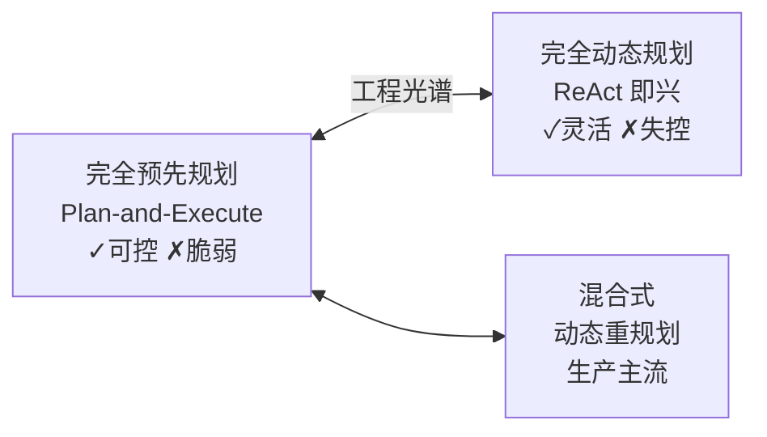

# 🗺️ 07 规划与任务执行

> **一句话**：会规划才叫「做事」而不是「碰运气」：任务分解、计划-执行分离、子目标管理、工具路由、错误恢复与工作流编排。

## 📌 你将学到

- 任务分解的粒度控制：TodoWrite 式任务清单为什么有效
- Plan-and-Execute：先规划后执行 vs 边想边做的取舍
- 子目标与依赖管理：拓扑排序、并行扇出
- 工具选择与路由：工具面太大时怎么选得准
- 错误恢复：重试、降级、回退、换路四板斧
- 工作流编排：什么时候该把「自主」换成「确定性」

## 核心张力

规划系统永远在两极之间找平衡：

## 本站页面

- [任务分解](task-decomposition.md)
- [Plan-and-Execute](plan-and-execute.md)
- [子目标规划](subgoal-planning.md)
- [工具选择与路由](tool-selection-routing.md)
- [错误恢复与重试](error-recovery-retry.md)
- [工作流编排](workflow-orchestration.md)
