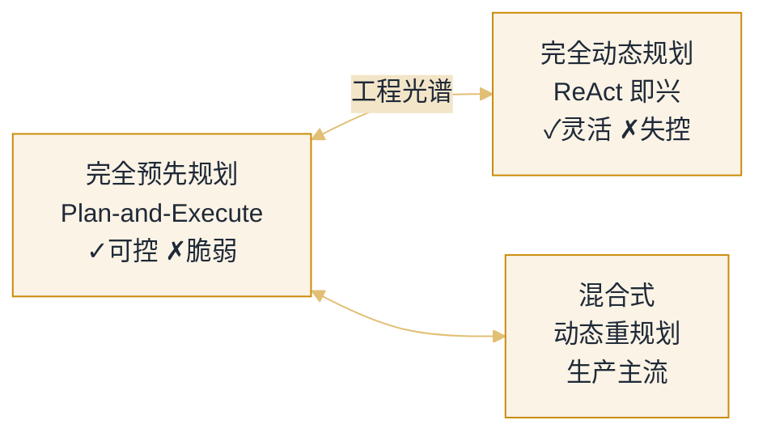

# 07 规划与任务执行


**一句话**：会规划才叫「做事」而不是「碰运气」：任务分解、计划-执行分离、子目标管理、工具路由、错误恢复与工作流编排。


## 你将学到

- 任务分解的粒度控制：TodoWrite 式任务清单为什么有效
- Plan-and-Execute：先规划后执行 vs 边想边做的取舍
- 子目标与依赖管理：拓扑排序、并行扇出
- 工具选择与路由：工具面太大时怎么选得准
- 错误恢复：重试、降级、回退、换路四板斧
- 工作流编排：什么时候该把「自主」换成「确定性」

## 核心张力

规划系统永远在两极之间找平衡：

*《图：两极之间那条双向边标的是「工程光谱」，不是二选一；混合式只挂在预先规划这一侧——留计划骨架，用重规划补回灵活性》*

## 本站页面

- [任务分解](task-decomposition.md)
- [Plan-and-Execute](plan-and-execute.md)
- [子目标规划](subgoal-planning.md)
- [工具选择与路由](tool-selection-routing.md)
- [错误恢复与重试](error-recovery-retry.md)
- [工作流编排](workflow-orchestration.md)

## 读完能做到

- [ ] 把「为公司官网写一篇产品博客并发布」分解成 6–8 个带机检验收标准的子任务，画出无环 DAG 并标出可并行项
- [ ] 解释 Plan-and-Execute 比 ReAct 更省 token 的结构性原因（ReAct ≈ O(T²) vs 执行步只用局部上下文），并说清何时该触发 replan
- [ ] 给「旧库→新库」数据迁移标出关键路径、哪个子目标失败可跳过、哪个失败必须中止
- [ ] 为 80 个工具设计路由方案（分组 / 延迟加载 / 语义路由），并解释「正确工具没进候选，模型再强也选不对」
- [ ] 按瞬时 / 参数 / 持续 / 能力边界 / 不可逆五类错误，给「并发抓 1000 网页」设计重试与降级，写出退避参数与三重熔断

## 章末自测

1. **回忆**：好子任务的三条标准是什么？为什么「验证任务」（测试、lint、review）本身要作为独立子任务进清单？（提示：见 task-decomposition.md）
2. **应用**：「排查一个未定位的线上 bug」该用 Plan-and-Execute 还是 ReAct？为什么？（提示：见 plan-and-execute.md、workflow-orchestration.md）
3. **判断**：用「下一步可预知吗 × 需要运行时信息吗」两问，判断一个环节该用固定工作流还是自主 Agent，并给一个该用固定流程的例子。（提示：见 workflow-orchestration.md）

## 本章术语速查

这章的名词都能在运维手册里找到亲戚——每一行都对应你迟早会撞上的现场。

| 英文术语 | 中文 | 白话一句话 |
|---|---|---|
| Task Decomposition | 任务分解 | 把大活切成能被独立机检验收的最小步骤，每步连同「怎么算完成」一起写下来 |
| DAG (Directed Acyclic Graph) | 有向无环图 | 分解的真正产物不是清单是这张依赖图：有依赖的排队走，没依赖的并行跑 |
| Plan-and-Execute | 先规划后执行 | 想清楚再动手：计划只算一次，执行步只看局部上下文，token 省一大截 |
| Replan | 重规划 | 实际和计划的偏差过了阈值才重新排计划，不是每一步都推翻重来 |
| Rolling Planning | 滚动式规划 | 先定前几步再走一步看一步——超过 10 步的计划大概率中途作废 |
| Critical Path | 关键路径 | DAG 里最长的那条链：它慢了整件事快不了，它断的子目标必须中止而不是跳过 |
| Tool Routing | 工具路由 | 两阶段：先检索出候选小集合再让模型挑，正确工具没进候选它再强也选不对 |
| Lazy Loading | 延迟加载 | 先只报工具名（几十 token），选中谁再掏谁的完整 schema，固定开销压下一个数量级 |
| Exponential Backoff + Jitter | 指数退避加抖动 | 重试等待翻倍、再加随机抖动，否则所有客户端约好同时重试，把「慢」的下游打成「挂」 |
| Circuit Breaker | 熔断器 | 某依赖连挂超阈值就直接快速拒绝、给它喘息的功夫，重试次数全局要有预算 |
| Idempotency | 幂等（幂等键） | 转账、发邮件这类操作重试前的先决条件，不然一次重试就是一笔重复扣款 |
| Orchestration Patterns | 编排五模式 | 链式、路由、并行、评估-优化、自主 Agent：先画确定性骨架，再决定哪个洞让 LLM 填 |

