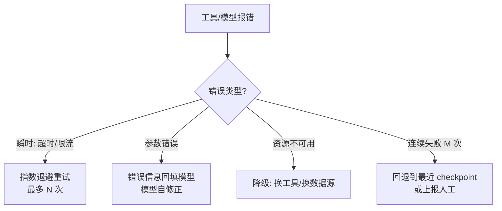

# 错误恢复与重试

> **一句话**：Agent 的可靠性不是「不犯错」，而是「犯错后有条不紊地恢复」：重试、降级、回退、换路四板斧 + 把错误喂回模型自我修正。
> **难度**：进阶
> **标签**：`#planning` `#engineering`

## 先看结论

- 错误分三类：**瞬时**（网络抖动→指数退避重试）、**持续性**（配置错→修因）、**能力边界**（任务超纲→降级或上报）
- 关键区别：让模型看见错误（它能自我修正）vs 框架层静默重试（快速恢复）——按类型选
- 所有恢复动作要留痕（事件流），避免「重试风暴」与不可审计
- 断点恢复（checkpoint）让失败不从零开始：长任务的性价比之王

## 错误处理决策树



## 重试模式

```python
for attempt in range(3):
    try:
        return tool.run(args)
    except RateLimitError:
        sleep(2 ** attempt + random())   # 指数退避 + 抖动
    except ValidationError as e:
        return fix_with_llm(e)            # 参数错: 让模型改参数
raise FatalError("3 次重试失败，降级或上报")
```

## 源码案例

- **SWE-agent 的错误即课程**（[GitHub](https://github.com/SWE-agent/SWE-agent)）：Princeton 的经典设计哲学——「Agent-Computer Interface」必须把错误信息设计得**可操作**（报错附建议），模型根据报错改命令重试，这是编程 Agent 自我修正的源头设计；其基准循环中大量改进都来自错误呈现方式
- **DeepSeek Harness 的执行流水线兜底**（[仓库](https://github.com/deepseek-ai/deepseek-harness)）：超时控制、取消传播、失败事件全部进 append-only 日志；turn/step 状态机里「取消中的 driver 与新输入」的生命周期收敛设计，避免了取消-重启竞态这一最常见的恢复 bug
- **LangGraph 的 checkpoint**（[GitHub](https://github.com/langchain-ai/langgraph)）：每个超步（superstep）持久化状态，任何节点失败可从上一个 checkpoint 重放——断点恢复的框架级标准实现

## 最佳实践

- 重试要有 jitter（随机抖动），避免同步重试打爆下游
- 重试与预算联动：每重试一次扣预算，预算尽则终止（→ [缓存与成本优化](../11-engineering/caching-cost-optimization.md)）
- 给模型的能力边界留出口：「连续失败 → 生成报告 + 请求人工」是好行为不是失败

## 常见误区

- ❌ 无限重试：退避上限 + 总次数上限 + 总预算上限，三重熔断
- ❌ 静默吞错：工具失败返回 "error" 字符串，模型失去了修正信息——错误要结构化回填
- ❌ 把自愈当银弹：能力边界错误重试一万次也没用，识别出来尽早止损

## 小练习

为「并发抓取 1000 个网页」的 Agent 设计错误策略：瞬时失败、封禁、内容异常分别怎么处理？checkpoint 放在哪一层？

## 相关知识点

- [Reflexion](../04-prompt-reasoning/reflexion.md)
- [状态机与事件驱动](../11-engineering/state-machine-event-driven.md)
