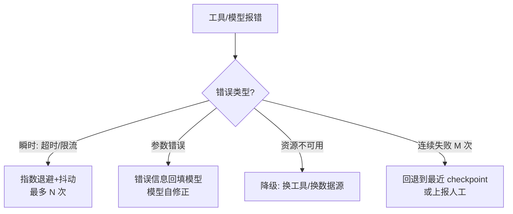

# 错误恢复与重试

> **一句话**：Agent 的可靠性不是「不犯错」，而是「犯错后有条不紊地恢复」：重试、降级、回退、换路四板斧 + 把错误喂回模型自我修正。

## 先看结论

- 错误分三类：**瞬时**（网络抖动 → 指数退避重试）、**持续性**（配置错 → 修因）、**能力边界**（任务超纲 → 降级或上报）
- 关键区别：让模型看见错误（它能自我修正）vs 框架层静默重试（快速恢复）——按类型选
- 重试必须带**抖动**与**预算**，否则会引发重试风暴
- 断点恢复（checkpoint）让失败不从零开始：长任务的性价比之王
- 所有恢复动作要留痕，否则不可审计

## 核心机制

### 1. 错误分类决定策略

$$
\text{策略}=f(\text{错误类型})
$$

| 类型 | 例子 | 正确策略 | 错误策略 |
|---|---|---|---|
| 瞬时 | 网络超时、限流 429 | 指数退避 + 抖动重试 | 立即重试（加剧拥塞） |
| 参数/逻辑 | schema 校验失败、参数错 | 错误原文回填模型，让它改 | 框架层静默重试（重复同样错误） |
| 持续性 | 凭证失效、配置错 | 修因；重试无用 | 无限重试 |
| 能力边界 | 任务超纲、无数据源 | 降级/上报人工 | 硬试到底 |
| 不可逆失败 | 已转账、已发送 | **绝不自动重试** | 当成瞬时错误重试 → 重复副作用 |

最后一行是 Agent 特有的陷阱：**非幂等操作的重试等于重复执行**。这类操作必须带幂等键，或直接升级为人审。

### 2. 指数退避 + 抖动

瞬时错误的标准处理是「退避」：第 $$n$$ 次重试等待时间按指数增长，并加上随机抖动避免大量客户端同步重试：

$$
t_n=\operatorname{rand}\!\Big(0,\;\min\big(t_{\max},\;t_0\cdot 2^{\,n-1}\big)\Big)
$$

- $$t_0$$：基准延迟（如 0.5s）
- $$t_{\max}$$：延迟上限（防止等待过久）
- $$\operatorname{rand}(0,\cdot)$$：**full jitter**，把重试打散

不加抖动的退避会让失败的下游在同一时刻被再次打满——这正是「重试风暴」的成因。

### 3. 三重熔断

重试必须有天花板，缺一就会无限循环：

$$
\text{停止}\iff
\underbrace{n>N_{\max}}_{\text{次数}}
\;\vee\;
\underbrace{\text{tokens}>\text{Budget}}_{\text{成本}}
\;\vee\;
\underbrace{\text{elapsed}>T_{\max}}_{\text{时间}}
$$

此外推荐叠加**熔断器（circuit breaker）**：当某依赖连续失败超过阈值，直接短期拒绝请求（快速失败），给它恢复时间——避免把资源耗在必然失败的调用上。这也是「重试预算」的另一面：每个请求可用的重试次数应全局受限，而不是各自为政。

### 4. 把错误设计成「可操作的课程」

对参数/逻辑类错误，重试无用，正确做法是**把错误原文回填给模型**，让它修正后重试（Reflexion 的思想）：

| 回填内容 | 模型能否修正 |
|---|---|
| `"error"` | 不能（信息量为零） |
| `"ValidationError: unit 应为 celsius/fahrenheit"` | 能（改参数重试） |
| `"FileNotFoundError: /tmp/a.txt"` | 能（换路径或先创建） |

## 错误处理决策树



## 重试模式

```python
import random, time

for attempt in range(1, MAX_ATTEMPTS + 1):
    try:
        return tool.run(args)
    except RateLimitError:
        delay = random.uniform(0, min(30.0, 0.5 * 2 ** (attempt - 1)))  # full jitter
        time.sleep(delay)
    except ValidationError as e:
        return fix_with_llm(e)          # 参数错：让模型改参数，不盲目重试
    except NonIdempotentError:
        raise                           # 不可逆操作：绝不自动重试
raise FatalError("重试次数耗尽：降级或上报人工")
```

## 源码案例

- **SWE-agent 的错误即课程**（[GitHub](https://github.com/SWE-agent/SWE-agent) / [论文](https://arxiv.org/abs/2405.15793)）：Princeton 的经典设计哲学——「Agent-Computer Interface」必须把错误信息设计得**可操作**（报错附建议），模型根据报错改命令重试；论文中大量改进都来自错误呈现方式
- **DeepSeek Harness 的执行流水线兜底**（[仓库](https://github.com/deepseek-ai/deepseek-harness)）：超时控制、取消传播、失败事件全部进 append-only 日志；turn/step 状态机里「取消中的执行与新输入」的生命周期收敛设计，避免了取消-重启竞态这一常见恢复 bug
- **LangGraph 的 checkpoint**（[仓库](https://github.com/langchain-ai/langgraph)）：每个超步持久化状态，任何节点失败可从上一个 checkpoint 重放——断点恢复的框架级标准实现

## 最佳实践

- 重试要有 jitter（随机抖动），避免同步重试打爆下游
- 重试与预算联动：每重试一次扣预算，预算尽则终止（→ [缓存与成本优化](../11-engineering/caching-cost-optimization.md)）
- 给模型的能力边界留出口：「连续失败 → 生成报告 + 请求人工」是好行为不是失败
- 失败要留痕并归类：统计各错误类型的占比，才能判断该改工具、改描述还是改权限

## 常见误区

- ❌ 无限重试：退避上限 + 总次数上限 + 总预算上限，三重熔断
- ❌ 静默吞错：工具失败返回 "error" 字符串，模型失去了修正信息——错误要结构化回填
- ❌ 把自愈当银弹：能力边界错误重试一万次也没用，识别出来尽早止损
- ❌ 对非幂等操作重试：会造成重复转账/重复发送，必须用幂等键或人工确认
- ❌ 退避不加抖动：所有客户端同时重试，把下游从「慢」打成「挂」

## 小练习

为「并发抓取 1000 个网页」的 Agent 设计错误策略：瞬时失败、封禁（403）、内容异常分别怎么处理？checkpoint 放在哪一层？再写出你会用的退避参数与熔断阈值。

## 参考资料

- [Exponential Backoff And Jitter](https://aws.amazon.com/blogs/architecture/exponential-backoff-and-jitter/)（AWS Architecture Blog）
- [Google SRE Book: Handling Overload](https://sre.google/sre-book/handling-overload/)（重试预算与熔断）
- [SWE-agent: Agent-Computer Interfaces Enable Automated Software Engineering](https://arxiv.org/abs/2405.15793)（Yang et al., 2024）
- [Reflexion: Language Agents with Verbal Reinforcement Learning](https://arxiv.org/abs/2303.11366)（Shinn et al., 2023）

## 相关知识点

- [Reflexion](../04-prompt-reasoning/reflexion.md)
- [状态机与事件驱动](../11-engineering/state-machine-event-driven.md)
- [子目标规划](subgoal-planning.md)
