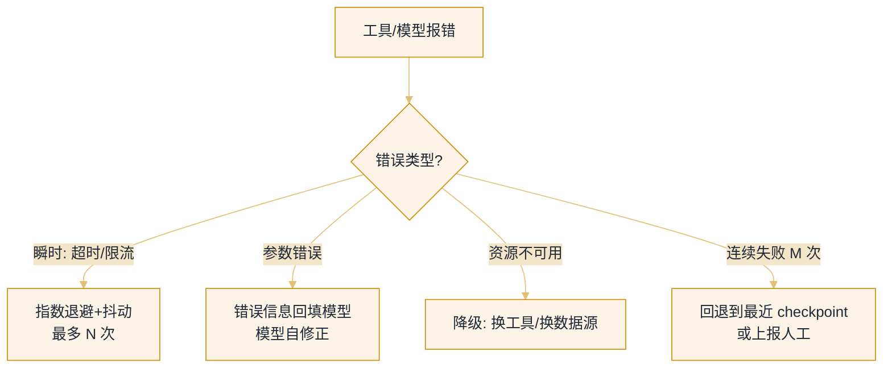
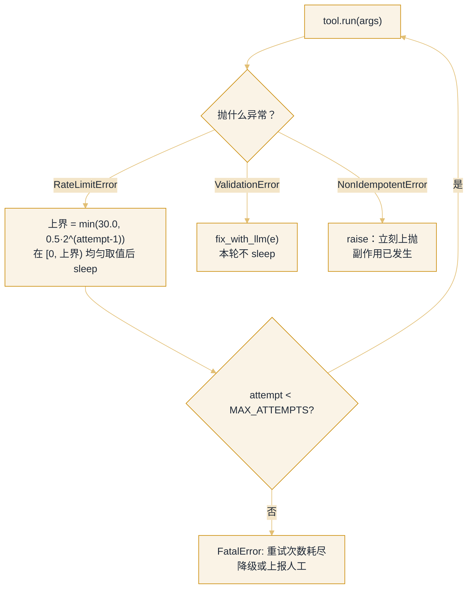

# 错误恢复与重试


**一句话**：Agent 的可靠性不是「不犯错」，而是「犯错后有条不紊地恢复」：重试、降级、回退、换路四板斧 + 把错误喂回模型自我修正。


## 先看结论

- 错误分三类：**瞬时**（网络抖动 → 指数退避重试）、**持续性**（配置错 → 修因）、**能力边界**（任务超纲 → 降级或上报）
- 关键区别：让模型看见错误（它能自我修正）vs 框架层静默重试（快速恢复）——按类型选
- 重试必须带**抖动**与**预算**，否则会引发重试风暴
- 断点恢复（checkpoint）让失败不从零开始：长任务的性价比之王
- 所有恢复动作要留痕，否则不可审计

## 核心机制

### 1. 错误分类决定策略

$$
\text{策略}=f(\text{错误类型})
$$

| 类型 | 例子 | 正确策略 | 错误策略 |
|---|---|---|---|
| 瞬时 | 网络超时、限流 429 | 指数退避 + 抖动重试 | 立即重试（加剧拥塞） |
| 参数/逻辑 | schema 校验失败、参数错 | 错误原文回填模型，让它改 | 框架层静默重试（重复同样错误） |
| 持续性 | 凭证失效、配置错 | 修因；重试无用 | 无限重试 |
| 能力边界 | 任务超纲、无数据源 | 降级/上报人工 | 硬试到底 |
| 不可逆失败 | 已转账、已发送 | **绝不自动重试** | 当成瞬时错误重试 → 重复副作用 |

最后一行是 Agent 特有的陷阱：**非幂等操作的重试等于重复执行**。这类操作必须带幂等键，或直接升级为人审。

### 2. 退避是服务侧的活，规划层只管「值不值得等」

指数退避 + full jitter 的标准式子、重试风暴的成因与熔断器实现都在[错误处理、重试与降级](../11-engineering/error-handling-retry-fallback.md)，Agent 不必重写一遍。规划层要解的是另一个问题：**这次失败可以占用多少墙钟**——因为对 Agent 来说最稀缺的资源不是调用次数，而是整个任务的时限。

把重试预算写成时限的一个分数：

$$
\sum_{i=1}^{n} t_i \;\le\; \beta\, T_{\text{deadline}},\qquad \beta\in[0.1,\,0.3]
$$

含义是**重试最多吃掉任务时限的一到三成**，剩下的必须留给「改道、降级、上报」。这条约束在实践中往往比 $$N_{\max}$$ 更早生效：按几何级数 $$t_i\sim t_0 2^{\,i-1}$$ 求和，可由预算反解出真正可用的重试次数

$$
n\;\le\;1+\log_2\!\Big(1+\frac{\beta\, T_{\text{deadline}}}{t_0}\Big)
$$

代入常见取值（$$t_0=0.5\,\text{s}$$、$$\beta=0.2$$）：任务只剩 30 秒时 $$n\approx3$$，只剩 3 分钟时 $$n\approx5$$。所以**「重试 5 次」不是一个常数，而是剩余时限的函数**——规划器应该在每次失败后按剩余时间重算，而不是照抄配置。

### 3. 三重熔断

重试必须有天花板，缺一就会无限循环：

$$
\text{停止}\iff
\underbrace{n>N_{\max}}_{\text{次数}}
\;\vee\;
\underbrace{\text{tokens}>\text{Budget}}_{\text{成本}}
\;\vee\;
\underbrace{\text{elapsed}>T_{\max}}_{\text{时间}}
$$

三个天花板互相独立才叫熔断：只看次数会在高单价模型上烧穿预算，只看预算会在廉价快速重试里耗光墙钟。**每个请求可用的重试次数应全局受限**（重试预算），而不是各子任务各自为政——依赖侧的熔断器实现见[错误处理、重试与降级](../11-engineering/error-handling-retry-fallback.md)。

### 4. 把错误设计成「可操作的课程」

对参数/逻辑类错误，重试无用，正确做法是**把错误原文回填给模型**，让它修正后重试（Reflexion 的思想）：

| 回填内容 | 模型能否修正 |
|---|---|
| `"error"` | 不能（信息量为零） |
| `"ValidationError: unit 应为 celsius/fahrenheit"` | 能（改参数重试） |
| `"FileNotFoundError: /tmp/a.txt"` | 能（换路径或先创建） |

## 错误处理决策树



*《图：前三条边按错误类型分道，最后一条按次数收口——连续失败 M 次时退避、回填、降级三招全部让位给回退或上报》*

## 重试模式

一份重试策略说到底是三件事：**退避怎么算**、**每类异常走哪条出口**、**耗尽之后交给谁**。把它们写成一份配置，代码就没有别的秘密了。

```json
{
  "retry_policy": {
    "call": "tool.run(args)",
    "max_attempts": "MAX_ATTEMPTS（由剩余时限反解，见上一节）",
    "backoff": {
      "kind": "full jitter",
      "formula": "uniform(0, min(cap_s, base_s * factor ** (attempt - 1)))",
      "base_s": 0.5,
      "factor": 2,
      "cap_s": 30.0
    },
    "on_rate_limit_error": "按上面的退避等待后重试（唯一真正重试的分支）",
    "on_validation_error": "fix_with_llm(e)：错误原文回填模型改参数，不在框架层重试",
    "on_non_idempotent_error": "raise：直接上抛，绝不自动重试",
    "on_attempts_exhausted": "FatalError(\"重试次数耗尽：降级或上报人工\")"
  }
}
```

退避上界是一条几何序列：`attempt` 从 1 开始，上界依次是 **0.5、1、2、4、8、16 秒**，第 7 次的裸值已是 $$0.5\times2^{6}=32$$ 秒，被 `cap_s: 30.0` 截住，之后每次都顶在 30 秒。前 7 次的**最坏累计等待是 61.5 秒**。full jitter 让等待在 `uniform(0, 上界)` 上均匀取值，所以平均只花掉一半：单次 0.5 秒的上界对应约 0.25 秒的期望退避。这半边不是可有可无的——它是防重试风暴的主力（见[错误处理、重试与降级](../11-engineering/error-handling-retry-fallback.md)）。



*《图：只有 `RateLimitError` 会回到 `tool.run`；另外两条异常根本不进重试计数，一个改参数、一个直接上抛》*



#### 第 1 步：`tool.run(args)` 抛出 `RateLimitError`

HTTP 429，带 `Retry-After` 也一样按瞬时处理。这是**唯一**该重试的分支：服务端只是没空，请求本身没错。循环走到 `except RateLimitError`，`attempt` 还是 1。


#### 第 2 步：算上界，再抖一下

上界是 $$\min(30.0,\;0.5\times2^{0})=0.5$$ 秒，实际等待在 `uniform(0, 0.5)` 上取值，可能是 0.03 秒，也可能是 0.49 秒。别嫌这点等待短：第 1 次失败的请求通常真的只要几十毫秒就能重投成功，而抖动的作用在第 100 个并发客户端同时失败时才显现——所有客户端的最坏节奏是 0.5、1、2、4 秒整齐叠加，正好把下游按同一节拍再次打满，而均匀抖动把这个尖峰摊平成一段噪声。


#### 第 3 步：连败时上界指数抬升，第 7 次撞封顶

第 2 到第 7 次的上界是 1、2、4、8、16、30 秒（第 7 次的裸值 32 秒被 `min` 截成 30）。到第 4 次，最坏累计等待 7.5 秒——**已经吃掉上一节那条预算 $$\beta=0.2$$ 在 30 秒任务上的全部额度**。所以「还剩多少墙钟」必须在每次退避前重算，而不是照着 `MAX_ATTEMPTS` 硬凑。


#### 第 4 步：换成 `ValidationError`，一次都不该重试

缺 `required` 字段、枚举值越界、1–5 的区间里填了 9——这类错误**重投同一份参数必然得到同一份报错**。代码走的是另一条出口：`fix_with_llm(e)`，把错误原文（形如 `ValidationError: unit 应为 celsius/fahrenheit`）连同已生成的参数一起回填给模型，让它改参数再发一次。框架层在这里的正确行为是「不 sleep、不重试、直接换回合」。


#### 第 5 步：`NonIdempotentError` 立刻上抛，耗尽才降级

已经扣过款、已经发过邮件的操作，重试等于重复执行。这条分支里唯一的动作是 `raise`：把失败原样交给上层，由上层决定是人工确认还是走补偿流程。而 `MAX_ATTEMPTS` 耗尽时抛的也不是普通异常，是带下一步指令的 `FatalError("重试次数耗尽：降级或上报人工")`——**报错文本要写清下一个动作**，这比堆栈对 Agent 更有用。



四条出口，四种结局（点标签切换）：



唯一真正消耗重试预算的分支。等待在 `[0, min(30.0, 0.5·2^(attempt-1)))` 内均匀取值；第 1 次平均 0.25 秒、第 4 次上界 4 秒。若响应带了 `Retry-After: 2`，就按 2 秒等——**服务端的明示优先于本地公式**，硬套抖动只会多等或早到。



交给 `fix_with_llm(e)`，把校验器原文回填进对话。这一支花的不是重试预算而是**模型轮次预算**：多出来的上下文（错误原文 + 重生成的参数）要计入本页开头那条成本熔断 `tokens > Budget`，也要占一次循环轮次（→ [子目标规划](subgoal-planning.md)）。它比盲重试更可能收敛，因为改的是原因而不是时机。前提是你的报错够具体——只回 `"error"` 等于把问题原样丢回去。



`raise` 出循环，不记入重试次数，也不给模型二次机会。要恢复只能靠**幂等键**（`run_id + step_id`，见[持久化执行](../16-ai-infrastructure/agent-runtime-durable-execution.md)）或人工确认。「转账失败但状态未知」的正确处理是查单，不是再转一次。



`MAX_ATTEMPTS` 用尽后抛 `FatalError`，文案里直接写着下一条动作。此时应当**先看错误类型分布再决定重跑**：如果这 5 次里 4 次都是同一类 `ValidationError`，那说明问题在参数生成而不是网络，退避再多也只是延后失败。




**提示**：把 `cap_s: 30.0` 与 `base_s: 0.5` 放在一起看是个真实取舍——**封顶越高，单次失败恢复越慢；封顶越低，越容易在持续限流时把退避打成一串空转重试**。Agent 场景常用 `base_s=0.5`、`cap_s=30`、full jitter；再往上抬 `base_s` 收益很小，因为限制恢复速度的是服务端窗口，不是你的重试节奏。


## 源码案例

- **SWE-agent 的错误即课程**（[GitHub](https://github.com/SWE-agent/SWE-agent) / [论文](https://arxiv.org/abs/2405.15793)）：Princeton 的经典设计哲学——「Agent-Computer Interface」必须把错误信息设计得**可操作**（报错附建议），模型根据报错改命令重试；论文中大量改进都来自错误呈现方式
- **DeepSeek Harness 的执行流水线兜底**（[仓库](https://github.com/deepseek-ai/deepseek-harness)）：超时控制、取消传播、失败事件全部进 append-only 日志；turn/step 状态机里「取消中的执行与新输入」的生命周期收敛设计，避免了取消-重启竞态这一常见恢复 bug
- **LangGraph 的 checkpoint**（[仓库](https://github.com/langchain-ai/langgraph)）：每个超步持久化状态，任何节点失败可从上一个 checkpoint 重放——断点恢复的框架级标准实现

## 最佳实践

- 重试要有 jitter（随机抖动），避免同步重试打爆下游
- 重试与预算联动：每重试一次扣预算，预算尽则终止（→ [缓存与成本优化](../11-engineering/caching-cost-optimization.md)）
- 给模型的能力边界留出口：「连续失败 → 生成报告 + 请求人工」是好行为不是失败
- 失败要留痕并归类：统计各错误类型的占比，才能判断该改工具、改描述还是改权限

## 常见误区

- ❌ 无限重试：退避上限 + 总次数上限 + 总预算上限，三重熔断
- ❌ 静默吞错：工具失败返回 "error" 字符串，模型失去了修正信息——错误要结构化回填
- ❌ 把自愈当银弹：能力边界错误重试一万次也没用，识别出来尽早止损
- ❌ 对非幂等操作重试：会造成重复转账/重复发送，必须用幂等键或人工确认
- ❌ 退避不加抖动：所有客户端同时重试，把下游从「慢」打成「挂」

## 小练习

为「并发抓取 1000 个网页」的 Agent 设计错误策略：瞬时失败、封禁（403）、内容异常分别怎么处理？checkpoint 放在哪一层？再写出你会用的退避参数与熔断阈值。

## 参考资料

- [Exponential Backoff And Jitter](https://aws.amazon.com/blogs/architecture/exponential-backoff-and-jitter/)（AWS Architecture Blog）
- [Google SRE Book: Handling Overload](https://sre.google/sre-book/handling-overload/)（重试预算与熔断）
- [SWE-agent: Agent-Computer Interfaces Enable Automated Software Engineering](https://arxiv.org/abs/2405.15793)（Yang et al., 2024）
- [Reflexion: Language Agents with Verbal Reinforcement Learning](https://arxiv.org/abs/2303.11366)（Shinn et al., 2023）

## 相关知识点

- [Reflexion](../04-prompt-reasoning/reflexion.md)
- [状态机与事件驱动](../11-engineering/state-machine-event-driven.md)
- [子目标规划](subgoal-planning.md)

