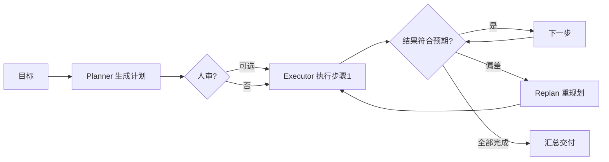

# Plan-and-Execute

> **一句话**：先让模型产出完整计划，再逐步执行并在必要时重规划——用「想清楚再做」换掉 ReAct 的「边做边想」，省 token 且更可控。

## 先看结论

- 三阶段：Plan（一次出全计划）→ Execute（逐步执行）→ Replan（偏差时重规划）
- 对比 ReAct：计划与执行解耦后，执行器可以用更小更便宜的模型；计划可先给人审（HITL 天然接入点）
- 适用：步骤可预知的结构化任务；不适用：探索型任务（做了才知道下一步）
- 生产主流是混合式：大结构 Plan-and-Execute + 执行中局部 ReAct

## 核心机制

### 1. 两个策略的解耦

ReAct 把「规划」和「执行」压在同一段对话里：每一步都要把完整历史重新送进模型，由模型隐式重规划。Plan-and-Execute 把它拆成两个策略：

$$
\underbrace{\pi_{\text{plan}}}_{\text{输入目标，输出步骤列表}}
\qquad\longrightarrow\qquad
\underbrace{\pi_{\text{exec}}}_{\text{输入单步，输出动作}}
$$

- $$\pi_{\text{plan}}$$ 只调用一次（或很少几次），看到全局
- $$\pi_{\text{exec}}$$ 调用多次，每次只看到「当前这一步」与必要上下文

### 2. 为什么更省 token

两种方式的 token 成本差异是结构性的。ReAct 的第 $$t$$ 步需要把前 $$t-1$$ 步的历史全部送进去：

$$
\text{Cost}_{\text{ReAct}}\approx\sum_{t=1}^{T}\big|\text{ctx}_t\big|
\;\;\sim\;\;O(T^2)\quad(\text{上下文随步数线性增长})$$

而 Plan-and-Execute 的计划只算一次，执行步只需局部上下文：

$$
\text{Cost}_{\text{P&E}}\approx\big|\text{ctx}_1\big|+\sum_{t=1}^{T}\big|\text{step}_t\big|
$$

**步骤数越多、单步上下文越短，优势越大**。代价是计划一旦错了，执行会沿着错误方向走——所以必须配 Replan。另外 $$\pi_{\text{exec}}$$ 因为任务简单，可以用更便宜的小模型，进一步降本。

### 3. 什么时候该重规划

重规划不是每步都触发，而是当「实际与计划的偏差」超过阈值时：

$$
\text{replan}\iff \big\|\,\text{result}_t-\text{expected}_t\,\big\|>\tau
\;\;\vee\;\;
\text{连续失败}\ge M
$$

因此计划里最好为每步写下**预期结果**，否则无从比较。没有预期，就只能等任务整体失败才知道计划错了。

## 流程图

## 工程含义

- **计划先给人审 = 天然 HITL 接入点**：大任务在动手前批准计划，比事后审查产出便宜得多（见 [Human-in-the-loop](../02-agent-basics/human-in-the-loop.md)）。
- **Planner / Executor 用不同 prompt**：规划视角是全局、抽象的；执行视角是局部、具体的。混用一个 prompt 会让两者都做不好。
- **执行器要能拒绝**：如果某一步与当前实际情况明显不符，执行器应上报而非硬做——这是 Replan 的触发来源。
- **计划要有上限**：超过 10 步的计划在长任务中大概率作废，滚动式规划（先定前几步）比一次定死更实际。

## 源码案例

- **Claude Code 的 Plan 模式**（逆向分析，[提示词全集](https://github.com/Piebald-AI/claude-code-system-prompts)）：内置独立的 Plan 子 Agent——先只读探索代码库、产出实施计划交用户批准，批准后才切回可写模式执行。这是 Plan-and-Execute + HITL 的产品级范本
- **DeepSeek Harness 的 goal/plan 插件**（[仓库](https://github.com/deepseek-ai/deepseek-harness)）：`packages/plan` 与 `packages/goal` 把计划与目标做成可插拔组件，挂在 agent-loop 的生命周期上——「换一套规划策略」不动循环代码
- **LangGraph 的 plan-and-execute 示例**（[仓库](https://github.com/langchain-ai/langgraph)）：用 planner / executor 两个节点 + 状态图实现，Replan 用条件边触发——学结构化实现的最佳起点

## 常见误区

- ❌ 计划越详细越好：超过 10 步的计划大概率中途作废，滚动式规划更实际
- ❌ 执行时不对照计划：每步执行完必须 diff「实际 vs 计划」，偏差触发 replan 而不是硬走
- ❌ Planner/Executor 同一 prompt：规划视角与执行视角分开写 prompt，效果显著更好
- ❌ 所有任务都上 Plan-and-Execute：探索型任务（下一步取决于刚发现什么）用 ReAct 更合适
- ❌ 计划一旦生成就不可改：无法重规划的系统在真实环境里非常脆弱

## 小练习

对比实验：同一「批量重命名 + 重构 10 个文件」任务，跑纯 ReAct vs Plan-and-Execute（计划先人工审），比较 token 消耗、步数与结果质量。再说明：如果任务换成「排查一个未定位的线上 bug」，哪种更合适？为什么？

## 参考资料

- [Plan-and-Solve Prompting: Improving Zero-Shot Chain-of-Thought Reasoning](https://arxiv.org/abs/2305.04091)（Wang et al., 2023）
- [ReAct: Synergizing Reasoning and Acting in Language Models](https://arxiv.org/abs/2210.03629)（Yao et al., 2022）
- [Reflexion: Language Agents with Verbal Reinforcement Learning](https://arxiv.org/abs/2303.11366)（Shinn et al., 2023，失败后重规划/复盘）

## 相关知识点

- [任务分解](task-decomposition.md)
- [Human-in-the-loop](../02-agent-basics/human-in-the-loop.md)
- [子目标规划](subgoal-planning.md)
