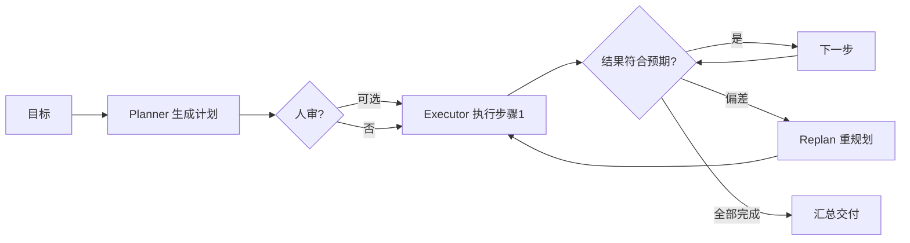

# Plan-and-Execute

> **一句话**：先让模型产出完整计划，再逐步执行并在必要时重规划——用「想清楚再做」换掉 ReAct 的「边做边想」，省 token 且更可控。
> **难度**：进阶
> **标签**：`#planning`

## 先看结论

- 三阶段：Plan（一次出全计划）→ Execute（逐步执行）→ Replan（偏差时重规划）
- 对比 ReAct：计划与执行解耦后，执行器可以用更小更便宜的模型；计划可先给人审（HITL 天然接入点）
- 适用：步骤可预知的结构化任务；不适用：探索型任务（做了才知道下一步）
- 生产主流是混合式：大结构 Plan-and-Execute + 执行中局部 ReAct

## 流程图

## 源码案例

- **Claude Code 的 Plan 模式**（逆向分析，[提示词全集](https://github.com/Piebald-AI/claude-code-system-prompts)）：内置独立的 Plan 子 Agent——先只读探索代码库、产出实施计划交用户批准，批准后才切回可写模式执行。这是 Plan-and-Execute + HITL 的产品级范本，专设的 Plan Agent 提示词（约 4K token，见逆向仓库）详细约束「只读、不改动、先设计」
- **DeepSeek Harness 的 goal/plan 插件**（[仓库](https://github.com/deepseek-ai/deepseek-harness)）：`packages/plan` 与 `packages/goal` 把计划与目标做成可插拔组件，挂在 agent-loop 的生命周期上——「换一套规划策略」不动循环代码
- **LangGraph 的 Plan-and-Execute 模板**（[langchain-ai/langgraph 官方示例](https://github.com/langchain-ai/langgraph)）：`plan-and-execute` 示例用两个节点（planner / executor）+ 状态图实现，Replan 用条件边触发——学结构化实现的最佳起点
- **BabyAGI / Plan-and-Solve**（[GitHub](https://github.com/yoheinakajima/babyagi)）：早期开源规划 Agent，思想源头，代码简单适合读历史演进

## 常见误区

- ❌ 计划越详细越好：超过 10 步的计划大概率中途作废，滚动式规划更实际
- ❌ 执行时不对照计划：每步执行完必须 diff「实际 vs 计划」，偏差触发 replan 而不是硬走
- ❌ Planner/Executor 同一 prompt：规划视角（全局、抽象）与执行视角（局部、具体）分开写 prompt，效果显著更好

## 小练习

对比实验：同一「批量重命名+重构 10 个文件」任务，跑纯 ReAct vs Plan-and-Execute（计划先人工审），比较 token 消耗、步数与结果质量。

## 相关资源

- [Plan-and-Solve 论文](https://arxiv.org/abs/2305.04091)

## 相关知识点

- [任务分解](task-decomposition.md)
- [Human-in-the-loop](../02-agent-basics/human-in-the-loop.md)
