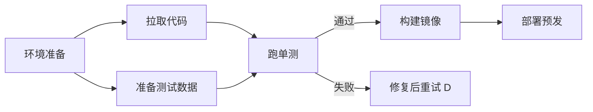

# 子目标规划

> **一句话**：子目标（subgoal）是计划树上带状态的节点：有自己的完成判据、依赖关系和重试策略——管理好它们，长任务才不会中途「失忆」或「迷路」。

## 先看结论

- 子目标三要素：完成判据（怎么算完）、依赖（谁必须先完成）、状态（pending/running/done/failed）
- 依赖关系构成 DAG（有向无环图）：拓扑序决定执行顺序，无依赖的可并行扇出
- 与任务分解的区别：分解关心「拆什么」，子目标管理关心「运行时怎么跟踪、调度、恢复」
- 里程碑式验收：每个子目标完成即验证入库，失败的只回滚局部

## 核心机制

### 1. 子目标 = 一个「有时长的动作」

在强化学习里，「有时长的动作」（option）被形式化为三元组：

$$
o=\big(\mathcal{I},\;\pi,\;\beta\big)
$$

- $$\mathcal{I}$$：**启动条件**（initiation set）——什么时候可以开始这个子目标
- $$\pi$$：**执行策略**——在里面怎么行动
- $$\beta$$：**终止条件**——什么时候算结束

把子目标按这个框架理解，就能看清它和「一步动作」的区别：子目标有自己的内部循环与明确的**终止谓词** $$\beta$$。对应到 Agent 工程：

| 形式概念 | 工程对应 |
|---|---|
| $$\mathcal{I}$$ 启动条件 | 依赖已满足（前置子目标 done） |
| $$\pi$$ 执行策略 | 该子目标的 prompt + 工具集 |
| $$\beta$$ 终止条件 | 可机检的完成判据（测试通过/文件存在） |

**终止条件必须可机检**——这是子目标管理里最容易做错的一点。「看起来差不多」不构成 $$\beta$$，会导致子目标永远无法判定完成。

### 2. DAG 与关键路径

子目标依赖构成有向无环图 $$G=(V,E)$$，执行受拓扑序约束。完成整个任务的最短时间由**关键路径**下界决定：

$$
\text{makespan}\;\ge\;\max_{\text{path }p\subseteq G}\sum_{v\in p}\text{duration}(v)
$$

这条式子给出两个调度结论：一是**并行只能压缩非关键路径**，优化要优先看关键路径上的子目标；二是**并行的收益有上限**，不可能低于关键路径长度——所以「无限加并行」是无效的。

### 3. 三种失败的处理边界

$$
\text{局部失败}\;\to\;\text{局部回滚}
\qquad
\text{关键路径失败}\;\to\;\text{重规划或中止}
\qquad
\text{可跳过失败}\;\to\;\text{降级继续（部分交付）}
$$

设计时就要为每个子目标标注「失败后是重试、跳过还是中止」，而不是等失败发生再临时决定。特别是父目标应有**降级路径**：局部失败不必让整个任务失败，能交付多少交付多少。

## 子目标 DAG

## 工程含义

- **子目标必须外置存储**：只存在对话里的话，上下文一压缩就丢了。用结构化状态（Todo 清单、事件流、图状态）保存。
- **每个子目标带状态机**：`pending → running → done/failed` 是基本盘，长任务还应支持 `blocked`（等外部依赖）与 `canceled`。
- **并发要有上限**：并行扇出受共享资源约束（同一文件、同一端口、同一 API 限流），无节制并行会导致冲突与成本失控。
- **完成即验证即入库**：把「完成判据通过」作为状态迁移的条件，而不是「执行完就算完成」。

## 源码案例

- **DeepSeek Harness 的 goal 包**（[仓库](https://github.com/deepseek-ai/deepseek-harness)）：`packages/goal` 把目标管理独立成插件——目标的生命周期事件（创建/推进/完成/放弃）写入事件流，与子 Agent 调度配合：每个子 Agent 背后就是一个子目标实例
- **Claude Code 的子 Agent 隔离**（逆向分析，[架构深拆](https://gist.github.com/yanchuk/0c47dd351c2805236e44ec3935e9095d)）：把「子目标」封装成子 Agent——全新消息列表或分叉上下文、独立转写文件、可选 git worktree 隔离——子目标之间不互相污染上下文，这是「子目标管理」的上下文级实现
- **LangGraph 的图状态**（[仓库](https://github.com/langchain-ai/langgraph)）：StateGraph 的节点即子目标，状态对象显式声明、checkpoint 持久化——子目标进度天然可恢复（断点续跑），见 [工作流编排](workflow-orchestration.md)

## 最佳实践

- 子目标完成判据要可机检（测试/查询/文件存在），「看起来差不多」不算完成
- 失败子目标的重试要带退避与上限，连败 2–3 次上升为「重规划」而非原地硬试（见 [错误恢复与重试](error-recovery-retry.md)）
- 并行子目标注意共享资源竞争（同一文件、同一端口、同一 API 限流）
- 为每个子目标预设失败语义（重试/跳过/中止），并给父目标留降级路径

## 常见误区

- ❌ 子目标只存在对话里：必须结构化存储，否则上下文一压缩子目标就丢了
- ❌ 平行推进一切：无节制并行导致资源冲突与成本失控，设并发上限
- ❌ 子目标失败牵连全局：局部失败应局部回滚，父目标降级继续（部分交付）
- ❌ 完成判据含糊：没有可机检的终止条件，子目标状态就无法自动推进
- ❌ 忽视关键路径：把优化精力花在非关键路径上，整体耗时不变

## 小练习

把「数据迁移：旧库 → 新库」拆成子目标 DAG，标注每个节点的完成判据；指出关键路径、哪个节点失败可跳过、哪个失败必须中止。

## 参考资料

- [Between MDPs and Semi-MDPs: A Framework for Temporal Abstraction in Reinforcement Learning](https://people.cs.umass.edu/~barto/courses/cs687/Sutton-Precup-Singh-AIJ99.pdf)（Sutton, Precup & Singh, 1999，option 框架）
- [Plan-and-Solve Prompting](https://arxiv.org/abs/2305.04091)（Wang et al., 2023）
- [DeepSeek Harness](https://github.com/deepseek-ai/deepseek-harness) / [LangGraph](https://github.com/langchain-ai/langgraph)

## 相关知识点

- [任务分解](task-decomposition.md)
- [监督者模式](../08-multi-agent/supervisor-pattern.md)
- [错误恢复与重试](error-recovery-retry.md)
