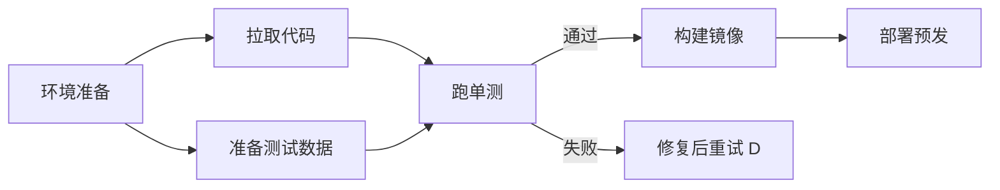

# 🗺️ 子目标规划

> **一句话**：子目标（subgoal）是计划树上带状态的节点：有自己的完成判据、依赖关系和重试策略——管理好它们，长任务才不会中途「失忆」或「迷路」。
> **难度**：⭐️⭐️ 进阶
> **标签**：`#planning`

## 📌 先看结论

- 子目标三要素：完成判据（怎么算完）、依赖（谁必须先完成）、状态（pending/running/done/failed）
- 依赖关系构成 DAG（有向无环图）：拓扑序决定执行顺序，无依赖的可并行扇出
- 与任务分解的区别：分解关心「拆什么」，子目标管理关心「运行时怎么跟踪、调度、恢复」
- 里程碑式验收：每个子目标完成即验证入库，失败的只回滚局部

## 🖼️ 子目标 DAG

## 📦 源码案例

- **DeepSeek Harness 的 goal 包**（[仓库](https://github.com/deepseek-ai/deepseek-harness)）：`packages/goal` 把目标管理独立成插件——目标的生命周期事件（创建/推进/完成/放弃）写入事件流，与子 Agent 调度（Supervisor–Worker）配合：每个子 Agent 背后就是一个子目标实例
- **Claude Code 的子 Agent 隔离**（逆向分析，[架构深拆](https://gist.github.com/yanchuk/0c47dd351c2805236e44ec3935e9095d)）：AgentTool 把「子目标」封装成子 Agent：全新消息列表（fresh）或分叉完整上下文（forked）、独立转写文件、可选 git worktree 隔离——子目标之间不互相污染上下文，这是「子目标管理」的上下文级实现
- **LangGraph 的图状态**（[GitHub](https://github.com/langchain-ai/langgraph)）：StateGraph 节点即子目标，状态对象显式声明、checkpoint 持久化——子目标进度天然可恢复（断点续跑），见 [工作流编排](workflow-orchestration.md)

## ✅ 最佳实践

- 子目标完成判据要可机检（测试/查询/文件存在），「看起来差不多」不算完成
- 失败子目标的重试要带退避与上限，连败 2–3 次上升为「重规划」而非原地硬试
- 并行子目标注意共享资源竞争（同一文件、同一端口、同一 API 限流）

## ⚠️ 常见误区

- ❌ 子目标只存在对话里：必须结构化存储，否则上下文一压缩子目标就丢了
- ❌ 平行推进一切：无节制并行导致资源冲突与成本失控，设并发上限
- ❌ 子目标失败牵连全局：局部失败应局部回滚，父目标降级继续（部分交付）

## 🧪 小练习

把「数据迁移：旧库 → 新库」拆成子目标 DAG，标注每个节点的完成判据；哪个节点失败可跳过？哪个失败必须中止？

## 📚 相关知识点

- [任务分解](task-decomposition.md)
- [监督者模式](../08-multi-agent/supervisor-pattern.md)
