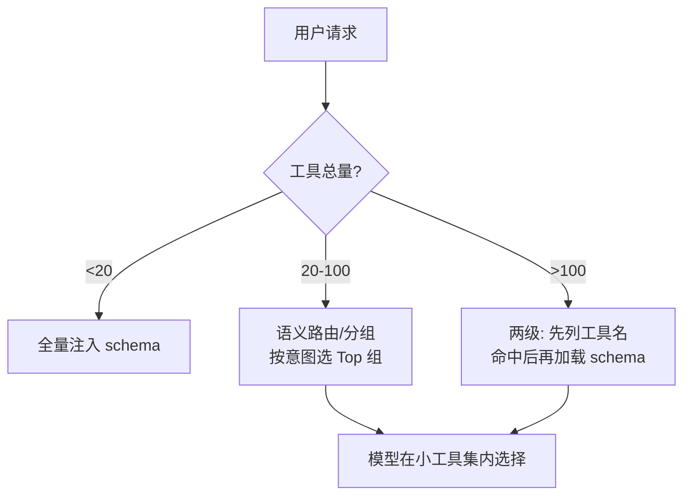

# 工具选择与路由

> **一句话**：工具面一大，模型就开始「选错扳手」：路由 = 用检索、分组、延迟加载等手段，让模型在每一步只看到一小撮高相关工具。

## 先看结论

- 工具数量与选择准确率负相关：几十个以上必须治理
- 路由本质是**两阶段**：先检索候选，再让模型在小集合内选择
- 四种治理手段：语义路由、延迟加载（先名后 schema）、按 Server 动态开关、角色限定（子 Agent 工具面裁剪）
- 工具描述是第一路由器：写清「什么时候用我/别用我」比任何算法都有效
- 路由必须评估：构造「应该选 X」的测试集，工具改动走回归

## 核心机制

### 1. 路由是「检索 + 选择」两阶段

面对工具全集 $T$，模型不可能直接在一百个工具里选对。工程做法是先检索出候选子集，再让模型定夺：

$$
T_{\text{visible}}=\operatorname{TopK}\big(\text{retrieve}(q,T)\big)
\;\subset\; T,
\qquad
a\sim \pi_\theta(\cdot\mid q,\,T_{\text{visible}})
$$

这和 RAG 的结构完全一致：**检索负责缩小范围，模型负责最终决策**。由此得出一个关键性质：

$$
\text{正确工具}\notin T_{\text{visible}}\;\Longrightarrow\;\text{无论模型多强都选不对}
$$

所以路由设计要**优先保证召回**（正确工具必须进候选），再考虑候选数量。这与 [RAG 基础](../06-memory-rag/rag-basics.md) 里「先召回 Top-50、再重排取 3–5」是同一套思路。

### 2. 为什么工具越多越选不对

模型选工具本质上是在做分类，而分类在候选数增多时准确率下降；同时每个工具的 schema 都在**每一轮**重复占用上下文：

$$
\text{成本}\propto |T_{\text{visible}}|\times\overline{\text{schema size}}
$$

所以工具增多带来的是**准确率下降 + 成本上升**的双重惩罚。治理的目标就是让 $|T_{\text{visible}}|$ 在每一步都尽可能小，同时不牺牲召回。

### 3. 四种治理手段

| 手段 | 做法 | 适用 |
|---|---|---|
| 语义路由 | 用 query 检索出相关工具组 | 工具多且功能可分组 |
| 延迟加载 | 先只给工具名，选中后再取完整 schema | 工具 schema 很大 |
| 动态开关 | 按 MCP Server / 功能模块启停工具 | 接入多个 MCP Server |
| 角色限定 | 不同子 Agent 用不同工具面（如 Plan Agent 只读） | 需要权限隔离 |

**延迟加载的收益最直观**：工具名约几十 token，完整 schema 可能上千 token——先列名字，能把工具面的固定开销压下一个数量级。

### 4. 工具描述是最强的路由器

无论用什么检索算法，模型最终读的是 `description`。一份好的描述应包含五段信息：

```text
做什么 | 输入含义 | 什么时候用我 | 什么时候不要用我 | 失败时返回什么
```

其中**「什么时候不要用我」最关键**，因为它直接消解了工具间的歧义——例如搜索工具写明「已知文件路径时请改用读取工具」，模型就不会在两者间摇摆。

## 路由策略



## 工程含义

- **把路由做成可评估组件**：构造「给定请求，应选哪个工具」的测试集，度量路由召回率与最终选择准确率，工具改动后回归。
- **留「放弃并问人」的出口**：路由错一次会让整条链路错，低置信度时应降级为询问用户，而不是硬选。
- **同义工具合并**：三个功能相近的「查数据库」工具留一个参数化最强的，减少歧义。
- **高频安全工具常驻，高危工具按需开启**：读文件、搜索永远注入；执行、删除类按需开启并叠加审批。

## 源码案例

- **Claude Code 的延迟工具加载**（逆向分析，[架构深拆](https://gist.github.com/yanchuk/0c47dd351c2805236e44ec3935e9095d)）：系统提示词只列工具**名字**，模型需要时再加载完整 schema——上下文预算管理与路由二合一；同时不同类型的子 Agent 有裁剪后的工具面（如计划阶段只给只读工具）
- **DeepSeek Harness 的动态工具面**（[仓库](https://github.com/deepseek-ai/deepseek-harness)）：`packages/core/system-prompt` 在每一步 `preStep` 组装工具 schema——工具面可以是「状态机当前阶段的函数」：探索阶段只给只读工具，确认后才开放写入工具
- **MCP 的工具风暴治理**（[MCP 文档](https://modelcontextprotocol.io/docs/learn/architecture)）：接入多个 MCP Server 后工具轻松过百——按 Server 启停 + 工具前缀分组，把治理从「注册时」延伸到「运行时」

## 常见误区

- ❌ 路由靠小模型分类器就够：分类器错一次全链路错，要留「放弃并问人」出口
- ❌ 工具名随便起：`tool1/tool2` 或过度缩写直接毁掉模型判断，名字即文档
- ❌ 改了工具不回归：工具描述改一句话可能让某条路径选择率骤降，改动要走评估集
- ❌ 只看候选数量不看召回：为了省 token 把候选压得太小，正确工具进不来反而更差
- ❌ 用语义相似度直接选工具而不给模型决定权：相近工具的细微差别（读 vs 写）相似度分不出来

## 小练习

你的 Agent 有 80 个工具（30 个 GitHub、20 个数据库、15 个文档、15 个杂项）。设计路由方案：分几组？每组的进入条件？用什么信号做路由？再写出你会用哪两个指标评估它。

## 参考资料

- [ToolLLM: Facilitating Large Language Models to Master 16000+ Real-world APIs](https://arxiv.org/abs/2307.16789)（Qin et al., 2023，含工具检索与选择）
- [Gorilla: Large Language Model Connected with Massive APIs](https://arxiv.org/abs/2305.15334)（Patil et al., 2023）
- [Anthropic: Writing effective tools for agents](https://www.anthropic.com/engineering/writing-tools-for-agents)
- [MCP 官方文档](https://modelcontextprotocol.io/docs/learn/architecture)

## 相关知识点

- [Tool Use](../05-tool-protocol/tool-use.md)
- [Function Calling](../05-tool-protocol/function-calling.md)
- [MCP](../05-tool-protocol/mcp.md)
