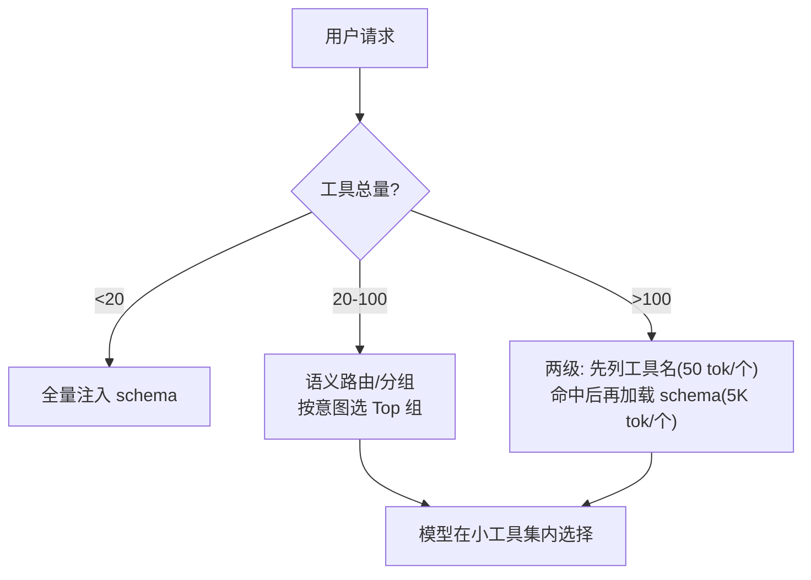

# 工具选择与路由

> **一句话**：工具面一大，模型就开始「选错扳手」：路由 = 用检索、分组、延迟加载等手段，让模型在每一步只看到一小撮高相关工具。
> **难度**：进阶
> **标签**：`#planning` `#tooling`

## 先看结论

- 工具数量与选择准确率负相关：几十个以上必须治理
- 四种治理手段：语义路由（query→工具组）、延迟加载（先名后 schema）、MCP 动态开关、角色限定（子 Agent 工具面裁剪）
- 工具描述是第一路由器：描述里写清「什么时候用我/别用我」比任何算法都有效
- 选择正确性要评估：构造「应该选 X 工具」的测试集，回归工具改动

## 路由策略

## 源码案例

- **Claude Code 的延迟工具加载**（逆向分析，[架构深拆](https://gist.github.com/yanchuk/0c47dd351c2805236e44ec3935e9095d)）：系统提示词只列工具**名字**（~50 token），模型需要时调 ToolSearch 加载完整 schema（~5000 token）——上下文预算管理 + 路由二合一；同时每个子 Agent 类型有裁剪后的工具面（Plan Agent 只读工具）
- **DeepSeek Harness 的动态工具面**（[仓库](https://github.com/deepseek-ai/deepseek-harness)）：`core/system-prompt` 在每一步 preStep 组装工具 schema——工具面可以是「状态机当前阶段的函数」：探索阶段只给只读工具，确认后才开放写入工具
- **MCP 的工具风暴治理**（[modelcontextprotocol](https://modelcontextprotocol.io)）：接入多个 MCP Server 后工具轻松过百，Claude Code 的解法是按 Server 启停 + 工具前缀分组——工具治理从「注册时」延伸到「运行时」

## 最佳实践

- 描述模板：`做什么 + 输入含义 + 什么时候用 + 什么时候不用 + 失败时返回什么`
- 同义工具合并（三个「查数据库」留一个参数化最强的）
- 高频安全工具（读文件、搜索）永远注入，低频高危工具（执行、删除）按需开启 + 审批

## 常见误区

- ❌ 路由靠小模型分类器就够：分类器错一次全链路错，语义路由要留「放弃并问人」出口
- ❌ 工具名随便起：`tool1/tool2` 或过度缩写直接毁掉模型判断，名字即文档
- ❌ 改了工具不回归：工具描述改一句话可能让某条路径选择率骤降，改动要走评估集

## 小练习

你的 Agent 有 80 个工具（30 个 GitHub、20 个数据库、15 个文档、15 个杂项）。设计路由方案：分几组？每组的进入条件？用什么信号做路由？

## 相关知识点

- [Tool Use](../05-tool-protocol/tool-use.md)
- [MCP](../05-tool-protocol/mcp.md)
