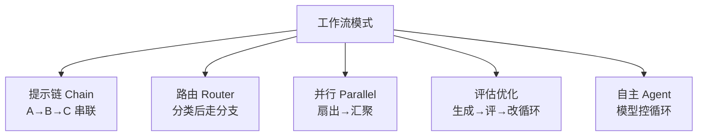

# 🗺️ 工作流编排

> **一句话**：工作流编排 = 把「何时用确定性代码、何时放权给 LLM」显式设计出来——好的 Agent 系统是工作流与自主性的混合体。
> **难度**：⭐️⭐️ 进阶
> **标签**：`#planning` `#engineering`

## 📌 先看结论

- Anthropic 的工程共识（[Building Effective Agents](https://www.anthropic.com/engineering/building-effective-agents)）：能 Workflow 不 Agent——可预测性、可测试性、成本三者 Workflow 全面占优
- 五种编排模式：提示链（串联）、路由（分流）、并行化（扇出/汇聚）、评估器-优化器、自主 Agent——按需组合
- 编排框架解决三件事：状态管理、持久化、人机中断恢复；选框架本质是选这三件的质量

## 🖼️ 五种模式速览

## 🧩 模式选型

| 模式 | 适用 | 典型例 |
|---|---|---|
| 提示链 | 线性流水线 | 写作→审校→排版 |
| 路由 | 输入类型异构 | 客服问题分流 |
| 并行 | 多视角/大批量 | 多文档审阅、投票 |
| 评估器-优化器 | 有质量标准 | 文案打磨、代码润色 |
| 自主 Agent | 开放环境多步任务 | 编程修 bug |

## 📦 源码案例

- **LangGraph**（[GitHub](https://github.com/langchain-ai/langgraph)）：把编排表达为「状态图」：节点（步骤）+ 边（流转）+ 条件边（路由）+ checkpoint（持久化）+ interrupt（人审中断）。其官方模板库覆盖上述全部五种模式，是学编排的第一开源教材
- **DeepSeek Harness 的编排光谱**（[仓库](https://github.com/deepseek-ai/deepseek-harness) / [InfoQ 解读](https://www.sohu.com/a/1062640652_122014422)）：标准模式（自主 Agent）、PTC 模式（模型写代码组合调用，程序化工作流）、极简模式（最小干扰测模型）、创造模式（Agent 自组运行时）——一个 harness 内实现编排光谱的滑动，而非五种产品
- **Claude Code 的混合**（逆向分析）：主循环自主，但 /init 生成 CLAUDE.md、Plan 模式审批、Hooks 拦截都是确定性工作流节点嵌在自主系统里——「自主为体、工作流为骨」

## ✅ 最佳实践

- 先画「确定性骨架」（哪些步骤固定），再决定「哪些洞让 LLM 填」
- 每个模式独立可测：串联的每段、路由的每条分支都要有自己的评估集
- 中断恢复从第一天设计（checkpoint + 幂等步骤），长任务没有它等于裸奔

## ⚠️ 常见误区

- ❌ 编排框架越重越好：简单提示链用框架是杀鸡用牛刀；Pi 用 ~300 行循环服务了绝大多数场景
- ❌ Agent 节点里塞确定性逻辑：确定的事交给代码，模型只做需要判断的事
- ❌ 忽略模式间的成本差异：自主 Agent 的 token 成本常是提示链的 10–50 倍，按 ROI 选模式

## 🧪 小练习

「客户投诉自动处理」需求：分类、退款审批、回复撰写。哪些环节用工作流模式？哪个环节必须 Agent？HITL 放哪？画出完整编排图。

## 🔗 相关资源

- [Anthropic: Building Effective Agents](https://www.anthropic.com/engineering/building-effective-agents)

## 📚 相关知识点

- [Plan-and-Execute](plan-and-execute.md)
- [多 Agent 编排](../08-multi-agent/multi-agent-orchestration.md)
- [状态机与事件驱动](../11-engineering/state-machine-event-driven.md)
