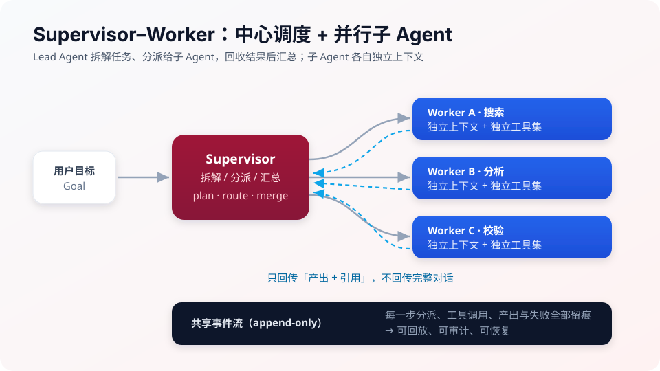

# 08 多智能体


**一句话**：多个 Agent 协作能换來更强的能力面与并行度，代价是通信成本、错误传播与调试复杂度——本章讲清协作模式与治理方法。


*《图：Supervisor 拆、派、合，Worker 各带独立上下文与工具集，只回传产出与引用；那条 append-only 事件流才让多智能体可审计》*
## 你将学到

- 什么时候真的需要多 Agent（以及什么时候单 Agent 更好）
- 角色分配、通信协议与三种经典拓扑：监督者、群聊、Swarm
- 辩论/共识/投票：用分歧提升质量
- 编排：LangGraph 图编排、DeepSeek Harness 的 Supervisor–Worker、Claude Code 的子 Agent 隔离

## 先泼冷水

Anthropic 与一线实践反复验证：**多 Agent 是最后的手段，不是默认架构**。每加一个 Agent，通信 token、失败模式、调试成本都翻倍。先读完本章再决定要不要「组队」。

## 本站页面

- [多 Agent 协作](multi-agent-collaboration.md)
- [角色分配](role-assignment.md)
- [通信协议](communication-protocol.md)
- [辩论、共识与投票](debate-consensus-voting.md)
- [监督者模式](supervisor-pattern.md)
- [群聊模式](group-chat.md)
- [Swarm](swarm.md)
- [多 Agent 编排](multi-agent-orchestration.md)

## 读完能做到

- [ ] 用 O(n²) 通信边增长和「超过 5 个 Agent 收益常转负」判断一个任务到底该不该拆多 Agent
- [ ] 给三角色（调研 / 写作 / 事实核查）各写出工具面、产出 JSON 格式、两条禁止事项，体现「角色 = 专属指令 + 工具 + 验收」
- [ ] 解释星型拓扑为什么优于点对点，并设计一条带 type / source / artifacts 的类型化消息（引用传递而非塞大产物）
- [ ] 用 Condorcet 陪审团定理说明投票里「独立性」为什么比「数量」重要，以及何时该把投票升级成辩论
- [ ] 给电商客服设计 Swarm 移交图，标出有死循环风险的边、最大跳数兜底，以及交接简报该带哪些字段

## 章末自测

1. **回忆**：多 Agent 的三大收益和三大代价各是什么？判据为什么是「上下文是否互相污染」而不是「任务大不大」？（提示：见 multi-agent-collaboration.md）
2. **应用**：设计「季度财报分析」的 Supervisor：几个 Worker、各自工具面、Worker 只回传什么才不会撑爆中心上下文？（提示：见 supervisor-pattern.md）
3. **判断**：「三个模型辩论一定比一个模型准」——用共同盲区和辩论放大执念两点评价这句话。（提示：见 debate-consensus-voting.md）

## 本章术语速查

一群人干活的词汇表，一半来自组织管理、一半来自网络工程——决定「组队」之前先把表过一遍。

| 英文术语 | 中文 | 白话一句话 |
|---|---|---|
| Multi-Agent System | 多智能体系统 | 花三样代价买三样收益：并行、上下文隔离、视角分歧互相纠错——判据是上下文会不会互相污染 |
| Role Assignment | 角色分配 | 角色 = 专属指令 + 工具面 + 验收标准 + 禁止事项，不是给模型贴个头衔就叫分工 |
| Topology | 通信拓扑 | 点对点边数 O(n²) 爆炸、星型 O(n)、广播慎用——选的是成本结构，不是审美 |
| Blackboard | 黑板模式 | 别互相刷屏了：产出写进共享存储，要用的自己去读，消息里只传引用 |
| Condorcet Jury Theorem | 陪审团定理 | 投票更准的数学依据：每人独立判断略强于随机；串行互相污染的「投票」只是复读 |
| Debate | 辩论 | 各答各的→互评→修订，比投票贵一档也强一档，但辩过头会越辩越执念 |
| Supervisor | 监督者模式 | 协调员只管拆解、派发、汇总质检，下场干活就乱了；它是单点也是瓶颈 |
| Worker | 工作者 Agent | 不和同级闲聊，只回传浓缩结论——Worker 的错误过程就此被挡在中心上下文之外 |
| Group Chat | 群聊模式 | 共享消息流加发言选择器，热闹是热闹，谁下一个说话的不确定性太大 |
| Handoff | 移交 | 控制权接力棒：A 断定「这事归 B」，连上下文一起打包递过去，没有中心裁判 |
| Swarm | 蜂群模式 | 没有监工、按有向图交接的拓扑，必须设最大跳数，否则两个推脱责任的 Agent 能无限传球 |

