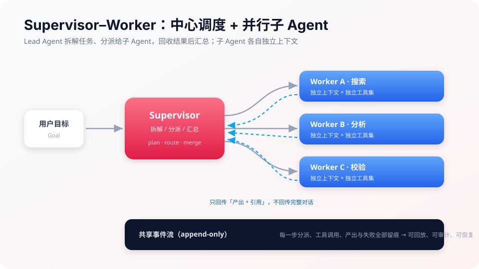

# 08 多智能体

> **一句话**：多个 Agent 协作能换來更强的能力面与并行度，代价是通信成本、错误传播与调试复杂度——本章讲清协作模式与治理方法。

## 你将学到

- 什么时候真的需要多 Agent（以及什么时候单 Agent 更好）
- 角色分配、通信协议与三种经典拓扑：监督者、群聊、Swarm
- 辩论/共识/投票：用分歧提升质量
- 编排：LangGraph 图编排、DeepSeek Harness 的 Supervisor–Worker、Claude Code 的子 Agent 隔离

## 先泼冷水

Anthropic 与一线实践反复验证：**多 Agent 是最后的手段，不是默认架构**。每加一个 Agent，通信 token、失败模式、调试成本都翻倍。先读完本章再决定要不要「组队」。

## 本站页面

- [多 Agent 协作](multi-agent-collaboration.md)
- [角色分配](role-assignment.md)
- [通信协议](communication-protocol.md)
- [辩论、共识与投票](debate-consensus-voting.md)
- [监督者模式](supervisor-pattern.md)
- [群聊模式](group-chat.md)
- [Swarm](swarm.md)
- [多 Agent 编排](multi-agent-orchestration.md)
